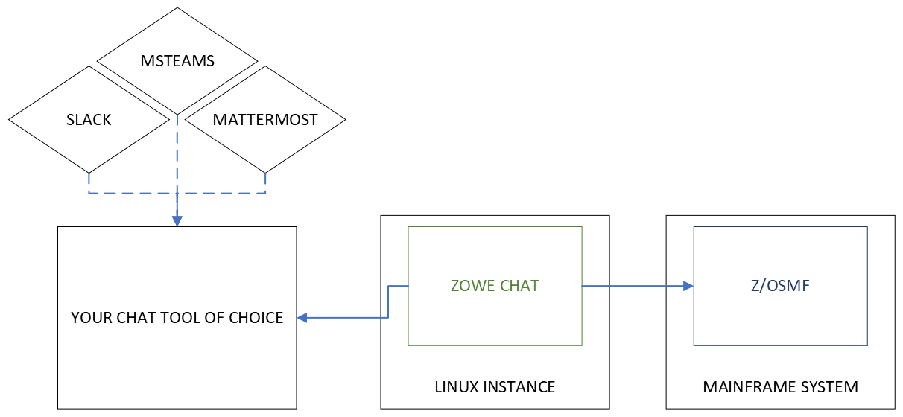

# Introduction

Zowe Chat Technical Preview is an early access build of the newest incubating technology in Zowe, Zowe Chat! Zowe Chat is a chatbot that aims to enable a ChatOps collaboration model by bringing simple access to z/OS resources and tools within the chat tools you use everyday in your organization. As this is an early access build, it is recommended to deploy the technical preview in development and test environments. 

The following topics guide you to set up and use Zowe Chat.

1. [System Requirements](systemrequirements-chat.md)
2. [Installing Zowe Chat](chat_install_overview.md)
3. [Configuring the Zowe container environment](k8s-config.md)
4. [Starting, stopping, and monitoring](k8s-using.md)
5. [Known limitations](#known-limitations)

## System Diagram

## Known limitations

- Zowe Chat can only be deployed to Linux or zLinux environments at this time. z/OS support is pending further review. If you are interested in running Zowe Chat on z/OS, let us know by [opening a question](https://github.com/zowe/zowe-chat/issues/new/choose).