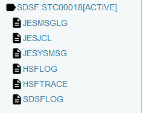

# Getting started tutorial

**Contents**

- [Learning objectives](#learning-objectives)
- [Estimated time](#estimated-time)
- [Prerequisites and assumptions](#prerequisites-and-assumptions)
- [Logging in to the Zowe Desktop](#logging-in-to-the-zowe-desktop)
- [Querying JES jobs and viewing related status in JES Explorer](#querying-jes-jobs-and-viewing-related-status-in-jes-explorer)
- [Using the 3270 Terminal in the Zowe Desktop to view the job](#using-the-3270-terminal-in-the-zowe-desktop-to-view-the-job)
- [Editing a data set in MVS Explorer](#editing-a-data-set-in-mvs-explorer)
- [Using the Zowe CLI to edit a data set](#using-the-zowe-cli-to-edit-a-data-set)
- [Viewing the data set changes in MVS Explorer](#viewing-the-data-set-changes-in-mvs-explorer)
- [Next steps](#next-steps)
   - [Go deeper with Zowe](#go-deeper-with-zowe)
   - [Try the Extending Zowe scenarios](#try-the-extending-zowe-scenarios)
   - [Give feedback](#give-feedback)


## Learning objectives

This tutorial walks you through the Zowe&trade; interfaces, including the Zowe Desktop and Zowe CLI, with several simple tasks to help you get familiar with Zowe.

- If you are new to Zowe, start with this tutorial to explore the base Zowe features and functions.
- If you are already familiar with Zowe interfaces and capabilities, you might want to visit the **Extending** section which guides you to extend Zowe by creating your own APIs or applications.
   - [Developing for API Mediation Layer](../extend/extend-apiml/onboard-overview.md)
   - [Developing for Zowe Application Framework](../extend/extend-desktop/mvd-extendingzlux.md)
   - [Developing for Zowe CLI](../extend/extend-cli/cli-devTutorials.md)

By the end of the session, you'll know how to:
- Log in to the Zowe Desktop
- Query jobs with filters and view the related status by using the JES Explorer
- View jobs by using the 3270 Terminal in the Zowe Desktop
- View and edit data sets by using the MVS Explorer
- Edit a data set and upload it to the mainframe by using Zowe Command-Line Interface (CLI)

As an introductory scenario, no previous knowledge of Zowe is needed.

## Estimated time

This tutorial guides you through the steps in roughly 20 minutes. If you explore other concepts related to this tutorial, it can take longer to complete.

## Prerequisites and assumptions

Before you begin, it is assumed that you have already successfully installed Zowe. You are ready to launch Zowe Desktop and Zowe CLI.

For information about how to install Zowe, see [Installing Zowe](installandconfig.md).

**Important!**

- In this tutorial, the following parameters are used as an example. Replace them with your own settings when you follow the tutorial in your environment.

   - URL to access the Zowe Desktop:
      - Using API mediation layer: `https://myhost:<gateway port>/ui/v1/zlux/`
      - Without the API mediation layer:  `https://myhost:<appserver httpsPort>/` 
   - Mainframe credentials:
     - Username: `ibmuser`
     - Password: `sys1`

- It is assumed that you perform the tasks in a Windows environment and that you have Visual Studio Code (VS Code) installed.

## Logging in to the Zowe Desktop

Access and navigate the Zowe Desktop to view the Zowe applications. In this tutorial, you will use the Firefox browser to log in to the Zowe Desktop.

There are two ways to log in to the Zowe Desktop:
- Through the API mediation layer: `https://myhost:<gateway port>/ui/v1/zlux/`
   - Example: `https://s0w1:7554/ui/v1/zlux/ZLUX/plugins/org.zowe.zlux.bootstrap/web/index.html`
- Directly, if the mediation layer is not used: `https://myhost:<appserver httpsPort>/`
   - Example `https://s0w1:8544/ZLUX/plugins/org.zowe.zlux.bootstrap/web/index.html`

- *myHost* is the host on which you are running the Zowe Application Server.
- *httpsPort* is the value that was assigned to *node.https.port* in `zluxserver.json`. For example, if you run the Zowe Application Server on host *myhost* and the value that is assigned to *node.https.port* in `zluxserver.json` is 12345, you would specify `https://myhost:12345/ZLUX/plugins/org.zowe.zlux.bootstrap/web/index.html`.

**Follow these steps:**

1. In the address field, enter the URL to access the Zowe Desktop. In this tutorial, the following URL is used as an example:

   ```https://s0w1:8544/ZLUX/plugins/org.zowe.zlux.bootstrap/web/index.html```

   

2. On the login page of the Zowe Desktop, enter your mainframe credentials. In this tutorial, the following ID is used as an example:
   - Username: ibmuser
   - Password: sys1

3. Press Enter.

Upon authentication of your user name and password, the Zowe Desktop opens. Several applications are pinned to the taskbar. Click the Start menu to see a list of applications that are installed by default. You can pin other applications to the taskbar by right-clicking the application icon and selecting **Pin to taskbar**.


Next, you will use the JES Explorer application to query the jobs with filters and view the related status.

## Querying JES jobs and viewing related status in JES Explorer

Use the Job Entry Subsystem (JES) Explorer to query JES jobs with filters and view the related status.

**Follow these steps:**

1. Click the Start menu in the Zowe Desktop.

   

2. Scroll down to find the JES Explorer icon and click to open it. The JES Explorer is displayed. If prompted to provide credentials for authentication, enter your mainframe credentials.

3. Click the **Job Filters** column to expand the filter criteria. You can filter jobs on various criteria by Owner, Prefix, Job ID, and Status. By default, the jobs are filtered by Owner. In this tutorial, the example owner is `IBMUSER`.

   

4. To query the jobs starting with `SDSF` and in an active status, clear the field of **Owner**, then enter `SDSF*` in the **Prefix** field and select **ACTIVE** from the **Status** drop-down list, and click **APPLY**.

   **Note:** Wildcard is supported. Valid wildcard characters are asterisk (*), percent sign (%), and question mark (?).

   

5. From the job filter results, click the job named **SDSF**. The data sets for this job are listed.

   

6. Click **JESJCL** to open the JESJCL data set. The contents of this data set are displayed. You can also select other data sets to view their contents.

   **Tip:** You can hover over the text in purple color to display a hover help window.

   

You used the JES Explorer to query the JES jobs with filters and viewed the related steps, files, and status.

Close the JES Explorer window. Next, you'll use the TN3270 application plug-in in the Zowe Desktop to view the same job that you viewed in this task.

## Using the 3270 Terminal in the Zowe Desktop to view the job

Use the 3270 Terminal application plug-in to view the same job that you filtered out in the previous task.

Zowe not only provides new, modern applications to interact with z/OS®, but it also integrates the traditional 3270 terminal interface that you may also be familiar with. The 3270 Terminal application plug-in provides a basic, emulated 3270 terminal connection to the mainframe via the Zowe Application Server.

**Follow these steps:**

1. From the taskbar at the bottom of the Zowe Desktop, click the 3270 Terminal icon to open the 3270 Terminal application plug-in.

   

   The 3270 Terminal panel is displayed, which offers selections to access various mainframe services.

   

2. Enter the following command and press Enter to log on to TSO:

   ```LOGON ibmuser```

   

3. On the TSO/E LOGON panel, enter the password `sys1` in the **Password** field and press Enter.

   

   You successfully log on to TSO.

4. When you see the following screen, press Enter. The **ISPF Primary Option Menu** is displayed.

   

5. Access SDSF to view output from a job. To do this,

   1. Type `M` at the **Option** prompt and press Enter.

      

   2. Type `5` and press Enter.

      

6. To view the jobs in an active status, type `DA` at the command input prompt and press Enter. The jobs that are running are displayed.

   

7. To query the jobs that start with `SDSF`, type prefix `sdsf; owner *` at the command input prompt and press Enter.

   

8. To view the contents of the job, type `S` next to the job name `SDSF` and press Enter.

   

   The contents of the job are displayed.

   

Close the 3270 Terminal window. In the next step, you will use the MVS Explorer to make changes to a data set.

## Editing a data set in MVS Explorer

Use the MVS Explorer to create and edit a data set member and save the changes. The MVS Explorer view lets you browse the MVS file system by creating filters against data set names.

**Follow these steps:**

1. Click the Start menu on Zowe Desktop.

2. Scroll down to find the MVS Explorer icon and pin this application to the desktop for later use.

3. Click the **MVS Explorer** icon on the taskbar. The MVS Explorer opens. The **Filter** field is pre-filled with the user name. In this tutorial, the filter string is `IBMUSER`. All the data sets matching this filter are displayed. You can expand a data set name and see the members in it.

   

4. Enter `USER.Z23B.PARMLIB` in the **Filter** field to locate this data set and then click to expand it. Ensure that there is no extra space before the data set member name that you enter.

5. Right-click the `USER.Z23B.PARMLIB` data set and select **New Dataset Member**.

   

6. Enter **ZTRIAL** as the data set member name and click **OK** to create the data set member.

   

7. Click the data set member you just created and edit it by adding a new sentence, for example, `First change to Zowe zTrial`.

   

8. Click **SAVE** to save your edits.

   The following message **Save success for USER.Z23B.PARMLIB(ZTRIAL)** pops up quickly at the bottom of the MVS Explorer window, which indicates that your edits are successfully saved.

   

Leave the MVS Explorer window open; we will look at the contents of the data set in a later step. If asked to leave the page, choose **Stay on Page**. Next, you will use Zowe CLI to view and add another change to the same data set.

## Using the Zowe CLI to edit a data set

Use Zowe CLI to download the same data set that you edited by using MVS Explorer in the previous step, edit it, and upload the changes to the mainframe.

Zowe CLI is a command-line interface that lets you interact with z/OS from various other platforms, such as cloud or distributed systems, to submit jobs, issue TSO and z/OS console commands, integrate z/OS actions into scripts, produce responses as JSON documents, and more. With this extensible and scriptable interface, you can tie in mainframes to distributed DevOps pipelines and build automation.

**Follow these steps:**

1. Start the Command Prompt or a terminal in your local desktop. In this tutorial, it's assumed that you use Windows Command Prompt.

   

2. (Optional) Issue the following command to view the top-level help descriptions.

   ```
   zowe --help
   ```

   **Tip:** The command `zowe` initiates the product on a command line. All Zowe CLI commands begin with `zowe`.

3. To list the data sets of USER, enter the following command:

   ```
   zowe zos-files list data-set "USER.*"
   ```

   The following data sets are listed.

   

4. To download all the data set members of USER.Z23B.PARMLIB, enter the following command:

   ```
   zowe zos-files download all-members "USER.Z23B.PARMLIB"
   ```

   The message "Data set downloaded successfully" indicates that the data set members are downloaded. A file hierarchy is added to your current directory.

   

5. To open the data set member named ZTRIAL in Visual Studio Code, issue the following command against the same directory where you issued the download command:

   ```
   code USER/Z23B/PARMLIB/ZTRIAL.txt
   ```
   Alternatively, navigate to the PARMLIB directory and issue `code ZTRIAL.txt`.

   The file opens in a text editor (in this example, VS Code). You will see the changes you made in the previous step by using the MVS Explorer.

6. Add the text `Second change to Zowe zTrial` to the file and then use `Ctrl+S` to save your edits.

   

7. Open the Command Prompt again and upload your changes to the mainframe by entering the following command:

   ```
   zowe zos-files upload file-to-data-set USER/Z23B/PARMLIB/ZTRIAL.txt "USER.Z23B.PARMLIB"
   ```

   The following message indicates that you successfully uploaded your changes:

   

Congratulations! You used Zowe CLI to edit a data set member and upload the changes to mainframe.

Close the Command Prompt window. In the next step, you will open the MVS Explorer again to view the updates that you made to the data set in this procedure.

## Viewing the data set changes in MVS Explorer

Use the MVS Explorer to view the data set changes from the previous step.

**Procedure**

1. Return to the Zowe Desktop and open the MVS Explorer application.

2. Locate the data set member **USER.Z23B.PARMLIB** > **ZTRIAL** and click the refresh icon. You will see the changes you just made by using Zowe CLI.

   

Congratulations! You explored several applications on the Zowe Desktop and learned how to work with them.

## Next steps

Here are some next steps.

### Go deeper with Zowe
In roughly 20 minutes, you used the MVS™ Explorer and Zowe CLI to edit the same data set member, and used the JES Explorer and the 3270 Terminal to query the same JES job with filters, all without leaving Zowe. Now that you're familiar with Zowe components, you can continue to learn more about the project. Zowe also offers many more plug-ins for both Zowe Desktop and Zowe CLI.

For more information, see the [User Guide](mvd-using.md).

For a complete list of available CLI commands, explore the Zowe CLI [Command Reference Guide](cli-usingcli.md#zowe-cli-command-reference).

### Try the Extending Zowe scenarios

You can add your own application plug-ins to Zowe. See how easy it is to extend Zowe to create your own APIs and applications by reading the [Extending](../extend/extend-apiml/onboard-overview.md) section.

### Give feedback
Did you find this tutorial useful? You can tell us what you think about this tutorial via an [online survey](https://forms.gle/Ztu9AjgV6HRr1kEs9).

If you encounter any problems or have an idea for improving this tutorial, you can create a GitHub issue [here](https://github.com/zowe/docs-site/issues).


