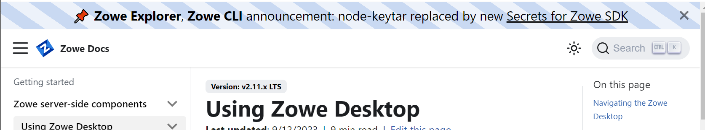

# Creating and removing a Zowe Docs banner message

Follow these instructions to create and remove a banner message from the Zowe Docs site.

## First, the banner request

There are times when we need a site-wide banner message on Zowe Docs to alert users of a major change or event.

These banner messages display on a temporary basis, for a period of time agreed to by the Zowe Technical Steering Committee (TSC). Before a banner can be published, a request for the banner must first be made to the Doc Squad and eventually approved by the TSC.

### Banner request process

1. A request is submitted to the Doc Squad with a [Banner Request issue](https://github.com/zowe/docs-site/issues/new?assignees=&labels=&projects=&template=---doc-site-banner-request.md&title=) on GitHub.
2. The Doc Squad reviews the request and works with the requester to finalize message content, style, and publication schedule.
3. The banner request goes before the TSC for review and approval.
4. The Doc Squad publishes the banner message on the approved display date and remains on the Zowe Docs site for the approved period of time.

## Creating the banner message

Once the banner request has been approved by the TSC, it is time for the Doc Squad to create the banner and make it ready for publication.

To create the banner message, you must edit the `docusaurus.config.js` file.

Depending on the changes you make, you also might need to edit the `custom.css` file.

### Editing the docusaurus config file

1. In the `docs-site` repository, find the `docusaurus.config.js` file and open it.

2. After `themeConfig: {:` (in Line 26), add the following code:

    ```
    announcementBar: {
        id: 'announcementBar-1', // increment on change
        content:
            '📌  <ADD MESSAGE HERE>',
        textColor: '#000',
        },
    ```

    Replace <ADD MESSAGE HERE\> with your message.

3. Run a local build of the site to check how the message displays.

    If you want to change the font and background styles, edit the `custom.css` file.
### Editing the custom css code

When should you edit the css? If you want to change the current font and background styles for the banner, you must edit the `custom.css` file. If you want to leave things unchanged, there is no need to edit the `custom.css` file.

To help decide which option to take, run a local build of the site to check how the custom css displays your message.

To edit the custom css:

1. Navigate to the `src/css` directory and open the `custom.css` file.
2. Scroll to the very end of the file and enter the following:

    ```
    @media (min-width: 997px) {
    :root {
    --docusaurus-announcement-bar-height: 1.8em !important;
    }
    }
    div[class^='announcementBar_'] {
    font-weight: 400;
    font-size: 1.5em;
    background: repeating-linear-gradient(35deg,#edf2fa,#edf2fa 20px,#c9d9f2 10px, #c9d9f2 40px) !important;
    }
    ```
3. If necessary, change the font and background colors to suit the tone of the message. Use colors listed in the [Zowe Colors pallette](https://docs.zowe.org/stable/contribute/guidelines-ui/colors).

    For example:
    - Use blue hues for neutral messages.
    - Use yellow hues for cautionary messages.
    - Use red hues for warning messages.

## Example of a Zowe Docs banner

You might find it helpful to reference the code and style of our first Zowe Docs banner to help you create a new banner.

The following code was used in the `docusaurus.config.js` file after Line 26:

    ```
    announcementBar: {
        id: 'announcementBar-1', // increment on change
        content:
            '📌  <b>Zowe Explorer</b>, <b>Zowe CLI</b> announcement: node-keytar  replaced by new <a target="_blank" rel="noopener noreferrer" href="https://github.com/zowe/zowe-cli/blob/master/packages/secrets/OVERVIEW.md">Secrets for Zowe SDK</a>',
        textColor: '#000',
        },
    ```
The following code was added at the end of the `custom.css` file:

    ```
    @media (min-width: 997px) {
    :root {
    --docusaurus-announcement-bar-height: 1.8em !important;
    }
    }
    div[class^='announcementBar_'] {
    font-weight: 400;
    font-size: 1.5em;
    background: repeating-linear-gradient(35deg,#edf2fa,#edf2fa 20px,#c9d9f2 10px, #c9d9f2 40px) !important;
    }
    ```

The two files rendered the banner in the following display:



## Removing a Zowe Docs banner

1. In the `docs-site` repository, find the `docusaurus.config.js` file and open it.

2. Remove the code added in the [docusaurus config file](#editing-the-docusaurus-config-file) instructions.
