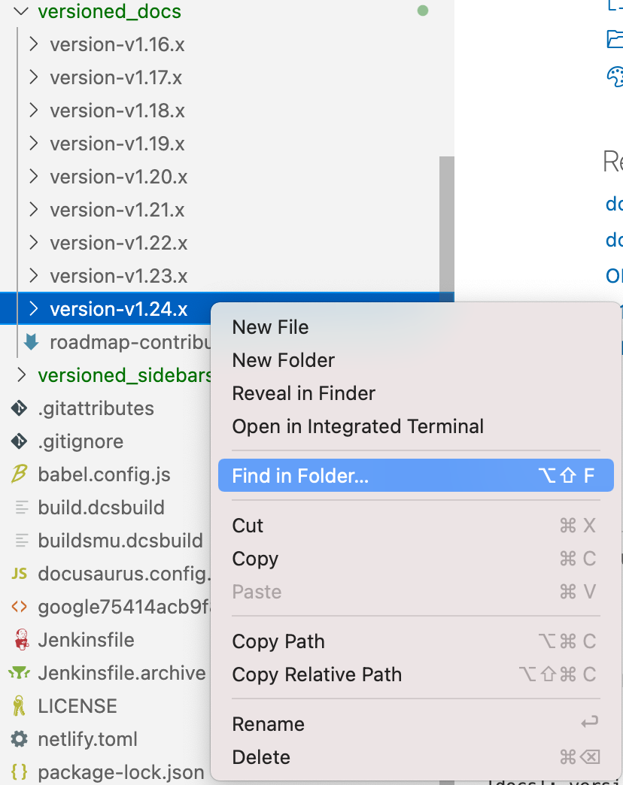
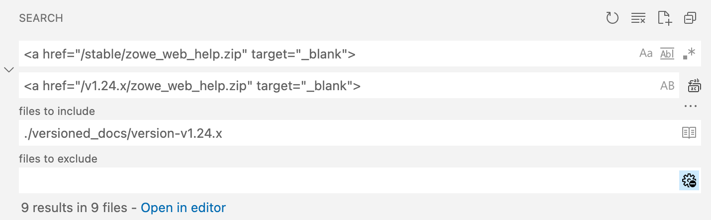
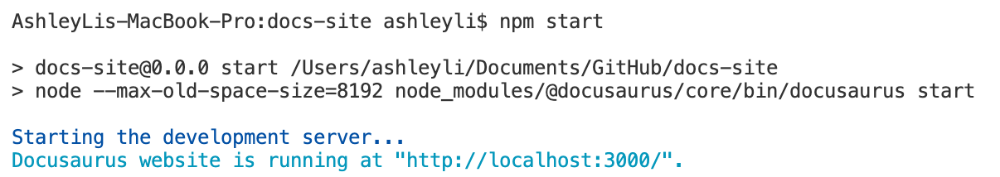

# How to manage doc for a major Zowe release

Major Zowe releases follow a similar publication process to that of minor releases: content is staged, and then that content is published to the live Zowe Docs site.

What is quite different about updating documentation for a major release is the amount and type of prep work required. To improve the chances of a smoother publication process, you will want to start preparing the doc work for a major release at least a year ahead of the major release GA date.

Zowe major releases are typically done about every two years or so. Minor releases take place about once a calendar quarter.

The publication process for minor releases is documented in the [Release handbook](release_handbook.md).

For major Zowe releases, follow the process outlined here.

## Major release publication process

1. At least a year before the major release GA, Doc Squad works together to create a release strategy.
    - Strategy to include:
        - Schedule for reviewing existing content for any needed modifications
        - Schedule for when modifications should be drafted, reviewed, and completed
        - Complete inventory of Zowe Docs content and the people who are responsible for ensuring that content is ready for the major release.
        - Assignment of responsibilities.
2. Create a new branch based off the `master` branch to be dedicated to the major release documentation. Open the new branch in Visual Studio Code.
    - For example, `v3-doc-branch` was used for the Zowe V3 release.
3. Archive the documentation for the most recent (minor) release by taking the following steps in this order:
    - In the Terminal, run `npm run docusaurus docs:version <version>`.

        - *\<version>* is the version number of the previous release.

            Example: At the time you create the new branch, Zowe 3.5 is the latest version for the current major release. That means the command must be issued as `npm run docusaurus docs:version v3.5.x`

        - When the command completes, it returns the message `[docs]: version v3.5.x created!`

        - The document versioning mechanism has:
            * Copied the full `docs/` folder contents into a new `versioned_docs/version-v3.5.x/` folder.
            * Created a versioned `sidebars` file based from your current sidebar configuration. The file is saved as `versioned_sidebars/version-v3.5.x-sidebars.json`.
            * Appended the new version number to the `versions.json` file.

    - Archive the `/static` files:
        1. Go to the `/static` folder.
        2. Create an empty directory with the name of the previous version in `/static`. For example: `static/v3.5.x`.
        3. Copy all contents of the `/static/stable` directory and paste them in the previous version's empty directory in the previous step. For example: `/static/v3.5.x`.

    - Update a set of links in the archived documentation to ensure that they refer to the correct location:

        1. To do this, switch to the archived directory. In our example, that's `versioned_docs/version-v3.5.x`.
    
        2. Update several locations in the archived docs to refer to the correct release, the 3.5 release (in our example case).

            **Tip**: Use the **Find** function of Visual Studio Code editor to make the updates. In our example, you can right-click the `versioned_docs/version-v3.5.x` folder and then select **Find in Folder...**.

            

            - Search all instances of `<a href="/stable/web_help/index.html" target="_blank">` and replace `stable` in the link with the previous version before adding the new version. Example: `<a href="/v3.5.x/web_help/index.html" target="_blank">`.
        
                

            - Search all instances of `<a href="/stable/CLIReference_Zowe.pdf" target="_blank">` and replace `stable` with the previous version before adding the new version. Example: `<a href="/v3.5.x/CLIReference_Zowe.pdf" target="_blank">`.

                

            - Search all instances of `<a href="/stable/zowe_web_help.zip" target="_blank">` and replace `stable` with the previous version before adding the new version. Example: `<a href="/v3.5.x/zowe_web_help.zip" target="_blank">`.

                

    3. Verify that the archived version works:
        1. Run `npm install`.
        2. Run `npm start` to build the site locally and clear any errors.

            

            **NOTE:** When the local build displays in your web browser, expect to see the previous minor release version listed twice in the Zowe Docs version drop-down menu. You will fix this in Step 4.

4. Bump the version of docs to the new major version (example: v4.0) by taking the following steps in this order:
    - Navigate to the `/docusaurus.config.js` file.
    - Change the `LATEST_VERSION` variable present in Line 1 of the `/docusaurus.config.js` file to the new major version.
    - Locate the presets: `> @docusaurus/preset-classic" > docs > versions` in the `/docusaurus.config.js` file to include the previous version in the list.
        - Create an entry label for the previous version.
            Example: If version v3.5.x docs is getting updated to v4.0.x, then v3.5.x will be appended between `current` and `v3.4.x` in the following format:

            ```
            presets: [
                [
                "@docusaurus/preset-classic",
                {
                    docs: {
                    path: "docs",
                    sidebarPath: require.resolve("./sidebars.js"),
                    editUrl: "https://github.com/zowe/docs-site/edit/master/",
                    showLastUpdateAuthor: false,
                    showLastUpdateTime: true,
                    routeBasePath: "/",
                    lastVersion: "current",
                    versions: {
                        current: {
                        path: "stable",
                        label: `${LATEST_VERSION}` + " LTS",
                        },
                        "v3.5.x": {
                        label: "v3.5.x LTS",
                        },
                        "v3.4.x": {
                        label: "v3.4.x LTS",
                        },
            ```

    - Open the `versions.json` file. Confirm that the previous release version number was added to the top of the list. (This is typically done automatically by the command issued in Step 3.) If not, manually add the version number. For example:

        ```
        [
        "v3.5.x",
        "v3.4.x",
        "v3.3.x",
        "v3.2.x",
        "v3.1.x",
        "v3.0.x"
        ]
        ```

5. Create placeholder files to prep for the release notes and TPSRs:
    - In Visual Studio Code, add the release notes placeholder file for the new major release:
        1. Go to `/docs/whats-new/release-notes`.
        2. Create a file for the new version and add the outline to the document. For example: `/docs/whats-new/release-notes/v4_0_0.md`

            To insert the outline, copy and paste the template from the [Release Notes guide](release_notes_guide.md). Ensure that you update the date and release version numbers included in the template.

        3. Open the `sidebars.js` file and add the new page to the release notes section.
            ```
            {
            type: "category",
            label: "Release notes",
            items: [
                "whats-new/release-notes/v4_0_0",
                "whats-new/release-notes/v3_5_0",
                "whats-new/release-notes/v3_4_0",
            ],
            },
            ```

    - Add the TPSR placeholder file.
        1. Go to the `/tpsr` directory.
        2. Add a new file for the new version. For example: `/tpsr/tpsr-v4.0.x.md`.
        3. Update the TPSR file URL the `sidebar.js` file:

            ```
            {
            type: "link",
            label: "Third Party Software Requirements",
            href: "https://github.com/zowe/docs-site/tree/master/tpsr/tpsr-v4.0.x.md",
            },
            ```

              **Note:** This is just a placeholder file. The day before GA, this file should be updated to include the information for the new release. Contact the Zowe release engineer to get the most up-to-date file.

    - Create a local build to confirm everything works in your temporary branch.

        1. Run `npm install`.
        2. Run `npm start` to build the site locally and clear any errors.
6. Create a PR in the `docs-site` repo to merge the new branch to the `docs-staging` branch. Set the PR to draft mode.
    - At this point, the branch becomes available to Zowe community members for them to make any needed doc updates. You should now decide what restrictions (if any) to put in place to protect the branch.
7. As the GA date for the major release approaches, continue to sync the new branch with `docs-staging`. Resolve any merge conflicts that show up. This might mean checking in with the Doc Squad to confirm which content is the correct content to merge.
8. The day or two before the GA date, perform Step 3 to include the last minor release of the previous major version.
9. The day or two before the GA date, contact the release engineer to get the TPSR file. Add the TPSR file contents to the TPSR placeholder file in the repo.
10. Publish the staged doc to the live site:
    - Change the PR you opened in Step 6 to **Ready for review** mode to merge the new branch into the `docs-staging` branch.
        - All checks **must** pass before merging. If any checks fail, troubleshoot with Doc Squad members or developers well familiar with the `docs-site` repo to resolve.
        - Any edits to the new major release doc now needs to be done in the `docs-staging` branch.
    - After the new branch is merged to `docs-staging`, create a PR to merge `docs-staging` into the `master` branch.
        - In your PR, do the following:
            - Add the Zowe release engineer to the reviewer list.
            - Add Zowe Doc Squad maintainers to the reviewer list.
            - Check the build status and notify the Doc Squad of any build problems or errors.
    - Once the PR checks all pass, notify the release engineer that the PR has been created and needs review. It is the engineer who will merge the PR once the new release is published.
    
        **Important**: Remind the engineer to merge the PR by selecting the **Create a merge commit** option.
        The engineer should **NOT** commit with a **Squash and merge**, which can lead to merge conflicts for later releases.

11. Perform post-publication tasks:
    - After the vNext content is live, create and publish a PDF of the content for new major release (v4.0, in our example):
        1. Follow the instructions in [Steps to manually generate PDF](pdf_generation_guide.md#steps-to-manually-generate-pdf-recommended).
        2. Create a new temporary branch to add the PDF to the `master` branch. Create and merge a PR in GitHub.
    - Check Zowe Docs to confirm the site works as expected. Confirm the following items:
        - The version dropdown menu includes all available versions
        - Release notes are current
        - The correct TPSRs are linked
        - The PDF for the current release can be downloaded and viewed
        - The Search functionality returns correct results
