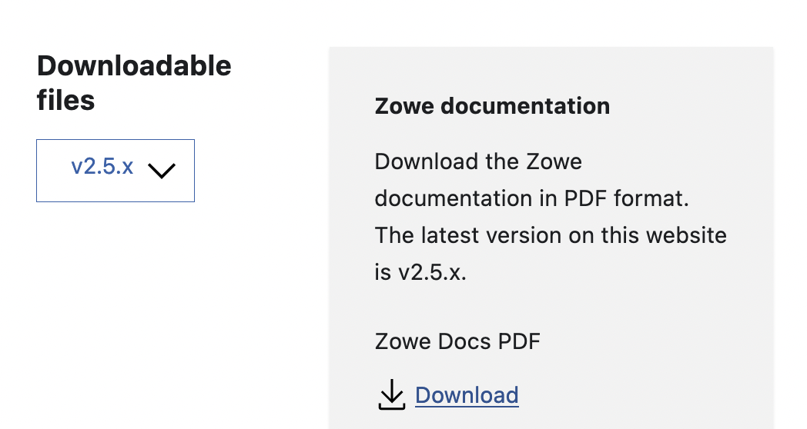

# Generate PDF

The Zowe Docs uses the [mr-pdf](https://github.com/kohheepeace/mr-pdf) to generate a downloadable PDF file. This document describes how to generate the PDF file by running some commands.

## Before you begin

- The PDF file contains all the content on the published doc site. 
- The PDF files are available for download in the landing/welcome page of the Zowe doc site. You can switch the version number and download the PDF file. 
  
- The PDF file is generated after a new release is published and doc site is refreshed. 
- Here is the naming rules of the files: 
   - If it's the PDF file for the latest version, simply use `zowe-docs.pdf`. 
   - For other versions, add the release number as suffix. For example, `zowe-docs-v2.3.x.pdf` or `zowe-docs-v1.28.x.pdf`. 

## Steps to manually generate PDF [Recommended]

1. Run the command to install project dependencies: `npm install`
2. Run the script to generate PDF using an online deployed links. (The script fetch the pages from https://docs.zowe.org):

To generate the PDF file for the most up-to-date release on the doc site (i.e. https://docs.zowe.org/stable/), run the following commands. You can customize the `--coverTitle` to include the version number. For example, `--coverTitle="Zowe Version 2.5 Documentation"`. 

```
npx mr-pdf --initialDocURLs="https://docs.zowe.org/stable/getting-started/overview,https://docs.zowe.org/stable/user-guide/install-overview,https://docs.zowe.org/stable/user-guide/zowe-getting-started-tutorial,https://docs.zowe.org/stable/extend/extend-zowe-overview,https://docs.zowe.org/stable/troubleshoot/troubleshooting,https://docs.zowe.org/stable/contribute/roadmap-contribute,https://docs.zowe.org/stable/appendix/zowe-cli-command-reference" --contentSelector="article" --paginationSelector=".pagination-nav__item--next > a" --excludeSelectors=".announcementBar_UUUQ,nav.navbar,.docSidebarContainer_3pwe,.docMainContainer_2pgU .col.col--3,footer.footer,.docItemContainer_2szM > .margin-vert--xl > .row > .col:first-child,.pagination-nav,.docsRating,.navbar__inner,.thin-scrollbar" --coverImage="https://docs.zowe.org/img/zowe-icon.png" --coverTitle="Zowe Documentation" --outputPDFFilename="static/zowe-docs.pdf"
```

To generate the PDF file for a previous version, replace the links with the release specific doc links and run the commands. For example, version 1.28.x, run the following commands: 

```
npx mr-pdf --initialDocURLs="https://docs.zowe.org/v1.28.x/getting-started/overview,https://docs.zowe.org/v1.28.x/user-guide/install-overview,https://docs.zowe.org/v1.28.x/user-guide/zowe-getting-started-tutorial,https://docs.zowe.org/v1.28.x/extend/extend-zowe-overview,https://docs.zowe.org/v1.28.x/troubleshoot/troubleshooting,https://docs.zowe.org/v1.28.x/contribute/roadmap-contribute,https://docs.zowe.org/v1.28.x/appendix/zowe-cli-command-reference" --contentSelector="article" --paginationSelector=".pagination-nav__item--next > a" --excludeSelectors=".announcementBar_UUUQ,nav.navbar,.docSidebarContainer_3pwe,.docMainContainer_2pgU .col.col--3,footer.footer,.docItemContainer_2szM > .margin-vert--xl > .row > .col:first-child,.pagination-nav,.docsRating,.navbar__inner,.thin-scrollbar" --coverImage="https://docs.zowe.org/img/zowe-icon.png" --coverTitle="Zowe Version 1.28.x Documentation" --outputPDFFilename="static/zowe-docs-v1.28.x.pdf"
```

## Steps to automatically generately PDF [Potential Issue]

1. Run the command to install project dependencies: `npm install`
2. Run `npm start` to view the site locally
3. Run `npm run docs:pdf` to pass the local site & generate PDF. 

NOTE: A [community plugin](https://github.com/kohheepeace/mr-pdf) is being used to generate the PDFs, which contain some bugs.
Currently internal links within the PDF are redirecting to the online site if PDF generated uses online deployed links.
If local build is passed to generate the PDF. The internal links redirect to localhost://3000/page .

Related issue: https://github.com/kohheepeace/mr-pdf/issues/18
Once this issue has been resolved we shall use Jenkins to leverage the PDF pipeline.

## What to do next

After generated, the PDF file should be stored in the `docs-site/static` folder. You can create a PR to publish it. 