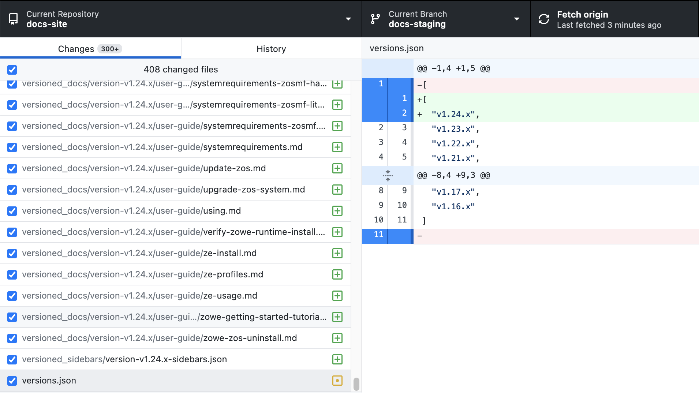
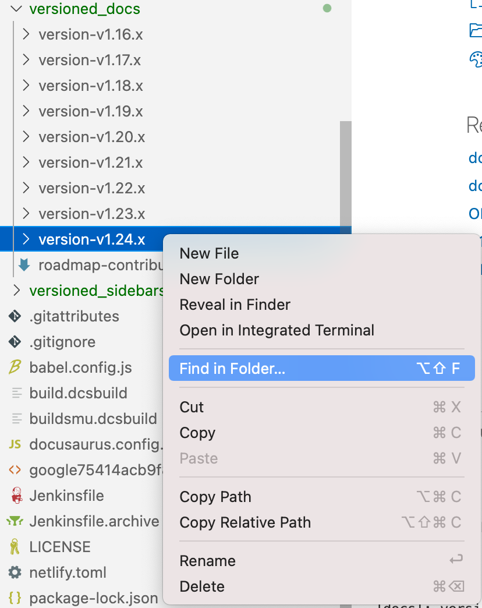
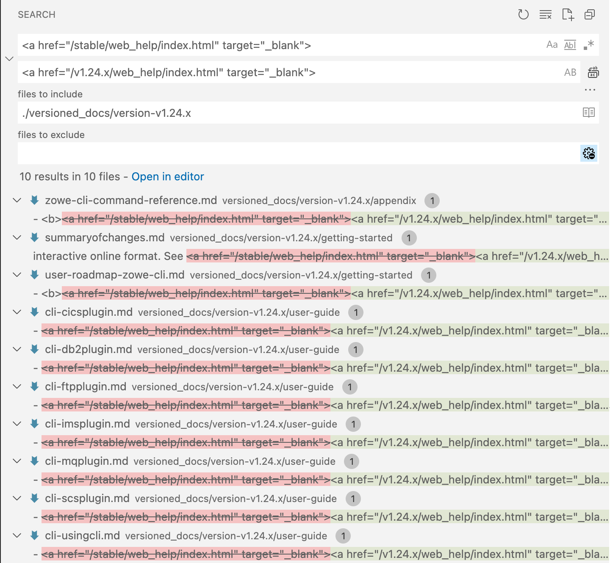
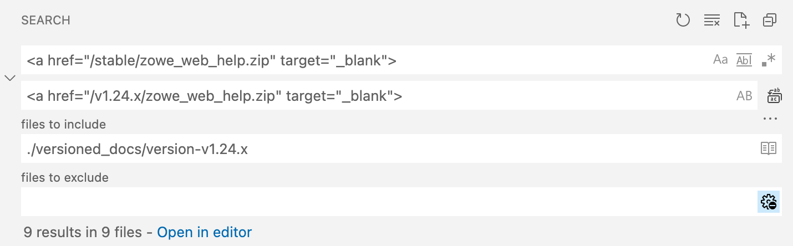
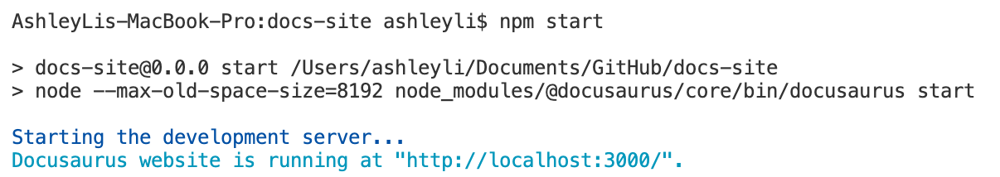

# Release handbook

Learn how to handle the documentation for Zowe releases.

- [Release communication](#release-communication)
- [Preparing documentation for a new release](#preparing-documentation-for-a-new-release)
    - [Before you begin](#before-you-begin)
    - [Part 1: Archive the previous release doc](#part-1-archive-the-previous-release-doc)
    - [Part 2: Bump the release version](#part-2-bump-the-release-version)
    - [Part 3: Prepare new release files](#part-3-prepare-new-release-files)
    - [What to do next](#what-to-do-next)
- [Sycn changes between releases](#sycn-changes-between-releases)
- [Publish documentation for a new release](#publish-documentation-for-a-new-release)
- [Remove archived version](#remove-archived-version)

## Release schedule 

The Zowe community communicates the release schedule in several ways. 
- [Zowe release cadence document](https://github.com/zowe/community/blob/master/Project%20Management/Schedule/Zowe%20PI%20%26%20Sprint%20Cadence.md) 
- [#zowe-release](https://openmainframeproject.slack.com/archives/G01M2C8QB3K) Slack channel (private for only release leads. Contact the CICD squad lead for invitation and access.)

Release contacts are as follows:  

- Release engineer: OJ Celis (Slack @OJ Celis)

For each release, Zowe documentation should define a doc delivery schedule with several key checkpoints. Code freeze date is not doc freeze date. The doc usually freezes 1 day before the GA date to allow time for doc build testing and issue fix. We also define a freeze date for release notes which is usually 3 days before the GA date to allow time for review. 

The following schedule takes release version 2.4 as an example: 

```
2.4
Code Freeze 2022/10/04
RC Build 2022/10/05
Release Notes Freeze 2022/10/14  (3 days before GA, 2 days for review)
Doc Freeze 2022/10/16  (1 day before GA)
GA/Doc Publish  2022/10/17
```

## Preparing documentation for a new release

This information guides you to archive the documentation of the previous version and tag a new version. 

### Before you begin

The vNext release documentation is hosted in the `docs-staging` branch. The `docs-staging` branch is merged to the `master` branch when a release is published. 

Once a new release rolls out, the `docs-staging` branch should be updated to get prepared for the next release. The updates include but are not limited to the following aspects:

- Archive the previous cversion documentation
- Bump the release version number to vNext
- Create placeholder files and folders for the vNext release, such as release notes document and TPSR document

The following steps takes v1.25 release prepration as an example. v1.24 was released a day ago, now we will prepare the `docs-staging` branch for the v1.25 release. An example commit for the steps can be found in [this](https://github.com/zowe/docs-site/commit/7f3dc7a938609d84f15d3ad6e67198155d0de029) commit. 

### Part 1: Archive the previous release doc

1. Go to the `docs-staging` branch. 
2. Navigate to the `/docs-site` directory. 
3. Run the following command:
   
   ```npm run docusaurus docs:version <version>```

   where, _version_ is the version number of the previous release. In our example, this is `v1.24.x` so the command looks like this: 

   ```npm run docusaurus docs:version v1.24.x```

   When it completes, you’ll see a message `[docs]: version v1.24.x created!` 

By doing this, the document versioning mechanism will:

* Copy the full `docs/` folder contents into a new `versioned_docs/version-<version>/` folder.
* Create a versioned sidebars file based from your current sidebar configuration - saved as `versioned_sidebars/version-<version>-sidebars.json`.
* Append the new version number to `versions.json`.

Here is an example of the changes when viewed in GitHub Desktop.



4. Archive the `/static` files. 
    
   1. Go to the `/static` folder. 
   2. Create an empty directory with the name of Previous version in `/static`. Example: static/v1.24.x.
   3. Copy all contents of the `/static/stable` directory and paste them in the Previous version's empty directory in the above step. Example: /static/v1.24.x.

4. Next, update some links in the archived documentation to ensure that they refer to the correct location. To do this, switch to the archived directory. In our example, `versioned_docs/version-v1.24.x`. Update several locations in the archived docs to refer to the 1.24 release. 

   **Tip**: It's recommended that you use the Find function of Visual Studio Code editor to make the update. In our example, you can right-click the `versioned_docs/version-v1.24.x` folder and then select **Find in Folder**. 

   

   * Search all instances of `<a href="/stable/web_help/index.html" target="_blank">` and replace `stable` in the link with the previous version before adding the new version. Example: `<a href="/v1.24.x/web_help/index.html" target="_blank">`.
   
     

   * Search all instaces of `<a href="/stable/CLIReference_Zowe.pdf" target="_blank">` and replace `stable` with the previous version before adding the new version. Example: `<a href="/v1.24.x/CLIReference_Zowe.pdf" target="_blank">`.

     

   * Search all instaces of `<a href="/stable/zowe_web_help.zip" target="_blank">` and replace `stable` with the previous version before adding the new version. Example: `<a href="/v1.24.x/zowe_web_help.zip" target="_blank">`. 

     

5. Verify that the archived version works. Run `npm start` to build the site locally and clear any errors. 

   

Next, let's bump the version of docs to a new version (example: v1.25). 

### Part 2: Bump the release version

1. Navigate to the `/docusaurus.config.js` file. 
2. Change the `LATEST_VERSION` variable present in `/docusaurus.config.js` to a new version. 
3. Locate the presets: > @docusaurus/preset-classic" > docs > versions. Create a Previous version's entry label. Example: if version v1.24.x docs is getting updated to v1.25.x. Then v1.24.x will be appended between current & v1.23.x in the following format:

```
presets: [
    [
      "@docusaurus/preset-classic",
      {
        docs: {
          path: "docs",
          sidebarPath: require.resolve("./sidebars.js"),
          editUrl: "https://github.com/zowe/docs-site/edit/master/",
          showLastUpdateAuthor: false,
          showLastUpdateTime: true,
          routeBasePath: "/",
          lastVersion: "current",
          versions: {
            current: {
              path: "stable",
              label: `${LATEST_VERSION}` + " LTS",
            },
            "v1.24.x": {
              label: "v1.24.x LTS",
            },
            "v1.23.x": {
              label: "v1.23.x LTS",
            },
```

4. Go to the `versions.json` file. Add the previous release version number at the top of the list. For example, 

```
  [
  "v1.24.x",
  "v1.23.x",
  "v1.22.x",
  "v1.21.x",
  "v1.20.x",
  "v1.19.x"
  ]
  ```

### Part 3: Prepare new release files

1. Add the release notes placeholder file for the new version. 
    1. Go to `/docs/getting-started/release-notes`. 
    2. Create a file for the new version and add the outline to the document. For example: `/docs/getting-started/release-notes/v1_25.md`

       Populate the release notes file with the basic outline. Copy and paste the template from the [Release Notes guide](release_notes_guide.md). Ensure that you update the release version number in the template. 

    3. Go to `sidebars.js` file and add the new topic to the release notes section.    
    ```
    {
      type: "category",
      label: "Release notes",
      items: [
        "getting-started/release-notes/v1_25",
        "getting-started/release-notes/v1_24",
        "getting-started/release-notes/v1_23",
        "getting-started/summaryofchanges",
      ],
    },
    ```

3. Add the TPSR placeholder file. 
    1. Go to the `/tpsr` directory. 
    2. Add a new file for the new version. For example: `/tpsr/tpsr-v1.25.x.md`. 

    **Note:** This is just a placeholder file. Once the RC build is available, this file should be updated to include the information for the new release. 

4. Build the site to check that no error occurs. 

Done! The site setup for the new release version is now complete. 

### What to do next 

Next, you must inform the squad and community that the branch for the vNext release is ready for doc changes. Post an announcement in the Slack channel [#zowe-doc](https://openmainframeproject.slack.com/archives/CC961JYMQ). 

## Sycn changes between releases

Before the new release is published, you need to cherry-pick changes from the `master` branch periodically into the `docs-staging` branch to ensure that important changes are incorporated into the next release. The changes could include but are not limited to: 

- Late-coming doc changes that go to the `master` branch directly after the GA. 

   For example, a feature doc for v1.24 didn't catch the GA date and two days after the v1.24 GA, the doc was published directly to master. In this case, it should be synchronized back to the docs-staging branch as these changes also apply to the next release. 
- Doc fixes into the `master` branch, such as broken links, typos, doc editings. 
- Doc enhancements into the `master` branch, such as refactoring, edits, new troubleshooting tips, etc. 

## Publish documentation for a new release

The documentation for the new release is published with the build simultaneously. 

Usually 1 week before the GA date of the new release, create a PR to merge the `docs-staging` branch to the `master` branch and do the following:

- Add the Zowe release engineer to the reviewer list. Check out the [release communication](#release-communication) section for up-to-date names. 
- Add Zowe Doc Squad maintainers to the reivewer list. 
- Check the build status and send build issues to the doc squad. 

Usually 2 days before the GA date, review the [release checklist](#release-checklist) for the release to ensure that all items are complete. 

### Release checklist

|Checkpoint | Due Date | Details
|--|--|--|
|New version doc setup               | Right after a release is published |See the [Preparing documentation for a new release](#preparing-documentation-for-a-new-release) on the `docs-staging` branch |  
|Relnotes: CHANGELOG update cutoff   | 3 days before GA | Doc squad to work with squads to complete review | 
|Relnotes: Draft review              | 3 days before GA | First run of release notes. Squad leads review the draft. | 
|Zowe CLI: Update web help and type doc |  | Zowe CLI squad
|Update TPSR                         |  | Work with CICD squad. See [Updating TPSR](#updating-tpsr) for how-to. 
|Doc freeze, PR for publish ready    | 1 day before GA | All release PRs merged. Action: Inform CI/CD squad of the doc PR number. Add CICD members as a reviewer of the PR. 
|Doc publish                         | GA day | Work with CICD squad to merge the doc PR. 
|Doc validation                      | Once published | Check that the doc site has been refreshed correctly. 
|Release promotion                   |  | Slack, LinkedIn, Twitter, etc
|System demo                         |  | See the [OMP Calendar](https://lists.openmainframeproject.org/g/zowe-dev/calendar) for details.  
|Write release blog, upload release demo video                  |  | Convert the system demo recording into a blog. 
|Add release demo video and blog link back in the release notes | Once the video and blog is published | Go to the release notes and add the links. For example, `Release demo: Check out the Zowe demo video for v1.24.0 to see a demo of what's new in this release. Release blog: Read this blog Zowe 1.24 Release Highlights written by Joe Winchester for a deeper dive of the major enhancements and changes for this release.` 

## Removing archived version

Removing archived version is necessary once two new versions are released to reduce total deploy & build time. It is advisable to keep latest **8-9 versions only** in the `master` branch to avoid build failure.

- Remove the specific version from `/versions.json` file.
- Delete the specific complete version folder from `/versioned_docs` directory. Example: `versioned_docs/version-v1.17.x.`
- Delete the versioned sidebars JSON file from `/versioned_sidebars`. Example: `versioned_sidebars/version-v1.17.x-sidebars.json`.
- Delete the specific version's static files from `/static` directory. Example: `static/v1.17.x`.
- Add the specific version entry in `versionsArchived.json` file. Example: `"v1.17.x LTS": "https://zowe-archived-docs.netlify.app/v1.17.x/getting-started/overview"`.
- Navigate to the `/docusaurus.config.js` file and locate the `presets:` > `@docusaurus/preset-classic"` > `docs` > `versions`.
  Delete the definition of that version which is specified in the following format:

  ```
   "v1.17.x": {
     label: "v1.17.x LTS",
   },
  ```

## Updating TPSR

Pick up the latest licenses file from this location: https://zowe.jfrog.io/zowe/libs-release-local/org/zowe/licenses/. Open the release folder and download the `zowe_licenses_full.zip` file. 

Extract the file and copy the content into the placeholder TPSR document for the release in the /tpsr folder. 