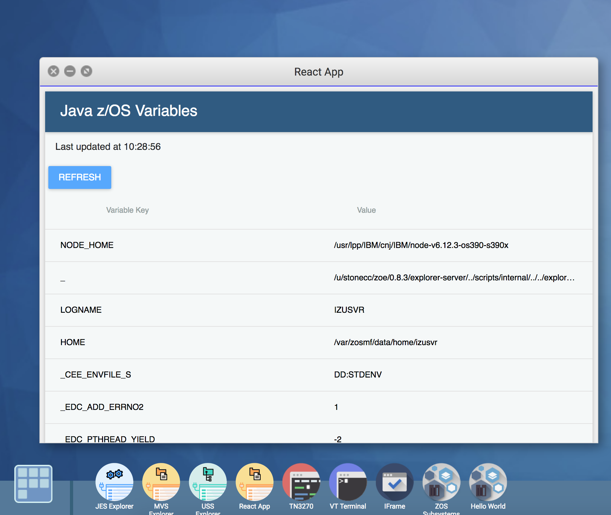

# Creating a Zowe integrated ReactJS UI

One of the great things about working with Zowe is that you can include any UI's that you have already developed in your Zowe Virtual Desktop. In this blog we look at how we do this and also show how to take advantage of a Restful API created on a JEE server within the Zowe environment.



Take a look at the [Creating a RestAPI with Swagger documentation using Liberty](../extend-api/libertyAPI.md) tutorial for the background to the Restful API with Swagger documentation we will be using.

## Prerequisite skills

Knowledge of the following development technologies is beneficial:

- React
- Redux
- Consuming Rest API's

## Examining the App Structure

First download the sample app found [here](https://github.com/zowe/webui-scenarios/tree/master/basic-react). We will not be examining the entire sample, but it is included as an example and boilerplate that can be built off of.

Looking at the sample app their are 2 main sections that are important to us:

- Constants.js
- actions/actions.js.

### Constants.js

Lets first examine Constants.js.

```javascript
let host = '<host>:<port>'
if (typeof location !== 'undefined') {
  const hostname = location.hostname
  if (hostname !== 'localhost') {
    host = location.host
  }
}

export const BASE_SERVER_URL = host
export const BASE_URL = `https://${host}`
export const BASE_WS_URL = `wss://${host}`
```

Notice that here we are setting our 'host' for the app. We are connecting to hypothetical server and the default port for the MVD 7445. This host then gets wrapped in a 'BASE_URL' constant that we can use in other sections of our app. Change this line to connect to your own server and port.

### Actions.js

Next lets look at calling our API created in the [creating a RestAPI with Swagger documentation using Liberty](libertyAPI.md) tutorial. Following Redux structure, this call will be in our action.js file. We won't be looking at the entire file, but instead the relevant fetch request.

```javascript
function fetchPosts(subreddit) {
  return dispatch => {
    dispatch(requestPosts(subreddit))
    let header = new Headers({
      'Access-Control-Allow-Origin': '*',
      'Content-Type': 'multipart/form-data'
    })
    return fetch(`${BASE_URL}/jzos/environmentVariable`, {
      header: header,
      credentials: 'include'
    })
      .then(response => response.json())
      .then(json => dispatch(receivePosts(subreddit, json)))
      .catch(error => console.log(error))
  }
}
```

Note that we are using the [fetch api](https://developer.mozilla.org/en-US/docs/Web/API/Fetch_API) to the grab the `environmentVariable` from the host that we defined before. We then make the rest of our app aware of the response using Redux's 'dispatch' method.

## Adding your App to the MVD

While the zlux environment comes with predefined "apps" and explorers, you also have the ability to extend the system and add your own apps.

### Building your App for the MVD.

Before we can place our app on the MVD, we need to first 'build' a production version of it and place it in a folder where Zowe can read it.
Zowe looks in a folder called 'web' when looking for an entry point to new apps.

In order to build and prepare your app:

1.  Run the `build` script in `package.json` using:

    - `npm run build`

2.  Create a folder for your project and a new `web` folder inside it.

    - EX: /Desktop/<Your_Project_Name> and Desktop/<Your_Project_Name>/web

3.  Copy built project into `Desktop/<Your_Project_Name>/web`
    - If using the sample, copy `app.min.js` , `index.html` , `icon.png` and `css` into to `/Desktop/<Your_Project_Name>/web/`

### Configuring your app for Zowe

In order for Zowe to be aware of an app, a pluginDefintion.json file must be included in the root of the project. This file lets Zowe know information about the framework used, reference files, and basic configuration for the app. Lets take a look at our pluginDefinition:

```json
{
  "identifier": "com.rs.basic-react",
  "apiVersion": "1.0",
  "pluginVersion": "1.0",
  "pluginType": "application",
  "webContent": {
    "framework": "iframe",
    "launchDefinition": {
      "pluginShortNameKey": "basic-react",
      "pluginShortNameDefault": "IFrame",
      "imageSrc": "icon.png"
    },
    "descriptionKey": "Sample App Showcasing IFrame Adapter",
    "descriptionDefault": "Sample App Showcasing IFrame Adapter",
    "startingPage": "index.html",
    "isSingleWindowApp": true,
    "defaultWindowStyle": {
      "width": 800,
      "height": 420,
      "x": 200,
      "y": 50
    }
  },
  "dataServices": []
}
```

Next add this pluginDefinition to the root of your project:

- EX: `Desktop/<Your_Project_Name>/`

### Explaining the Plugin file system

To add new apps, files must be added in two locations.

- Zowe root (`/zaas1/zowe/<build-number>`)
- Plugins Folder (`/zaas1/zowe/<build-number>/zlux-example-server/plugins`)

Inside the 'Plugins Folder' we will add our identifier named `com.basic-react.json`. Inside this json file the **plugin location** and the **identifier name** are specified. Our identifier will look like this:

```json
{
  "identifier": "com.rs.basic-react",
  "pluginLocation": "../../<basic-react>"
}
```

To add our app to the file system:

1.  Copy project from `/Desktop` to `<zowe_base>/` on your server

    - Use `scp <userID>@<server> /Users/path/to/files <zowe_base>/`
    - Alternatively this can be done using SFTP or the ZOS Explorer in binary mode.

2.  Create our identifier within the plugins folder (`<zowe_base>/zlux-example-server/plugins`):

    - `touch com.basic-react.json`

3.  Edit file with vi to read:

```json
{
  "identifier": "com.<basic-react>",
  "pluginLocation": "../../<basic-react>"
}
```

### Deploying your App

In order to deploy our newly added app,

1.  Run `./deploy.sh` found in `/zaas1/zowe/<build-number>/zlux-build`
2.  Run `./zowe-stop.sh` found in `/zaas1/zowe/<build-number>/scripts`
3.  Run `./zowe-start.sh` found in `/zaas1/zowe/<build-number>/scripts`

## Setting up the server for Development

:::warning
This next section should only be changed for development purposes.
:::

While not necessary depending on your system configuration, often will need to allow our server to accept incoming connections and avoid CORS errors.

In order to update the server to accept all connections:

- Navigate to `<zowe-base>/explorer-server/wlp/usr/servers/Atlas/server.xml`
- Open the file with vi and paste the following code in.

```javascript
<!-- FOR TESTING ONLY -->
    <cors allowCredentials="true" allowedMethods="GET, DELETE, POST, PUT, OPTIONS" allowedOrigins="*" allowedHeaders="*" domain="/"/>
<!-- /FOR TESTING ONLY -->
```

After adding this section, navigate to `https://<base>:<port>/ZLUX/plugins/com.rs.mvd/web/` and you should see your new app added to the MVD!
