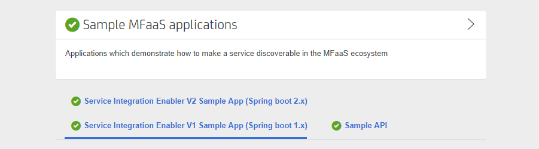
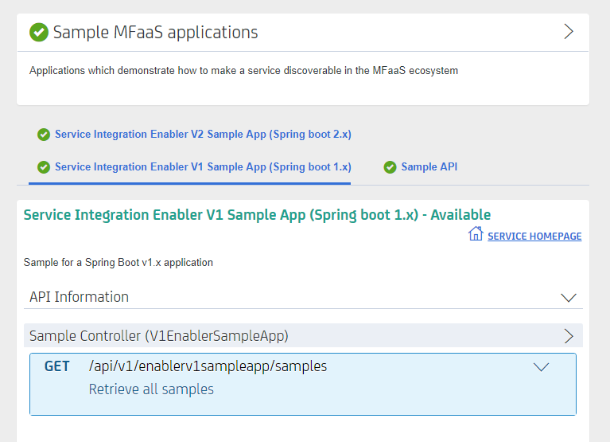
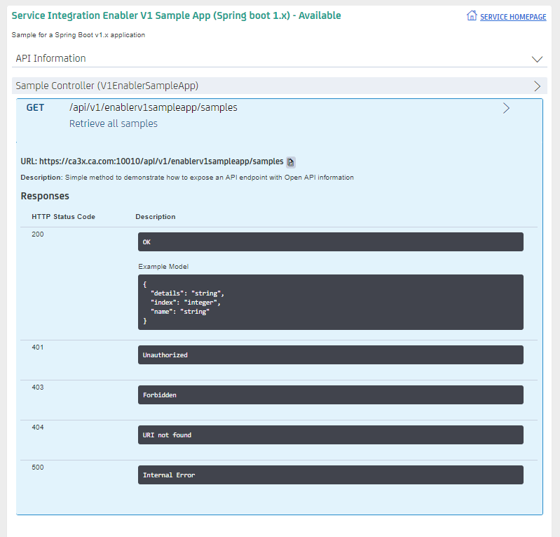

# API Catalog

As an application developer, use the API Catalog to view what services are running in the API Mediation Layer. Through the API Catalog, you can also view the associated API documentation corresponding to a service, descriptive information about the service, and the current state of the service. The tiles in the API Catalog are customized according to the configuration of the mfaas.catalog.ui section in the application.yml for a service. A microservice that is onboarded with the API Mediation Layer and configured appropriately, registers automatically with the API Catalog and a tile for that service is added to the Catalog.

## Prerequisite

* Ensure that the service you would like to view in the API Catalog is configured to be displayed in the API Catalog.

**Note:** For more information about how to configure the API Catalog in the application.yml, see: [Add API Onboarding Configuration](../../extend/extend-apiml/onboard-spring-boot-enabler.md).

## View a Service in the API Catalog 

Use the API Catalog to view services, API documentation, descriptive information about the service, the current state of the service, service endpoints, and detailed descriptions of these endpoints.

**Tip:** If the home page of the service is configured you can click Home Page to open the services home page.

**Follow these steps:**

1. Verify that your service is running. At least one started and registered instance with the Discovery Service is needed for your service to be visible in the API catalog.
2. In the API Catalog, find the tile that describes the product family of the API documentation that you are looking for.
   
    **Example:** `Sample Applications, Endevor, SDK Application` 
3. Click the tile. Header information and the registered services under that family ID is displayed.
    
    **Example:**
    

 **Note:** The state of the service is indicated in the tab. If at least one instance of the service is running, the state of the service is represented with a checkmark . If no instances of the service are currently running the state of the service is represented as an 'x' . At least one instance of a service must be started and registered with the discovery service for it to be visible in the API Catalog. If a service was started and the corresponding API documentation was viewed, then that information is cached and is visible even when the service and all instances are stopped.  
4. Click the tab to view the API documentation for that service.
   Descriptive information about the service and a link to the home page of the service is displayed.
5. Expand the panel to see the high-level description of the API and endpoint groups.

    **Example:** 
    
    
    
6. Expand the endpoints to see a detailed description of the endpoints including the responses and parameters of each endpoint.
   The summary of the endpoint and the full structure of the endpoint including the base URL and description of the endpoint is displayed.
   
   **Note:** If a lock is visible, the endpoint requires authentication.
   
   **Example:**
   
   
   The structure of the endpoint is displayed relative to the base URL.
   
   **Example:**
   
   In the Endpoint panel header section, the abbreviated endpoint relative to the base URL is displayed as the following path:
   ```aidl
    /api/v1/discoverableclient/movies/list
   ```
   A full URL that includes the base URL is also displayed as the following path:
   ```aidl
    https://hostName:basePort/api/v1/discoverableclient/movies/list
   ```
   Both links target the same endpoint location.
