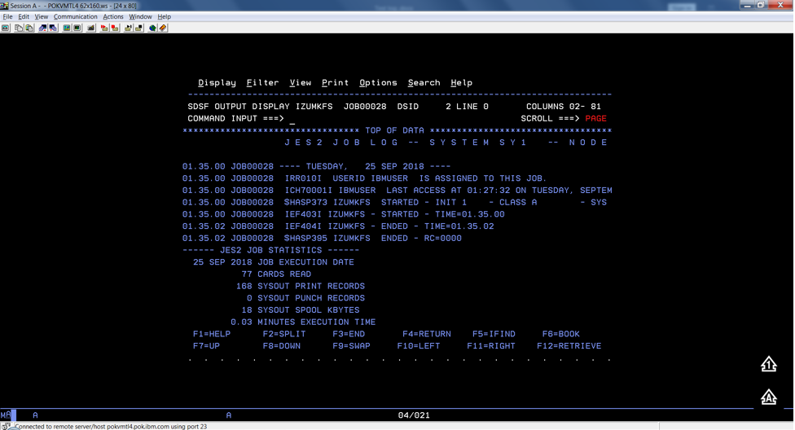
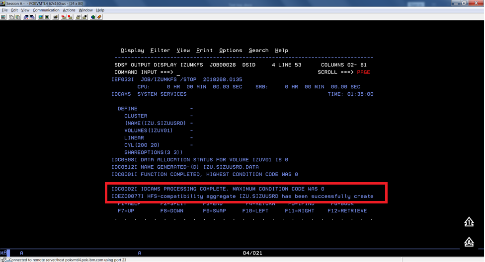
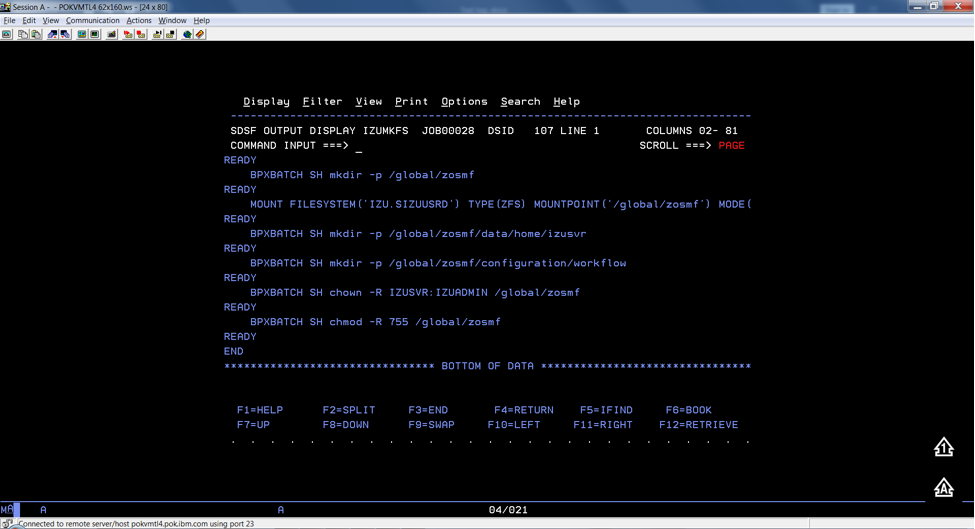
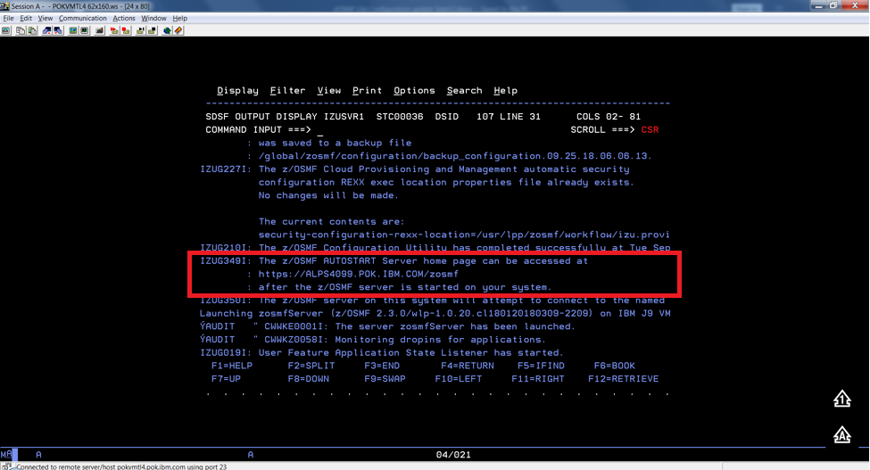

# Configuring z/OSMF Lite (for non-production use)

This section provides information about requirements for z/OSMF Lite configuration. 

**Disclaimer:** z/OSMF Lite can be used in a non-production environment such as development, proof-of-concept, demo and so on. It is not for use in a production environment. To use z/OSMF in a production environment, see [Configuring z/OSMF](systemrequirements-zosmf.md). 

- [Configuring z/OSMF Lite (for non-production use)](#configuring-zosmf-lite-for-non-production-use)
  - [Introduction](#introduction)
  - [Assumptions](#assumptions)
  - [Software Requirements](#software-requirements)
    - [Minimum Java level](#minimum-java-level)
    - [WebSphere® Liberty profile (z/OSMF V2R3 and later)](#websphere-liberty-profile-zosmf-v2r3-and-later)
    - [System settings](#system-settings)
    - [Web browser](#web-browser)
  - [Creating a z/OSMF nucleus on your system](#creating-a-zosmf-nucleus-on-your-system)
    - [Running job IZUNUSEC to create security](#running-job-izunusec-to-create-security)
      - [Before you begin](#before-you-begin)
      - [Procedure](#procedure)
      - [Results](#results)
      - [Common errors](#common-errors)
    - [Running job IZUMKFS to create the z/OSMF user file system](#running-job-izumkfs-to-create-the-zosmf-user-file-system)
      - [Before you begin](#before-you-begin-1)
      - [Procedure](#procedure-1)
      - [Results](#results-1)
      - [Common errors](#common-errors-1)
    - [Copying the IBM procedures into JES PROCLIB](#copying-the-ibm-procedures-into-jes-proclib)
      - [Before you begin](#before-you-begin-2)
      - [Procedure](#procedure-2)
      - [Results](#results-2)
      - [Common errors](#common-errors-2)
    - [Starting the z/OSMF server](#starting-the-zosmf-server)
      - [Before you begin](#before-you-begin-3)
      - [Procedure](#procedure-3)
      - [Results](#results-3)
    - [Accessing the z/OSMF Welcome page](#accessing-the-zosmf-welcome-page)
      - [Before you begin](#before-you-begin-4)
      - [Procedure](#procedure-4)
      - [Results](#results-4)
      - [Common errors](#common-errors-3)
    - [Mounting the z/OSMF user file system at IPL time](#mounting-the-zosmf-user-file-system-at-ipl-time)
      - [Before you begin](#before-you-begin-5)
      - [Procedure](#procedure-5)
      - [Results](#results-5)
  - [Adding the required REST services](#adding-the-required-rest-services)
    - [Enabling the z/OSMF JOB REST services](#enabling-the-zosmf-job-rest-services)
      - [Procedure](#procedure-6)
      - [Results](#results-6)
      - [Common errors](#common-errors-4)
    - [Enabling the TSO REST services](#enabling-the-tso-rest-services)
      - [Before you begin](#before-you-begin-6)
      - [Procedure](#procedure-7)
      - [IZUTSSEC](#izutssec)
      - [Results](#results-7)
    - [Enabling the z/OSMF data set and file REST services](#enabling-the-zosmf-data-set-and-file-rest-services)
      - [Before you begin](#before-you-begin-7)
      - [Procedure](#procedure-8)
      - [Results](#results-8)
      - [Common errors](#common-errors-5)
    - [Enabling the z/OSMF Workflow REST services and Workflows task UI](#enabling-the-zosmf-workflow-rest-services-and-workflows-task-ui)
      - [Before you begin](#before-you-begin-8)
      - [Procedure](#procedure-9)
      - [Results](#results-9)
  - [Troubleshooting problems](#troubleshooting-problems)
    - [Common problems and scenarios](#common-problems-and-scenarios)
      - [System setup requirements not met](#system-setup-requirements-not-met)
    - [Tools and techniques for troubleshooting](#tools-and-techniques-for-troubleshooting)
      - [Common messages](#common-messages)
  - [Appendix A. Creating an IZUPRMxx parmlib member](#appendix-a-creating-an-izuprmxx-parmlib-member)
  - [Appendix B. Modifying IZUSVR1 settings](#appendix-b-modifying-izusvr1-settings)
  - [Appendix C. Adding more users to z/OSMF](#appendix-c-adding-more-users-to-zosmf)
    - [Before you Begin](#before-you-begin-9)
    - [Procedure](#procedure-10)
    - [Results](#results-10)

- [Appendix A. Creating an IZUPRMxx parmlib member](#appendix-a-creating-an-izuprmxx-parmlib-member)
- [Appendix B. Modifying IZUSVR1 settings](#appendix-b-modifying-izusvr1-settings)
- [Appendix C. Adding more users to z/OSMF](#appendix-c-adding-more-users-to-z-osmf)

## Introduction
IBM® z/OS® Management Facility (z/OSMF) provides extensive system management
functions in a task-oriented, web browser-based user interface with integrated
user assistance, so that you can more easily manage the day-to-day operations
and administration of your mainframe z/OS systems.

By following the steps in this guide, you can quickly enable z/OSMF on your z/OS
system. This simplified approach to set-up, known as "z/OSMF Lite", requires
only a minimal amount of z/OS customization, but provides the key functions that
are required by many exploiters, such as the open mainframe project (Zowe&trade;). 

A z/OSMF Lite configuration is applicable to any future expansions you make to
z/OSMF, such as adding more optional services and plug-ins.

It takes 2-3 hours to set up z/OSMF Lite. Some steps might require the
assistance of your security administrator.

For detailed information about various aspects of z/OSMF configuration such as
enabling the optional plug-ins and services, see the IBM publication [_z/OSMF Configuration Guide_](https://www.ibm.com/support/knowledgecenter/en/SSLTBW_2.3.0/com.ibm.zos.v2r3.izua300/toc.htm).

## Assumptions

This document is intended for a first time z/OSMF setup. If z/OSMF is already configured
on your system, you do not need to create a z/OSMF Lite configuration.

This document is designed for use with a single z/OS system, not a z/OS sysplex. If you plan to run z/OSMF in a sysplex, see [_z/OSMF Configuration Guide_](https://www.ibm.com/support/knowledgecenter/en/SSLTBW_2.3.0/com.ibm.zos.v2r3.izua300/toc.htm) for multi-system considerations.

It is assumed that a basic level of security for z/OSMF is sufficient on the z/OS system. IBM provides a program, IZUNUSEC, to help you set up basic security for a z/OSMF Lite configuration.


System defaults are used for the z/OSMF environmental settings. Wherever possible, it is recommended that you use the default values. If necessary, however, you can override the defaults by supplying an IZUPRMxx member, as described in [Appendix A. Creating an IZUPRMxx parmlib member](#appendix-a-creating-an-izuprmxx-parmlib-member).  

It is recommended that you use the following procedures as
provided by IBM:

-   Started procedures IZUSVR1 and IZUANG1

-   Logon procedure IZUFPROC

Information about installing these procedures is provided in [Copying the IBM procedures into JES PROCLIB](#copying-the-ibm-procedures-into-jes-proclib).

## Software Requirements

Setting up z/OSMF Lite requires that you have access to a z/OS V2R2 system or later. Also, your z/OS system must meet the following minimum software requirements:

- [Minimum Java level](#minimum-java-level)
- [WebSphere® Liberty profile (z/OSMF V2R3 and later)](#websphere®-liberty-profile-z-osmf-v2r3-and-later)
- [System settings](#system-settings)
- [Web browser](#web-browser)

### Minimum Java level

Java™ must be installed and operational on your z/OS system, at the required minimum level. See the table that follows for the minimum level and default location. If you installed Java in another location, you must specify the JAVA_HOME statement in your IZUPRMxx parmlib member, as described in [Appendix A. Creating an IZUPRMxx parmlib member](#appendix-a-creating-an-izuprmxx-parmlib-member).   

**z/OS Version** | **Minimum level of Java™**  | **Recommended level of Java**  | **Default location**  
---|---|---|---
z/OS V2R2 | IBM® 64-bit SDK for z/OS®, Java Technology Edition V7.1 (SR3), with the PTFs for APAR PI71018 and APAR PI71019 applied **OR** IBM® 64-bit SDK for z/OS®, Java Technology Edition V8, with the PTF for APAR PI72601 applied.                                 | IBM® 64-bit SDK for z/OS®, Java™ Technology Edition, V8 SR6 (5655-DGH) | `/usr/lpp/java/J7.1_64`
z/OS V2R3        | IBM® 64-bit SDK for z/OS®, Java™ Technology Edition, V8 SR4 FP10 (5655-DGH) | IBM® 64-bit SDK for z/OS®, Java™ Technology Edition, V8 SR6 (5655-DGH) | `/usr/lpp/java/J8.0_64`


### WebSphere® Liberty profile (z/OSMF V2R3 and later)


z/OSMF V2R3 uses the Liberty Profile that is supplied with z/OS, rather than its own copy of Liberty. The WebSphere Liberty profile must be mounted on your z/OS system. The default mount point is: `/usr/lpp/liberty_zos`. To determine whether WebSphere® Liberty profile is mounted, check for the existence of the mount point directory on your z/OS system.

If WebSphere® Liberty profile is mounted at a non-default location, you need to specify the location in the IZUSVR1 started procedure on the keyword **WLPDIR=**. For details, see [Appendix B. Modifying IZUSVR1 settings](#appendix-b-modifying-izusvr1-settings).

Note: Whenever you apply PTFs for z/OSMF, you might be prompted to install outstanding WebSphere Liberty service. It is recommended that you do so to maintain z/OSMF functionality.

### System settings

Ensure that the z/OS host system meets the following requirements:

-   Port 443 (default port) is available for use.

-   The system host name is unique and maps to the system on which z/OSMF Lite will be configured.

Otherwise, you might encounter errors later in the process. If you encounter errors, see [Troubleshooting problems](#troubleshooting-problems) for the corrective actions to take.

### Web browser

For the best results with z/OSMF, use one of the following web browsers on your workstation:

-   Microsoft Internet Explorer Version 11 or later

-   Microsoft Edge (Windows 10)

-   Mozilla Firefox ESR Version 52 or later.

To check your web browser's level, click **About** in the web browser.

## Creating a z/OSMF nucleus on your system

The following system changes are described in this chapter:

- [Running job IZUNUSEC to create security](#running-job-izunusec-to-create-security)
- [Running job IZUMKFS to create the z/OSMF user file system](#running-job-izumkfs-to-create-the-z-osmf-user-file-system)
- [Copying the IBM procedures into JES PROCLIB](#copying-the-ibm-procedures-into-jes-proclib)
- [Starting the z/OSMF server](#starting-the-z-osmf-server)
- [Accessing the z/OSMF Welcome page](#accessing-the-z-osmf-welcome-page)
- [Mounting the z/OSMF user file system at IPL time](#mounting-the-z-osmf-user-file-system-at-ipl-time)


The following sample jobs that you might use are included in the package and available for download:

- IZUAUTH
- IZUICSEC
- IZUNUSEC_V2R2
- IZUNUSEC_V2R3
- IZUPRM00
- IZURFSEC
- IZUTSSEC
- IZUWFSEC

[**Download sample jobs**](https://docs.zowe.org/stable/zosmf_lite_samples.zip)

Check out the video for a demo of the process:

<iframe class="embed-responsive-item" id="youtubeplayer" title="Creating a z/OSMF nucleus on your system demo" type="text/html" width="100%" height="365" src="https://www.youtube.com/embed/ebJb9RR9x9c" frameborder="0" webkitallowfullscreen="true" mozallowfullscreen="true" allowfullscreen="true"> </iframe>

### Running job IZUNUSEC to create security

The security job IZUNUSEC contains a minimal set of RACF® commands for creating security profiles for the z/OSMF nucleus. The profiles are used to protect the resources that are used by the z/OSMF server, and to grant users access to the z/OSMF core functions. IZUNUSEC is a simplified version of the sample job IZUSEC, which is intended for a more complete installation of z/OSMF.

**Note:** If your implementation uses an external security manager other than RACF (for example, Top Secret or ACF2), provide equivalent commands for your environment. For more information, see the following  product documentation:

- [Configure z/OS Management Facility for Top Secret](https://docops.ca.com/ca-top-secret-for-z-os/16-0/en/installing/configure-z-os-management-facility-for-ca-top-secret)
- [Configure z/OS Management Facility for ACF2](https://techdocs.broadcom.com/us/en/ca-mainframe-software/security/ca-acf2-for-z-os/16-0/installing/configure-z-os-management-facility-for-ca-acf2.html)

#### Before you begin

In most cases, you can run the IZUNUSEC security job without modification. To verify that the job is okay to run as is, ask your security administrator to review the job and modify it as necessary for your security environment. If security is not a concern for the host system, you can run the job without modification.

#### Procedure

1.	If you run z/OS V2R2 or V2R3, download job IZUNUSEC in the [sample jobs package](https://docs.zowe.org/stable/zosmf_lite_samples.zip) and upload this job to z/OS. If you run z/OS V2R4, locate job IZUNUSEC at SYS1.SAMPLIB.
2.	Review and edit the job, if necessary.
3.	Submit IZUNUSEC as a batch job on your z/OS system.  
4.	Connect your user ID to IZUADMIN group. 
    1. Download job IZUAUTH in the [sample jobs package](https://docs.zowe.org/stable/zosmf_lite_samples.zip) and customize it.
    2. Replace the 'userid' with your z/OSMF user ID. 
    3. Submit the job on your z/OS system.


#### Results

Ensure the IZUNUSEC job completes with return code `0000`.

To verify, check the results of the job execution in the job log. For example, you can use SDSF to examine the job log:  

1.  In the SDSF primary option menu, select Option ST.

2.  On the SDSF Status Display, enter **S** next to the job that you
    submitted.

3.  Check the return code of the job. The job succeeds if '0000' is returned.

#### Common errors

Review the following messages and the corresponding resolutions as needed:

**Symptom** | **Cause**  | **Resolution**  
---|---|---
Message IKJ56702I: INVALID data is issued | The job is submitted more than once.| You can ignore this message.
Job fails with an authorization error. | Your user ID lacks superuser authority.             | Contact your security admin to run IZUNUSEC. If you are using RACF®, select a user ID with SPECIAL attribute which can issue all RACF® commands.
Job fails with an authorization error. | Your installation uses the RACF PROTECT-ALL option. | See [Troubleshooting problems](#troubleshooting-problems).         
ADDGROUP and ADDUSER commands are not executed. |  The automatic GID and UID assignment is required. | Define SHARED.IDS and BPX.NEXT.USER profiles to enable the use of AUTOUID and AUTOGID.                                              


### Running job IZUMKFS to create the z/OSMF user file system

The job IZUMKFS initializes the z/OSMF user file system, which contains
configuration settings and persistence information for z/OSMF.

The job mounts the file system. On a z/OS V2R3 system with the PTF for APAR
PI92211 installed, the job uses mount point `/global/zosmf`. Otherwise, for an
earlier system, the job mounts the file system at mount point `/var/zosmf`.

#### Before you begin

To perform this step, you need a user ID with "superuser" authority on the z/OS
host system. For more information about how to define a user with superuser
authority, see the publication [_z/OS UNIX System Services_](https://www.ibm.com/support/knowledgecenter/en/SSLTBW_2.3.0/com.ibm.zos.v2r3.bpx/bpx.htm).

#### Procedure

1.  In the system library `SYS1.SAMPLIB`, locate job IZUMKFS.

2.  Copy the job.

3.  Review and edit the job:
    - Modify the job information so that the job can run on your system.
    - You must specify a volume serial (VOLSER) to be used for allocating a data set for the z/OSMF data directory.

3.  Submit IZUMKFS as a batch job on your z/OS system.


#### Results

The z/OSMF file system is allocated, formatted, and mounted, and
the necessary directories are created.

To verify if the file system is allocated, formatted, locate the following messages in IZUMKFS job output.

```
IDC0002I IDCAMS PROCESSING COMPLETE. MAX CONDITION CODE WAS 0.

IOEZ00077I HFS-compatibility aggregate izu.sizuusrd has been successfully created.
```
Sample output:







#### Common errors

Review the following messages and the corresponding resolutions as needed

**Symptom**   | **Cause**    | **Resolution**       
---|---|---
Job fails with FSM error. | Your user ID lacks superuser authority. | For more information about how to define a user with superuser authority, see the publication [_z/OS UNIX System Services_](https://www.ibm.com/support/knowledgecenter/en/SSLTBW_2.3.0/com.ibm.zos.v2r3.bpx/bpx.htm).
Job fails with an authorization error. | Job statement errors.                   | See [Troubleshooting problems](#troubleshooting-problems).      

### Copying the IBM procedures into JES PROCLIB

Copy the z/OSMF started procedures and logon procedure from SYS1.PROCLIB into
your JES concatenation. Use `$D PROCLIB` command to display your JES2 PROCLIB definitions. 

#### Before you begin

Locate the IBM procedures. IBM supplies procedures for z/OSMF in your z/OS
order:

-   ServerPac and CustomPac orders: IBM supplies the z/OSMF procedures in the
    SMP/E managed proclib data set. In ServerPac and SystemPac, the default name for the data set is
    SYS1.IBM.PROCLIB.

-   CBPDO orders: For a CBPDO order, the SMP/E-managed proclib data set is named as SYS1.PROCLIB.

-   Application Development CD.

#### Procedure

Use ISPF option 3.3 or 3.4 to copy the procedures from SYS1.PROCLIB into your JES
concatenation.

-   IZUSVR1

-   IZUANG1

-   IZUFPROC

#### Results

The procedures now reside in your JES PROCLIB.

#### Common errors

Review the following messages and the corresponding resolutions as needed

**Symptom**   | **Cause** | **Resolution**
---|---|---
Not authorized to copy  into PROCLIB.     |      Your user ID doesn't have the permission to modify PROCLIB.     |      Contact your security administrator.                   
Abend code B37 or E37. |     The data set runs out of space.      |          Use IEBCOPY utility to compress PROCLIB dataset before you copy it.                     


### Starting the z/OSMF server

z/OSMF processing is managed through the z/OSMF server, which runs as the
started tasks IZUANG1 and IZUSVR1. z/OSMF is started with the START command.

####  Before you begin

Ensure that you have access to the operations console and can enter the START
command.

####  Procedure

In the operations console, enter the START commands sequentially:

```
S IZUANG1

S IZUSVR1
```

Note: The z/OSMF angel (IZUANG1) must be started before the z/OSMF server
(IZUSVR1).

You must enter these commands manually at subsequent IPLs. If necessary, you can
stop z/OSMF processing by entering the STOP command for each of the started
tasks IZUANG1 and IZUSVR1.

Note: z/OSMF offers an autostart function, which you can configure to have the z/OSMF server started automatically. For more information about the autostart capability, see [_z/OSMF Configuration Guide_](https://www.ibm.com/support/knowledgecenter/SSLTBW_2.3.0/com.ibm.zos.v2r3.izua300/toc.htm).

####  Results

When the z/OSMF server is initialized, you can see the following messages
displayed in the operations console:

```
CWWKB0069I: INITIALIZATION IS COMPLETE FOR THE IZUANG1 ANGEL PROCESS.

IZUG400I: The z/OSMF Web application services are initialized.

CWWKF0011I: The server zosmfServer is ready to run a smarter planet.
```             

### Accessing the z/OSMF Welcome page

At the end of the z/OSMF configuration process, you can verify the results of your work by opening a web browser to the Welcome page.

####  Before you begin

To find the URL of the Welcome page, look for message IZUG349I in the z/OSMF server job log.



#### Procedure

1.  Open a web browser to the z/OSMF Welcome page. The URL for the Welcome page
    has the following format: https://hostname:port/zosmf/

    Where:
    -   *hostname* is the host name or IP address of the system in which z/OSMF is
    installed.

    -   *port* is the secure port for the z/OSMF configuration. If you specified a
    secure port for SSL encrypted traffic during the configuration process
    through parmlib statement HTTP_SSL_PORT, port is required to log in.
    Otherwise, it is assumed that you use the default port 443.

2.  In the z/OS USER ID field on the Welcome page, enter the z/OS user ID that
    you use to configure z/OSMF.

3.  In the z/OS PASSWORD field, enter the password or pass phrase that is
    associated with the z/OS user ID.

4.	Select the style of UI for z/OSMF. To use the desktop interface, select this option. Otherwise, leave this option unselected to use the tree view UI.

5.  Click **Log In**.

####  Results

If the user ID and password or pass phrase are valid, you are authenticated to z/OSMF. The Welcome page of IBM z/OS Management Facility tab opens in the main area. At the top right of the screen, Welcome *<your_user_ID>* is displayed. In the UI, only the options you are allowed to use are displayed.

 

You have successfully configured the z/OSMF nucleus.


####  Common errors

The following errors might occur during this step:

**Symptom**    |**Cause**   |**Resolution**  
---|---|---
z/OSMF welcome page does not load in your web browser. | The SSL handshake was not successful. This problem can be related to the browser certificate. | See [Certificate error in the Mozilla Firefox browser](https://www.ibm.com/support/knowledgecenter/SSLTBW_2.3.0/com.ibm.zos.v2r3.izua300/IZUHPINFO_FirefoxCertificateError.htm).
To log into z/OSMF, enter a valid z/OS user ID and password. Your account might be locked after too many incorrect log-in attempts.| The user ID is not connected to the IZUADMIN group.  | Connect your user ID to the IZUADMIN group.                                
To log into z/OSMF, enter a valid z/OS user ID and password. Your account might be locked after too many incorrect log-in attempts. | The password is expired.       | Log on to TSO using your z/OS User ID and password, you will be asked to change your password if it's expired.          

### Mounting the z/OSMF user file system at IPL time

Previously, in [Running job IZUMKFS to create the z/OSMF user file system](#running-job-izumkfs-to-create-the-z-osmf-user-file-system), you ran job IZUMKFS to create and mount the z/OSMF user file system. Now you should ensure that the z/OSMF user file system is mounted automatically for subsequent IPLs. To do so, update the BPXPRMxx parmlib member on your z/OS system.

####  Before you begin

By default, the z/OSMF file system uses the name IZU.SIZUUSRD, and is mounted in read/write mode. It is recommended that this file system is mounted automatically at IPL time.

If you do not know which BPXPRMxx member is active, follow these steps to find out:

1.	In the operations console, enter the following command to see which parmlib members are included in the parmlib concatenation on your system:

     `D PARMLIB`

2.	Make a note of the BPXPRMxx member suffixes that you see.

3.	To determine which BPXPRMxx member takes precedence, enter the following command:

     `D OMVS`

  The output of this command should be similar to the following:

  ```
  BPXO042I 04.01.03 DISPLAY OMVS 391

  OMVS 000F ACTIVE OMVS=(ST,3T)
  ```

In this example, the member BPXPRMST takes precedence. If BPXPRMST is not present in the concatenation, member BPXPRM3T is used.  

####  Procedure

Add a MOUNT command for the z/OSMF user file system to your currently active
BPXPRMxx parmlib member. For example:

On a z/OS V2R3 system with the PTF for APAR PI92211 installed:
```
MOUNT FILESYSTEM('IZU.SIZUUSRD') TYPE(ZFS) MODE(RDWR)

MOUNTPOINT('/global/zosmf') PARM('AGGRGROW') UNMOUNT
```
On a z/OS V2R2 or V2R3 system without PTF for APAR PI92211 installed:
```
MOUNT FILESYSTEM('IZU.SIZUUSRD') TYPE(ZFS) MODE(RDWR)

MOUNTPOINT('/var/zosmf') PARM('AGGRGROW') UNMOUNT
```

####  Results

The BPXPRMxx member is updated. At the next system IPL, the following message is issued to indicate that the z/OSMF file system is mounted automatically.

```
BPXF013I FILE SYSTEM IZU.SIZUUSRD WAS SUCCESSFULLY MOUNTED. 
```

## Adding the required REST services

You must enable a set of z/OSMF REST services for the Zowe framework.

The following system changes are described in this topic:
- [Enabling the z/OSMF JOB REST services](#enabling-the-z-osmf-job-rest-services)
- [Enabling the TSO REST services](#enabling-the-tso-rest-services)
- [Enabling the z/OSMF data set and file REST services](#enabling-the-z-osmf-data-set-and-file-rest-services)
- [Enabling the z/OSMF Workflow REST services and Workflows task UI](#enabling-the-z-osmf-workflow-rest-services-and-workflows-task-ui)


### Enabling the z/OSMF JOB REST services

The Zowe framework requires that you enable the z/OSMF JOB REST services, as described in this topic.

#### Procedure
None

#### Results
To verify if the z/OSMF JOB REST services are enabled, open a web browser to our z/OS system (host name and port) and add the following REST call to the URL:

`GET /zosmf/restjobs/jobs`

The result is a list of the jobs that are owned by your user ID. For more information about the z/OSMF JOB REST services, see [_z/OSMF Programming Guide_](https://www.ibm.com/support/knowledgecenter/SSLTBW_2.3.0/com.ibm.zos.v2r3.izua700/IZUHPINFO_API_RESTJOBS.htm).


#### Common errors

Review the following messages and the corresponding resolutions as needed:

**Symptom 1**

401 Unauthorized

**Cause**

The user ID is not connected to IZUADMIN or IZUUSER. 

**Resolution**

Connect your user ID to IZUADMIN or IZUUSER.

**Symptom 2**

HTTP/1.1 500 Internal Server Error  {"rc":16,"reason":-1,"stack":"JesException: CATEGORY_CIM rc=16 reason=-1 cause=com.ibm.zoszmf.util.eis.EisConnectionException: IZUG911I: Connection to \"http:\/\/null:5988\" cannot be established, or was lost and cannot be re-established using protocol \"CIM\"......Caused by: WBEMException: CIM_ERR_FAILED (JNI Exception type CannotConnectException:\nCannot connect to local CIM server. Connection failed.)

**Cause**

For JES2, you may have performed one of the following "Modify" operations: Hold a job, Release a job, Change the job class, Cancel a job, Delete a job (Cancel a job and purge its output), or you are running JES3 without configuring CIM Server.

**Resolution**

If you are running JES2, you can use [_synchronous support for job modify operations_](https://www.ibm.com/support/knowledgecenter/en/SSLTBW_2.3.0/com.ibm.zos.v2r3.izua700/IZUHPINFO_API_RESTJOBS.htm#izuhpinfo_api_restjobs__RequestingSynchronousProcessing) which does not required CIM. If you are running JES3, follow the [_CIM setup instructions_](https://www.ibm.com/support/knowledgecenter/SSLTBW_2.3.0/com.ibm.zos.v2r3.izua300/IZUHPINFO_AdditionalCIMStepsForZOS.htm) to configure CIM on your system.

### Enabling the TSO REST services
The Zowe framework requires that you enable the TSO REST services, as described in this topic.

#### Before you begin

Ensure that the common event adapter component (CEA) of z/OS is running in full function mode.

1.	To check if the CEA address space is active, enter the following command:

  `D A,CEA`

2.	If not, start CEA in full function mode. For detailed instructions, see [_System prerequisites for the CEA TSO/E address space services_](https://www.ibm.com/support/knowledgecenter/SSLTBW_2.3.0/com.ibm.zos.v2r3.ieac100/prerequisites.htm).

3.	To verify that CEA is running in full function mode, enter the following command:

 `F CEA,D`

The output should look like the following:

```
CEA0004I COMMON EVENT ADAPTER 399  
STATUS: ACTIVE-FULL CLIENTS: 0 INTERNAL: 0  
EVENTS BY TYPE: \#WTO: 0 \#ENF: 0 \#PGM: 0  
TSOASMGR: ALLOWED: 50 IN USE: 0 HIGHCNT: 0
```

#### Procedure

1.	If you run z/OS V2R2 and V2R3, download job IZUTSSEC in the [sample jobs package](https://docs.zowe.org/stable/zosmf_lite_samples.zip) and upload this Job to z/OS. If you run z/OS V2R4, locate job IZUTSSEC at `SYS1.SAMPLIB`.
2.	Review and edit job IZUTSSEC before you submit. You can review the IZUTSSEC section below for more details.
3.	Submit IZUTSSEC as a batch job on your z/OS system.  

#### IZUTSSEC
IBM provides a set of jobs in `SYS1.SAMPLIB` with sample RACF commands to help with your z/OSMF configuration and its prerequisites. The IZUTSSEC job represents the authorizations that are needed for the z/OSMF TSO/E address space service. Your security administrator can edit and run the job.
Generally, your z/OSMF user ID requires the same authorizations for using the TSO/E address space services as when you perform these operations through a TSO/E session on the z/OS system. For example, to start an application in a TSO/E address space requires that your user ID be authorized to operate that application.
In addition, to use TSO/E address space services, you must have:
-   READ access to the account resource in class ACCTNUM, where account is the value specified in the COMMON_TSO ACCT option in parmlib.
-   READ access to the CEA.CEATSO.TSOREQUEST resource in class SERVAUTH.
-   READ access to the proc resource in class TSOPROC, where proc is the value specified with the COMMON_TSO PROC option in parmlib.
-   READ access to the <SAF_PREFIX>.*.izuUsers profile in the EJBROLE class. Or, at a minimum, READ access to the <SAF_PREFIX>.IzuManagementFacilityTsoServices.izuUsers resource name in the EJBROLE class.
You must also ensure that the z/OSMF started task user ID, which is IZUSVR by default, has READ access to the CEA.CEATSO.TSOREQUEST resource in class SERVAUTH.
To create a TSO/E address space on a remote system, you require the following authorizations:
-   You must be authorized to the SAF resource profile that controls the ability to send data to the remote system (systemname), as indicated:
CEA.CEATSO.FLOW.systemname
-   To flow data between different systems in the sysplex, you must be authorized to do so by your external security manager, such as a RACF database with sysplex-wide scope. For example, to flow data between System A and System B, you must be permitted to the following resource profiles:
    - CEA.CEATSO.FLOW.SYSTEMA
    - CEA.CEATSO.FLOW.SYSTEMB

#### Results
The IZUTSSEC job should complete with return code 0000.


###  Enabling the z/OSMF data set and file REST services

The Zowe framework requires that you enable the z/OSMF data set and file REST services.

#### Before you begin

1.  Ensure that the message queue size is set to a large enough value. It is recommended that you specify an IPCMSGQBYTES value of at least 20971520 (20M) in BPXPRMxx. 
    
    Issue command `D OMVS,O` to see the current value of IPCMSGQBYTES, if it is not large enough, use the `SETOMVS` command to set a large value. To set this value dynamically, you can enter the following operator command:

    `SETOMVS IPCMSGQBYTES=20971520`

2.  Ensure that the TSO REST services are enabled.

3.  Ensure that IZUFPROC is in your JES concatenation.

4.  Ensure that your user ID has a TSO segment defined. To do so, enter the following command from TSO/E command prompt:

    `LU userid TSO`

 Where *userid* is your z/OS user ID.

The output from this command must include the section called **TSO
information**, as shown in the following example:

```
TSO LU ZOSMFAD TSO NORACF

4:57:17 AM: USER=ZOSMFAD

TSO INFORMATION

---------------

ACCTNUM= 123412345

PROC= OMVSPROC

SIZE= 02096128

MAXSIZE= 00000000

USERDATA= 0000

 ***
```

#### Procedure

1.	If you run z/OS V2R2 and V2R3, download job IZURFSEC in the [sample jobs package](https://docs.zowe.org/stable/zosmf_lite_samples.zip) and upload it to z/OS. If you run z/OS V2R4, locate job IZURFSEC at `SYS1.SAMPLIB`.
2.	Copy the job.
3.	Examine the contents of the job.
4.	Modify the contents as needed so that the job will run on your system.
5.	From the TSO/E command line, run the IZURFSEC job.


#### Results

Ensure that the IZURFSEC job completes with return code `0000`.

To verify if this setup is complete, try issuing a REST service. See the example in [_List data sets_](https://www.ibm.com/support/knowledgecenter/SSLTBW_2.3.0/com.ibm.zos.v2r3.izua700/IZUHPINFO_API_GetListDataSets.htm) in the z/OSMF programming guide.  

#### Common errors

Review the following messages and the corresponding resolutions as needed:

**Symptom**      | **Cause**                               | **Resolution**
---|---|---
REST API doesn't return expected data with rc=12, rsn=3, message: message queue size  "SIZE"  is less than minimum: 20M       | The message queue size for CEA is too small. | Ensure that the message queue size is set to a large enough value. It is recommended that you specify an IPCMSGQBYTES value of at least 20971520 (20M) in BPXPRMx.                        
   

### Enabling the z/OSMF Workflow REST services and Workflows task UI
The Zowe framework requires that you enable the z/OSMF Workflow REST services and Workflows task UI.

#### Before you begin

1.  Ensure that the JOB REST services are enabled.
2.  Ensure that the TSO REST services are enabled.
3.  Ensure that the dataset and file REST services are enabled.

#### Procedure

1.	If you run z/OS V2R2 and V2R3, download job IZUWFSEC in the [sample jobs package](https://docs.zowe.org/stable/zosmf_lite_samples.zip) and upload this job to z/OS. If you run z/OS V2R4, locate job IZUWFSEC at `SYS1.SAMPLIB`.
2.	Copy the job.
3.	Examine the contents of the job.
4.	Modify the contents as needed so that the job will run on your system.
5.	From the TSO/E command line, run the IZUWFSEC job.

#### Results

Ensure the IZUWFSEC job completes with return code `0000`.

To verify, log on to z/OSMF (or refresh it) and verify that the Workflows task appears in the z/OSMF UI.
         

At this point, you have completed the setup of z/OSMF Lite.

Optionally, you can add more users to z/OSMF, as described in [Appendix C. Adding more users to z/OSMF](#appendix-c-adding-more-users-to-z-osmf).


## Troubleshooting problems

This section provides tips and techniques for troubleshooting problems you might encounter when creating a z/OSMF Lite configuration. For other types of problems that might occur, see [_z/OSMF Configuration Guide_](https://www.ibm.com/support/knowledgecenter/SSLTBW_2.3.0/com.ibm.zos.v2r3.izua300/toc.htm).

### Common problems and scenarios
This section discusses troubleshooting topics, procedures, and tools for recovering from a set of known issues.

#### System setup requirements not met
This document assumes that the following is true of the z/OS host system:

-   Port 443 is available for use. To check this, issue either TSO command `NETSTAT SOCKET` or TSO command `NETSTAT BYTE` to determine if the port is being used.

-   The system host name is unique and maps to the system on which z/OSMF Lite is being installed. To retrieve this value, enter either "hostname" z/OS UNIX command or TSO command "HOMETEST". If your system uses another method of assigning the system name, such as a multi-home stack, dynamic VIPA, or System Director, see [_z/OSMF Configuration Guide_](https://www.ibm.com/support/knowledgecenter/SSLTBW_2.3.0/com.ibm.zos.v2r3.izua300/toc.htm).

-   The global mount point exists. On a z/OS 2.3 system, the system includes this directory by default. On a z/OS 2.2 system, you must create the global directory at the following location: `/global/zosmf/`.

If you find that a different value is used on your z/OS system, you can edit the IZUPRMxx parmlib member to specify the correct setting. For details, see [Appendix A. Creating an IZUPRMxx parmlib member](#appendix-a-creating-an-izuprmxx-parmlib-member).

### Tools and techniques for troubleshooting

For information about working with z/OSMF log files, see [_z/OSMF Configuration Guide_](https://www.ibm.com/support/knowledgecenter/SSLTBW_2.3.0/com.ibm.zos.v2r3.izua300/toc.htm).

#### Common messages

```
ICH420I PROGRAM CELQLIB FROM LIBRARY CEE.SCEERUN2 CAUSED THE ENVIRONMENT
 TO BECOME UNCONTROLLED.  
 
BPXP014I ENVIRONMENT MUST BE CONTROLLED FOR DAEMON (BPX.DAEMON)         
PROCESSING. 
```

If you see above error messages, check if your IZUANG0 procedure is up to date.

For descriptions of all the z/OSMF messages, see [_z/OSMF messages_](https://www.ibm.com/support/knowledgecenter/en/SSLTBW_2.3.0/com.ibm.zosmfmessages.help.doc/izuG00hpMessages.html) in IBM Knowledge Center.


## Appendix A. Creating an IZUPRMxx parmlib member

If z/OSMF requires customization, you can modify the applicable settings by using the IZUPRMxx parmlib member. To see a sample member, locate the IZUPRM00 member in the SYS1.SAMPLIB data set. IZUPRM00 contains settings that match the z/OSMF defaults.

Using IZUPRM00 as a model, you can create a customized IZUPRMxx parmlib member for your environment and copy it to SYS1.PARMLIB to override the defaults.

The following IZUPRMxx settings are required for the z/OSMF nucleus:

-   HOSTNAME

-   HTTP_SSL_PORT

-   JAVA_HOME.

The following setting is needed for the TSO/E REST services:

-   COMMON_TSO ACCT(IZUACCT) REGION(50000) PROC(IZUFPROC)

Descriptions of these settings are provided in the table below. For complete details about the IZUPRMxx settings and the proper syntax for updating the member, see [_z/OSMF Configuration Guide_](https://www.ibm.com/support/knowledgecenter/SSLTBW_2.3.0/com.ibm.zos.v2r3.izua300/toc.htm).

If you change values in the IZUPRMxx member, you might need to customize the started procedure IZUSVR1, accordingly. For details, see [Appendix B. Modifying IZUSVR1 settings](#appendix-b-modifying-izusvr1-settings).  


To create an IZUPRMxx parmlib member, follow these steps:

1.  Copy the sample parmlib member into the desired parmlib data set with the desired suffix.

2.  Update the parmlib member as needed.

3.  Specify the IZUPRMxx parmlib member or members that you want the system to use on the IZU parameter of IEASYSxx. Or, code a value for IZUPRM= in the IZUSVR1 started procedure. If you specify both IZU= in IEASYSxx and IZUPARM= in IZUSVR1, the system uses the IZUPRM= value you specify in the started procedure.

**Setting**|**Purpose**|**Rules**|**Default**             
---|---|---|---|
HOSTNAME(*hostname*) | Specifies the host name, as defined by DNS, where the z/OSMF server is located. To use the local host name, enter asterisk (\*), which is equivalent to \@HOSTNAME from previous releases. If you plan to use z/OSMF in a multisystem sysplex, IBM recommends using a dynamic virtual IP address (DVIPA) that resolves to the correct IP address if the z/OSMF server is moved to a different system. | Must be a valid TCP/IP HOSTNAME or an asterisk (\*).                        | Default: \*
HTTP_SSL_PORT(nnn)   | Identifies the port number that is associated with the z/OSMF server. This port is used for SSL encrypted traffic from your z/OSMF configuration. The default value, 443, follows the Internet Engineering Task Force (IETF) standard. **Note:** By default, the z/OSMF server uses the SSL protocol SSL_TLSv2 for secure TCP/IP communications. As a result, the server can accept incoming connections that use SSL V3.0 and the TLS 1.0, 1.1 and 1.2 protocols. | Must be a valid TCP/IP port number. Value range: 1 - 65535 (up to 5 digits) | Default: 443  
COMMON_TSO ACCT(*account-number*) REGION(*region-size*) PROC(*proc-name*)|Specifies values for the TSO/E logon procedure that is used internally for various z/OSMF activities and by the Workflows task.|The valid ranges for each value are described in [_z/OSMF Configuration Guide_](https://www.ibm.com/support/knowledgecenter/SSLTBW_2.3.0/com.ibm.zos.v2r3.izua300/toc.htm).|Default: 443 ACCT(IZUACCT) REGION(50000) PROC(IZUFPROC)
USER_DIR=*filepath*  | z/OSMF data directory path. By default, the z/OSMF data directory is located in `/global/zosmf`. If you want to use a different path for the z/OSMF data directory, specify that value here, for example: USER_DIR=`/the/new/config/dir`. | Must be a valid z/OS UNIX path name. | Default: `/global/zosmf/`

## Appendix B. Modifying IZUSVR1 settings

You might need to customize the started procedure IZUSVR1 for z/OSMF Lite.

To modify the IZUSVR1 settings, follow these steps:

1.  Make a copy

2.  Apply your changes

3.  Store your copy in PROCLIB.

**Setting**|**Purpose**|**Rules**| **Default**
---|---|---|---
 WLPDIR='directory-path'| WebSphere Liberty server code path. | The directory path must: Be a valid z/OS UNIX path name Be a full or absolute path name Be enclosed in quotation marks Begin with a forward slash ('/'). | Default: `/usr/lpp/zosmf/liberty`
 USER_DIR=*filepath*  | z/OSMF data directory path. By default, the z/OSMF data directory is located in /global/zosmf. If you want to use a different path for the z/OSMF data directory, specify that value here, for example: USER_DIR=`/the/new/config/dir`. | Must be a valid z/OS UNIX path name.| Default: `/global/zosmf/`

## Appendix C. Adding more users to z/OSMF

Your security administrator can authorize more users to z/OSMF. Simply connect the required user IDs to the z/OSMF administrator group (IZUADMIN). This group is permitted to a default set of z/OSMF resources (tasks and services). For the specific group permissions, see Appendix A in [_z/OSMF Configuration Guide_](https://www.ibm.com/support/knowledgecenter/SSLTBW_2.3.0/com.ibm.zos.v2r3.izua300/toc.htm).

You can create more user groups as needed, for example, one group per z/OSMF task.

### Before you Begin
Collect the z/OS user IDs that you want to add.

### Procedure
1.	On an RACF system, enter the CONNECT command for the user IDs to be granted authorization to z/OSMF resources:

  `CONNECT userid GROUP(IZUADMIN)`

### Results

  The user IDs can now access z/OSMF.             
