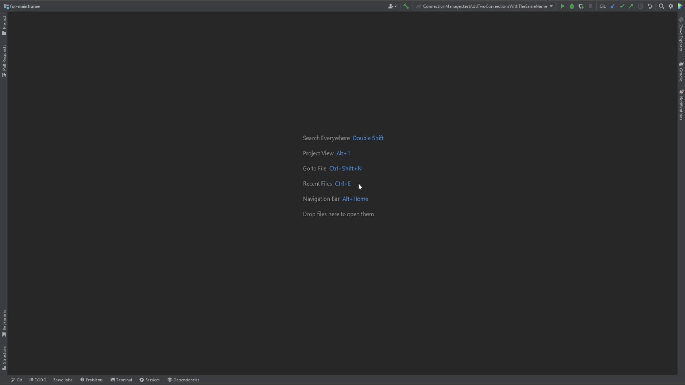

# Configuring Zowe IntelliJ plug-in

After you install the Zowe Intellij plug-in, you must create a z/OSMF connection to your mainframe and some working sets. 

:::note

z/OS v2.1 or later is required z/OSMF configuration. The plug-in is in active development state. 

:::

## Creating z/OSMF connection 

There are two ways to create a z/OSMF connection: 
- using the in-built plug-in feature
- using Zowe Config v2

### Creating the connection using the plug-in feature

You can create a z/OSMF connection to your mainframe either by manually specifying all the needed information through the Settings tab, or by clicking the "+" sign. The z/OSMF port should be specified at the end of the address.

To create the connection:
1. In Zowe Explorer click **+** button
2. Select **Connection**
3. Type in all the necessary information
4. Wait until the connection is tested

### Creating the connection using Zowe Config v2

*Prerequisite: Zowe CLI installed ([click here for the guide](https://docs.zowe.org/stable/user-guide/cli-installcli))*

To create the z/OSMF connection with Zowe Config v2:
1. In command line, issue: `zowe config init`
2. Enter all the required information
3. After that, *Zowe config file detected* notification should appear, click **Add Zowe Connection**
4. If the connection test is failed, click **Add Anyway**
5. In Zowe Config change all the wrong parameters to the correct ones
6. Click appeared *Reload* button in the editor
7. Wait until the connection is tested

After the configuration is made, you will be able to use all the features of the plug-in.
