# Working with data sets

## Viewing data sets and using multiple filters

1. Expand **DATA SETS** in the **Side Bar**, and hover over the profile you want to filter.
2. Click the **Search** icon.
3. Use the **picker** field to select or enter the patterns you want to apply as filters.  
   
   The data sets that match your pattern(s) display in the **Side Bar**.

   :::tip
   
   To use multiple filters, separate individual entries with a comma. You can append or postpend any filter with an \* to indicate a wildcard search. You cannot enter an \* as the entire pattern.

   :::
   

## Viewing data sets with member filters

1. Expand **DATA SETS** in the **Side Bar**, and hover over the profile you want to filter.
2. Click the **Search** icon.
3. In the **picker** field, enter or select a search pattern in the `HLQ.ZZZ.SSS(MEMBERNAME)` format to filter out and display the specified member in the **Side Bar**.

   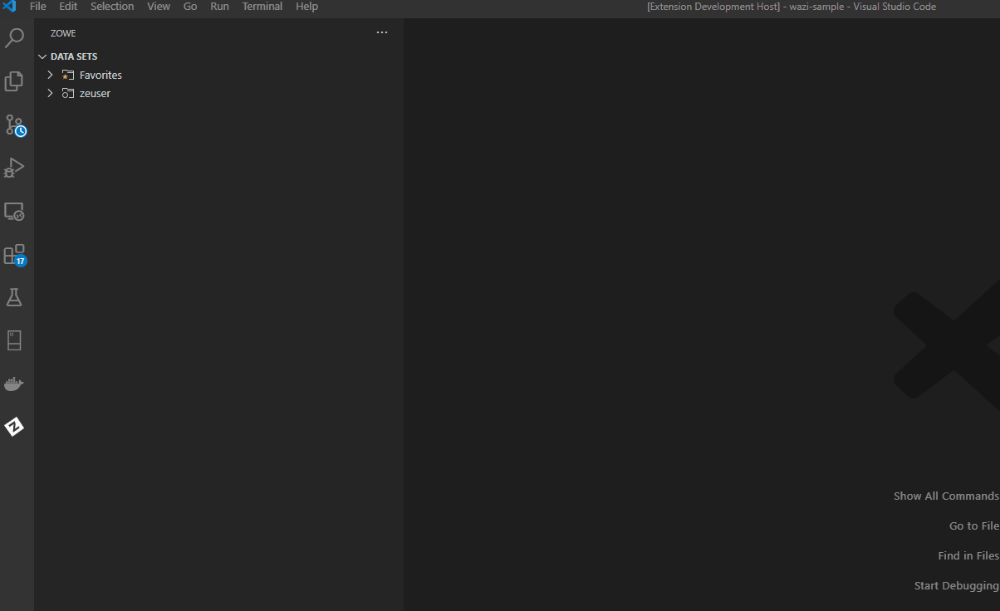

## Refreshing the list of data sets

1. Hover over  **DATA SETS** in the **Side Bar**.
2. Click the **Refresh All** icon.

## Renaming data sets

1. Expand **DATA SETS** in the **Side Bar**, and select the data set you want to rename.
2. Right-click the data set and select the **Rename Data Set** option.
3. Enter the new name of the data set in the **picker** field.

   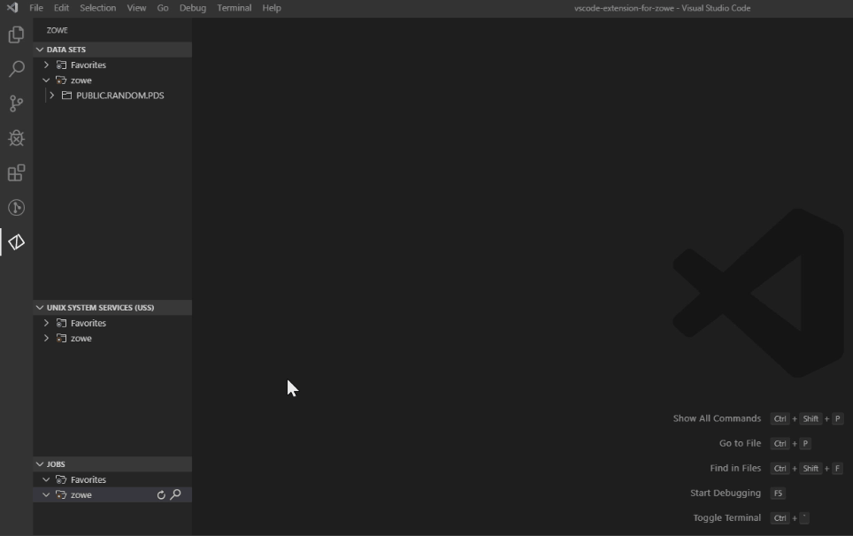

## Copying data set members

1. Expand **DATA SETS** in the **Side Bar**, and select the member you want to copy.
2. Right-click the member and select the **Copy Member** option.
3. Right-click the data set where the member is to be contained and select the **Paste Member** option.
4. In the **picker** field, enter the name of the copied member.

   

## Editing and uploading a data set member

1. Expand **DATA SETS** in the **Side Bar**, and select a profile to open it.
2. Open the data set with the member you want to edit.
3. Click on the member name to display it in an **Editor** tab.
4. Edit the document.
5. Press `Ctrl`+`S` or `Command`+`S` to save the changes and upload the data set to the mainframe.

   :::note 
   
   If someone else has made changes to the data set member while you were editing, you can merge your changes before uploading to the mainframe. See [Preventing merge conflicts](#preventing-merge-conflicts) for more information.

   :::

   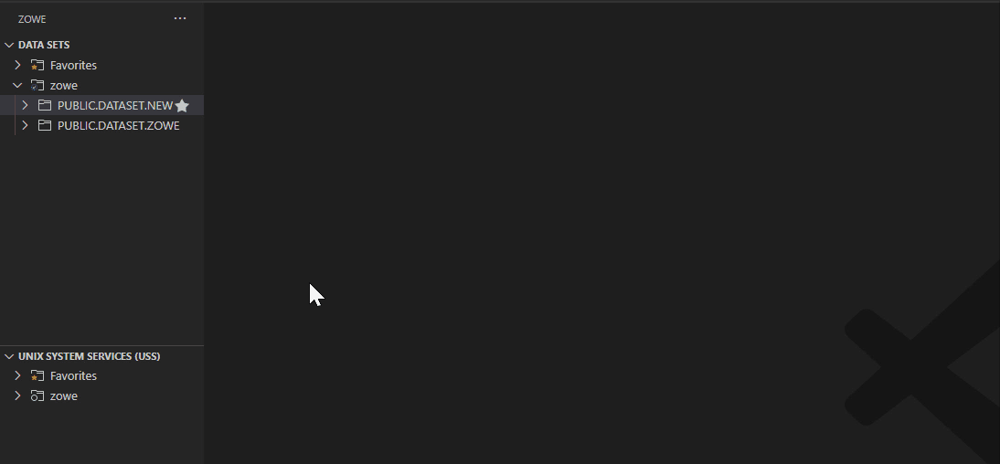

## Preventing merge conflicts

1. Expand **DATA SETS** in the **Side Bar**, and navigate to the member you want to edit.
2. Edit the document in the **Editor** tab.
3. Press `Ctrl`+`S` or `Command`+`S` to save the changes.

   If the original content in your local version no longer matches the same file in the mainframe, a warning message displays advising the user to compare both versions.
4. If necessary, use the editor tool bar to resolve merge conflicts.

   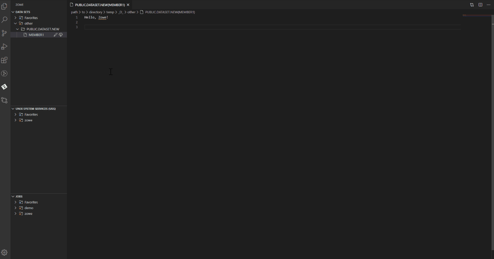

## Creating data sets and specifying parameters

1. Expand **DATA SETS** in the **Side Bar**.
2. Right-click the profile you want to create a data set with and select **Create New Data Set**.
3. Enter a name for your data set in the **picker** field and press `Enter`.
4. From the **picker** drop-down menu, select the data set type that you want to create and press `Enter`.
5. Select **Edit Attributes** in the **picker** drop-down menu and press `Enter`.

   The attributes list for the data set displays. You can edit the following attributes:

   - Allocation Unit

   - Average Block Length

   - Block Size

   - Data Class

   - Device Type

   - Directory Block

   - Data Set Type

   - Management Class

   - Data Set Name

   - Data Set Organization

   - Primary Space

   - Record Format

   - Record Length

   - Secondary Space

   - Size

   - Storage Class

   - Volume Serial

6. Select the attribute you want to edit, provide the value in the **picker** field, and press `Enter`.
7. (Optional) Edit the parameters of your data set.
8. Select the **+ Allocate Data Set** option to create the data set and list it in the **Side Bar**.

   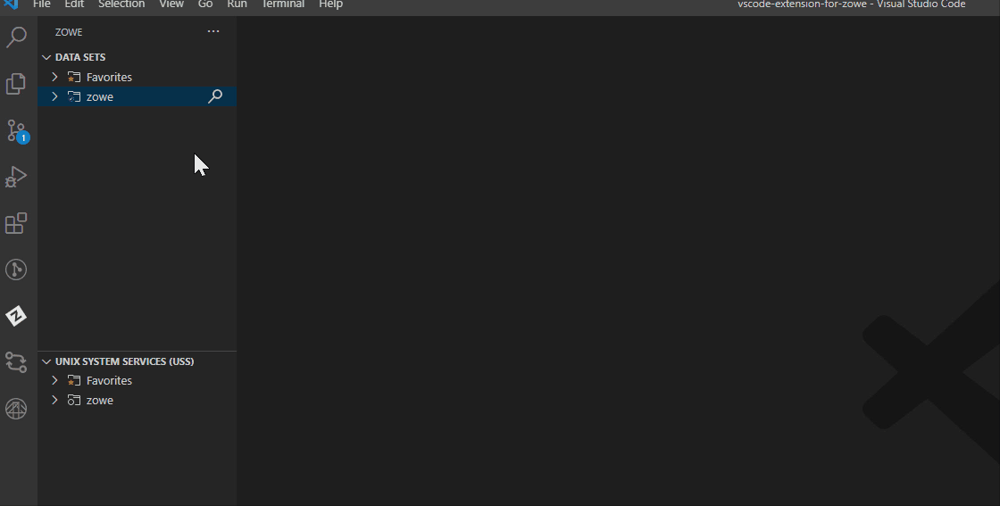

## Creating data sets and data set members

1. Expand **DATA SETS** in the **Side Bar**.

2. Right-click on the profile where you want to create a data set and select **Create New Data Set**.
3. Enter a name for your data set in the **picker** field and press `Enter`.
4. From the **picker** drop-down menu, select the data set type that you want to create.
5. Select **+Allocate Data Set** to create your data set.
6. In the **Side Bar**, right-click your newly-created data set and select **Create New Member**.
7. Enter a name for your new data set member in the **picker** field and press **Enter**.
   The member is created and opened in an **Editor** tab.

## Deleting a data set member and a data set

1. Expand **DATA SETS** in the **Side Bar**.
2. Open the profile and data set containing the member you want to delete.
3. Right-click the member and select **Delete Member**.
4. Confirm the deletion by selecting **Delete** on the **picker** drop-down menu.
5. To delete a data set, right-click the data set and select **Delete Data Set**, then confirm the deletion.

  :::note
  
  You can delete a data set before you delete its members.

  :::

   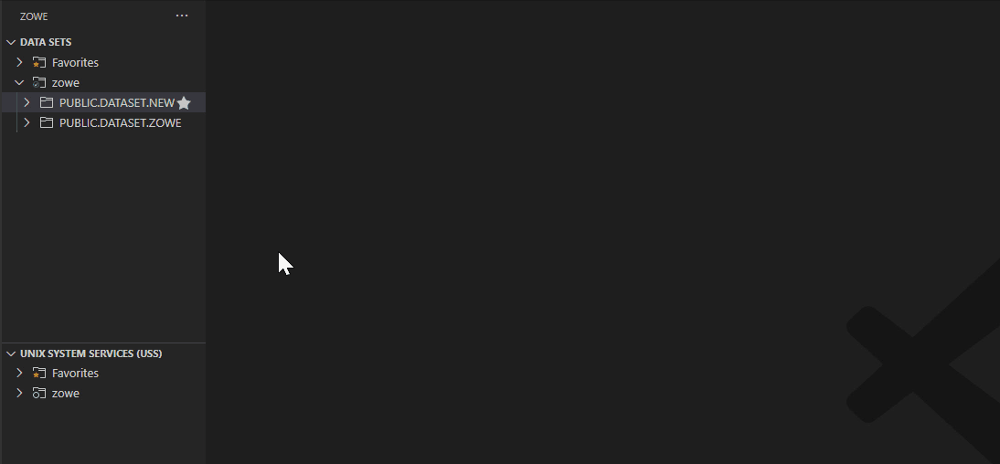

## Viewing data set, member attributes

1. Expand **DATA SETS** in the **Side Bar**, and click the **+** icon.
2. Select the **Search** icon.
3. In the **picker** field, enter or select a search pattern to filter search results in the **Side Bar**.
4. Right-click a data set or member and select the **Show Attributes** option.

   The attributes display in an **Editor** tab.

    

## Viewing and accessing multiple profiles simultaneously

1. Expand **DATA SETS** in the **Side Bar**, and click the **+** icon.
2. Select the profiles from the **picker** drop-down to add them to the **Side Bar**.
3. Click the **Search** icon for each profile to search and select associated data sets.

   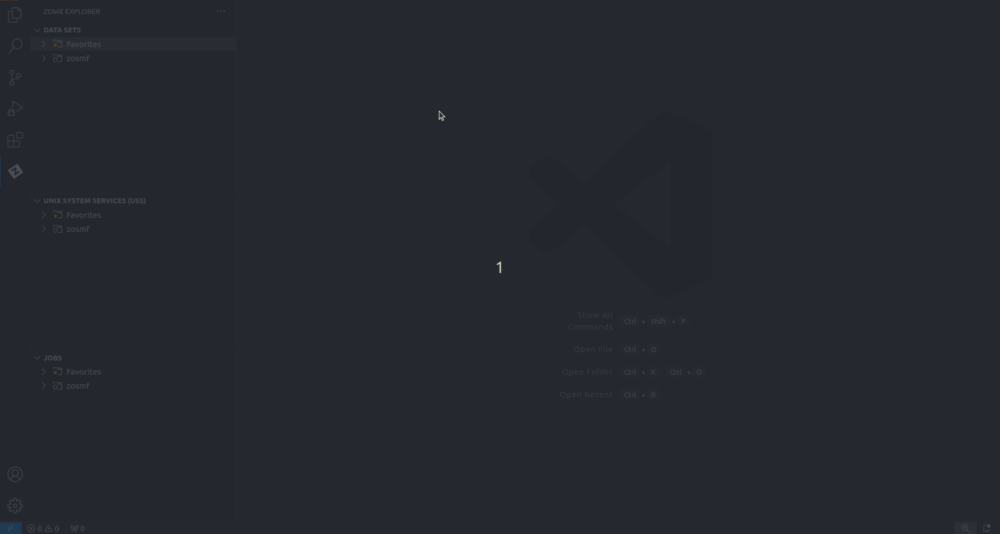

## Filtering partitioned data set members

Filter partitioned data set members in the **DATA SETS** tree view by **Date Modified** or **User ID**.

### Filtering all partitioned data set members under a specific profile

1. In the **DATA SETS** tree, click on the **Filter** icon to the right of a profile.

   The filter selection menu appears in the **picker** field.
2. Select a filter type from the list of available options:
   - **Date Modified**
   - **User ID**
3. Enter a valid value for the selected filter.
4. Press the `Enter` key to confirm the filter.

   Expanded data sets display a filtered list of members under the selected profile in the **DATA SETS** tree.

   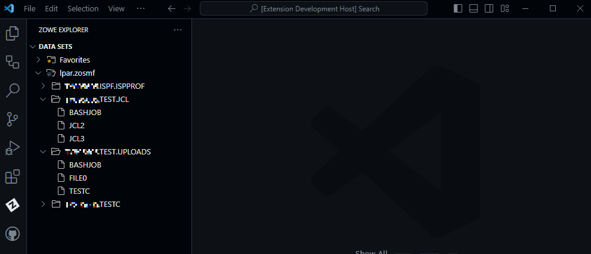

### Filtering members for a single partitioned data set

1. In the **DATA SETS** tree, right-click on a data set and select the **Filter PDS members…** option.

   The filter selection menu appears in the **picker** field.
2. Select a filter type from the list of available options:
   - **Date Modified**
   - **User ID**
3. Enter a valid value for the selected filter.
4. Press the `Enter` key to confirm the filter. This overrides any *profile* filter preferences that might be in effect for the single data set.

   The selected data set displays a filtered list of members in the **DATA SETS** tree.

   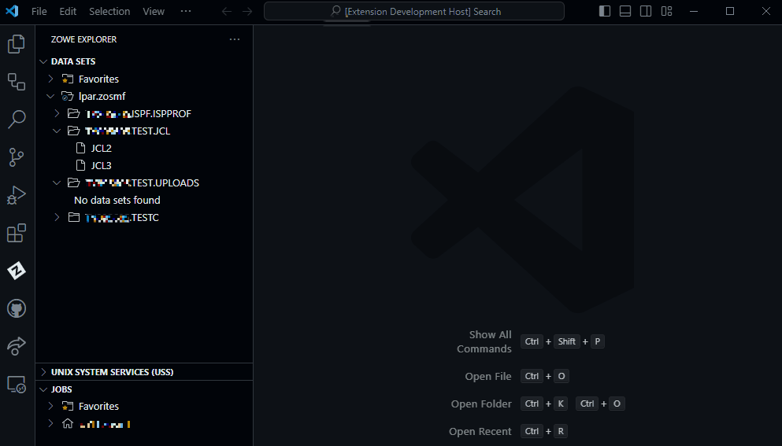

## Sorting partitioned data set members

Sort partitioned data set members in the **DATA SETS** tree view by member **Name**, **Date Modified**, or **User ID**.

### Sorting all partitioned data set members under a specific profile

1. In the **DATA SETS** tree, click on the **Sort** icon to the right of a profile.

   The sorting selection menu appears in the **picker** field.
2. To change the sorting direction, select the **Sort Direction** option and select a direction type from the **picker** menu.
3. Select a sort type from the list of available options:
   - **Name**
   - **Date Modified**
   - **User ID**

   Expanded data sets display a sorted list of members under the selected profile in the **DATA SETS** tree.

   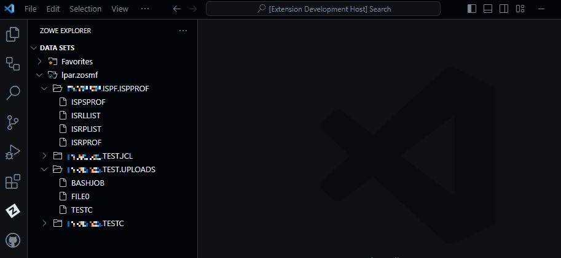

### Sorting members for a single partitioned data set

1. In the **DATA SETS** tree, right-click on a data set and select the **Sort PDS members…** option.
   The sort selection menu appears in the **picker** field.
2. To change the sorting direction, select the **Sort Direction** option and select a direction type from the **picker** menu.
3. Select a sort type from the list of available options:
   - **Name**
   - **Date Modified**
   - **User ID**

   This overrides any *profile* sort preferences that might be in effect for the single PDS. The selected data set displays a sorted list of members in the **DATA SETS** tree.

   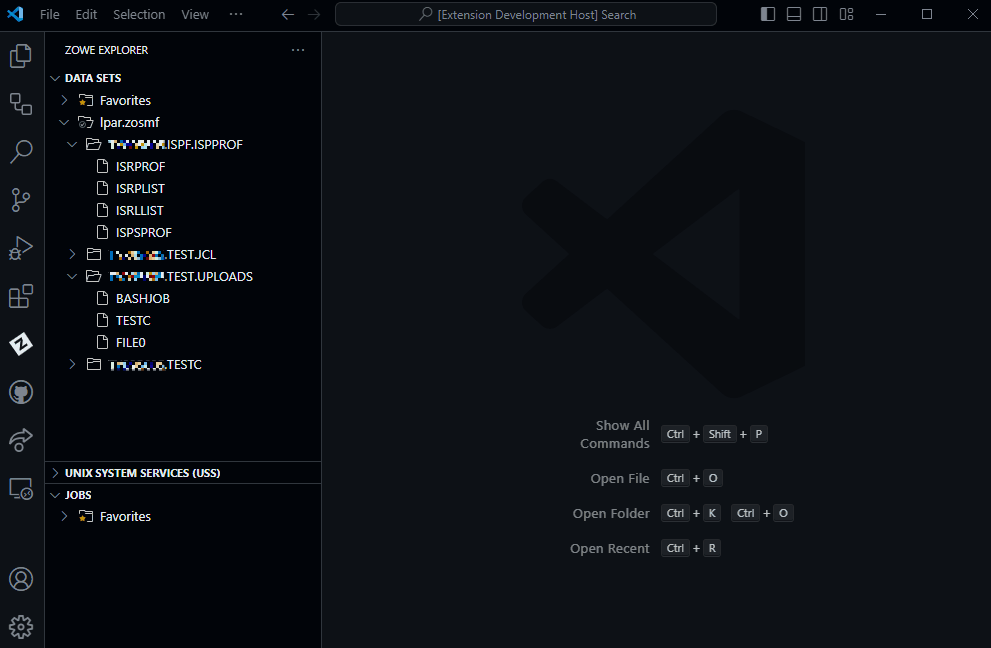

## Submiting a JCL

1. Expand **DATA SETS** in the **Side Bar**.
2. Select the data set or data set member you want to submit.
3. Right-click the data set or member and select the **Submit Job** option.

   :::note
   
   Click on the hyperlink on the notification pop-up message to view the job.

   :::

   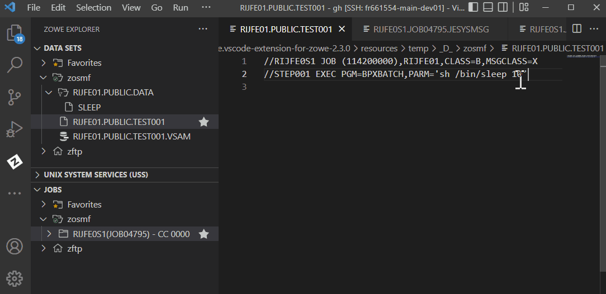

## Allocate like

1. Expand **DATA SETS** in the **Side Bar**.
2. Right-click a data set and select the **Allocate Like (New File with Same Attributes)** option.
3. Enter the new data set name in the **picker** field and press `Enter`.

   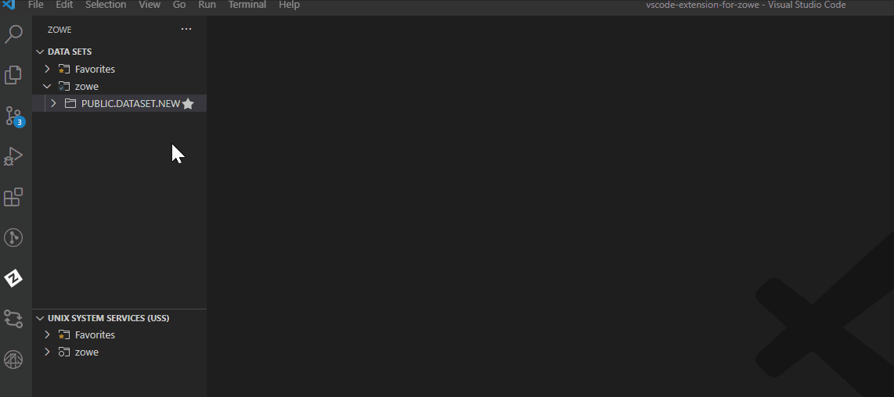