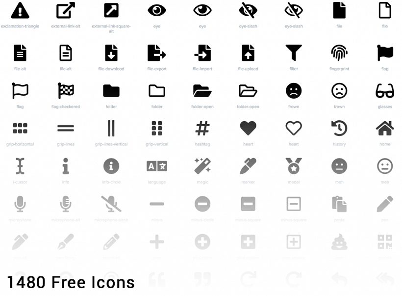

# Iconography

Icons are key component for a successful UI design because they are a visual way to help add meaning to elements.

[Font Awesome](https://fontawesome.com/) is a robust icon library that allows for an easy addition to any web project. Scalable vector icons that can instantly be customized — size, color, drop shadow, and anything that can be done with the power of CSS.

- **One Font, Hundreds of Icons** – In a single collection, Font Awesome is a pictographic language of web-related actions.
- **No JavaScript Required** – Fewer compatibility concerns because Font Awesome doesn’t require JavaScript.
- **Infinite Scalability** – Scalable vector graphics means every icon looks awesome at any size.
- **Free, as in Speech** – Font Awesome is completely free for commercial use. Check out the license.
- **CSS Control** – Easily style icon color, size, shadow, and anything that’s possible with CSS.
- **Perfect on Retina Displays** – Font Awesome icons are vectors, which mean they’re gorgeous on high-resolution displays.
- **Plays Well with Others** – Originally designed for Bootstrap, Font Awesome works great with all frameworks.
- **Desktop Friendly** – To use on the desktop or for a complete set of vectors, check out the cheatsheet.
- **Accessibility-minded** – Font Awesome loves screen readers and helps make your icons accessible on the web.

To learn more or download the library go to www.fontawesome.com
