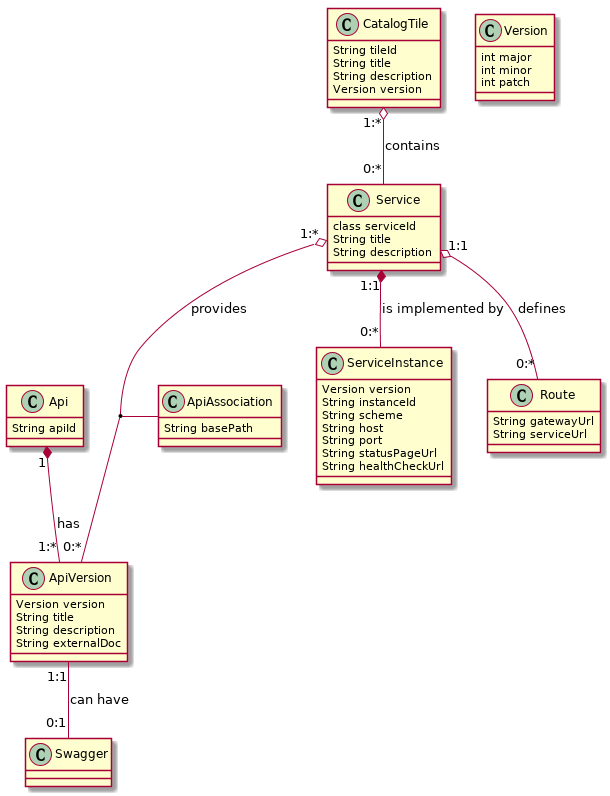

# API Versioning

 ## Introduction

 _API Catalog_ is the catalog of published API services and their associated documentation that have been
 discovered or might get available if provisioned from the service catalog.

 _Application program interface (API)_ is a set of functions and procedures that allow the creation
 of applications which access the features or data of other applications, service, or systems.

 Our API Catalog contains APIs of services provided by implementations of mainframe products. Service can
 be implemented by one or more service instances (that provide exactly the same service for
 high-availability or scalability).

 ### Versioning

 APIs are versioned. Users of the API specify the major version (`v1`, `v2`). Backward incompatible
 changes can be introduced only with changing major version. The service can provide multiple
 versions of the API (it should provide `v{n}` and previous `v{n-1}` versions).

 ### REST

 In our case, we are speaking about REST APIs, which is a way how to access and manipulate textual
 representations of Web resources using uniform and a predefined set of stateless operations.
 Usually via HTTP(S) protocol and using JSON format. Resources are identified by their Uniform
 Resource Identifier (URIs). The services are accessed via APIML gateway. Example of a URI:
 `https://host:10010/endevormfno/api/v1/ENWSQA01/packages/PACKAGETST
 (https://{gatewayHost}:{port}/{serviceName}/api/v{majorVersion}/{resource}`)
 See [Components of URL](../extend-apiml/api-mediation-components-of-URL.md) for more information about the URL components of REST APIs.
 
 ## Data Model

 The following data model describes the model behind data about APIs and API services in the API Catalog.
 The most of the data are provided during service registration. In case of the dynamic registration they are
 provided by the service. Some of them are determined by the service developer (API-related), system
 administrator (service-related), and some of them can be altered by user (catalog tiles - in
 future).

 

 _(this a [UML class diagram](https://en.wikipedia.org/wiki/Class_diagram))_

 **Catalog Tile** - API Catalog UI groups API services into tiles. An API service can be in multiple tiles. The
 purpose of titles is to organize API services on the dashboard of the API Catalog. Default catalog tiles
 are constructed from the definitions provided by the services. In future, it will be possible for
 the user to modify the tiles.

 **API** - _Api_ object represents a collection of specific versions of the same API which share the
 same _apiId_.

 **API Version** represents a specific version of the API. This version can be documented by an
 external documentation or by a Swagger document. This information is set by the developer of the
 API.

 **Swagger** represents a Swagger specification instance for a specific API version. See
 https://swagger.io/docs/specification/ for more details.

 **API Association** provides information how a specific API version is provides by a specific
 service. Different services can use different basePath. The full path to access endpoints is:
 `scheme://host:port/basePath/endpointPath`. This information is set by the service developer.

 **Service** represents a collection of all service instances. The description and title are taken
 from the service with highest version, in case if this is not clear then the latest registered
 wins. API clients are using a service and the API gateway chooses what service instance will be
 accessed. The same API version can be implemented by multiple services. Such services are not
 interchangeable because they contain or access different data.

 **Service instance** is a real implementation of a service. It contains the information about where
 service is running. The information are provided by the system programmer. The default title and
 description is provided by service developer. Instances are interchangeable and they are used to
 achieve high availability.

 **Route** - _Routes_ provide a way how service URLs are mapped to the gateway. Gateway translates
 an URL based on the start of the base path on the gateway and translates it to a base path that is
 used in the URL to access the service. The purpose is to make possible to access services via the
 gateway with a consistent URL format no matter what is the format at the service.

 **Version** type follows semantic versioning (http://semver.org/) and is used on multiple places.

 ### Service and instance

 _Service_ and _instance_ are overloaded words that have a different meaning in different contexts.
 This document uses similar meaning as in (Netflix) Eureka discovery service. Service (or
 application) is a logical entity that is comprised of functionality to access and manipulate
 specific resources. Instances are real processes (servers) that provide that functionality to
 clients. Eureka is used in distributed software world where a service is implemented by many
 instances. But z/OSMF software services registry defines software service instance and software
 service templates in the context of the provisioning where "instances" are provisioned from
 "templates". z/OSMF service instance does not need to correspond exactly to Eureka service. z/OSMF
 service instance does need to provide REST API. z/OSMF service instance can be anything that can be
 provisioned (e.g. multiple services that provide REST API, one API service, additional instance for
 a service, just a container for other services, a database server, a database, a table...).

 ## API Versioning

 Service instances provide one or more different API versions (we take only one assumption: one
 service instance will not provide two versions with the same major version, no other assumptions
 which versions will be provided and how - e.g. an instance can provide only one version and another
 version will be provided by different instance, other services can have instances that provide
 multiple versions).

 The API user specifies only the major version in the URI. The API catalog needs to differentiate
 between different _full versions_ internally and able to return a specific full version or return
 documentation for the highest version of the specified major version that is supported by all
 running services.

 Guidelines:

- The version of the API, not dependent on the product release

- Two last versions are supported

 - Major version - specified by the user of the API in the URI - increased only when backward
 incompatible change is introduced (it is rare because the REST APIs should be designed to allow
 extensibility)

 - Minor version - not specified in the URI but the user should know what is it, important to
 display the correct level of documentation. Increased when the API is extended with a new feature
 (if you use a new resource available in v1.2, the service has to provide at least v1.2, the request
 fails on v1.1). If there are multiple instances of the services that have different minor versions,
 the service together will say that has the lowest minor version (e.g instance A provide v1.3 and
 v2.2, instance B was not yet upgraded and provides v1.2 and v2.1, then the service provides v1.2
 and v2.1)

 - Patch version - not specified in the URI, no difference in the API, used only when the API
 documentation is patched or a bug was fixed, there is no change in the API

 
