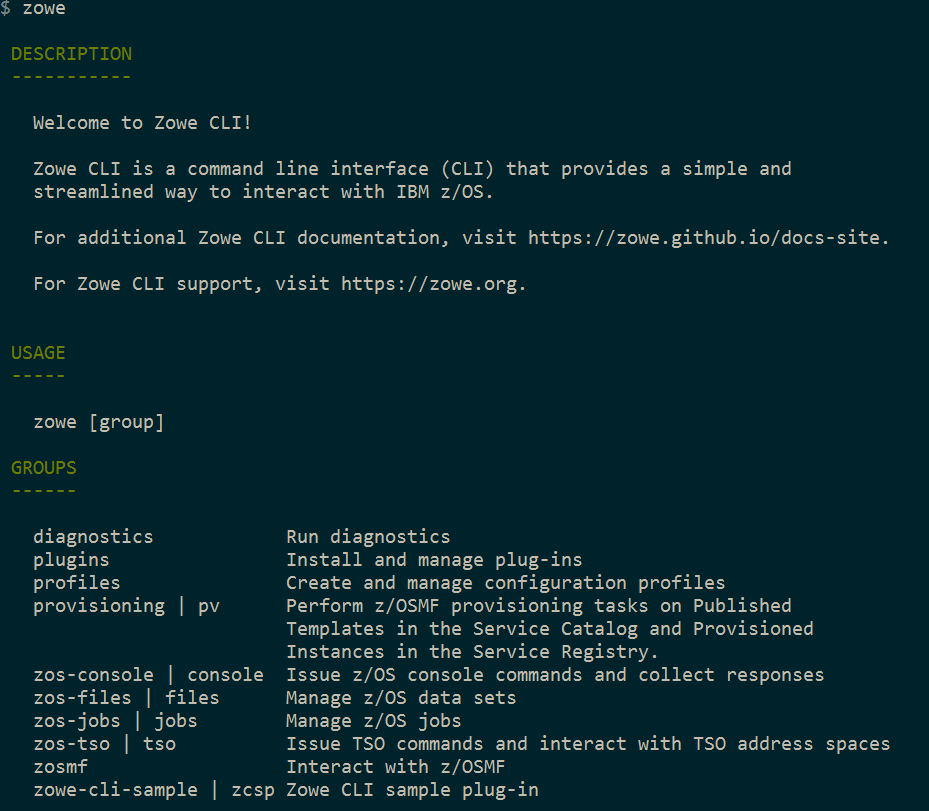
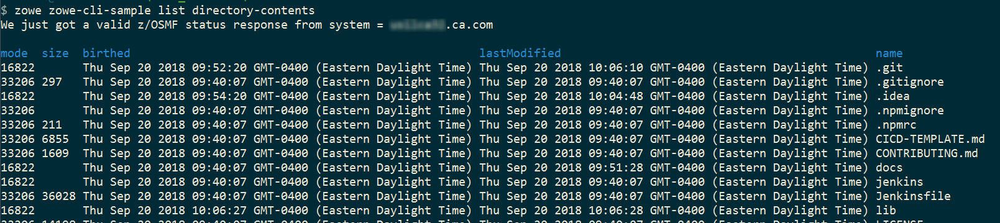

# Installing the sample plug-in

Before you begin, [set up](cli-setting-up.md) your local environment to install a plug-in.

## Overview
This tutorial covers installing and running this bundled Zowe&trade; CLI plugin as-is (without modification), which will display your current directory contents. 

The plug-in adds a command to the CLI that lists the contents of a directory on your computer. 

## Installing the sample plug-in to Zowe CLI

To begin, `cd` into your `zowe-tutorial` folder.

Issue the following commands to install the sample plug-in to Zowe CLI:

`zowe plugins install ./zowe-cli-sample-plugin`

## Viewing the installed plug-in
Issue `zowe --help` in the command line to return information for the installed `zowe-cli-sample` command group:



## Using the installed plug-in
To use the plug-in functionality, issue: `zowe zowe-cli-sample list directory-contents`:



## Testing the installed plug-in
To run automated tests against the plug-in, `cd` into your `zowe-tutorial/zowe-cli-sample-plugin` folder.

Issue the following command:

```
npm run test
```

## Next steps
You successfully installed a plug-in to Zowe CLI! Next, try the [Extending a plug-in](cli-extending-a-plugin.md) tutorial to learn about developing new commands for this plug-in. 