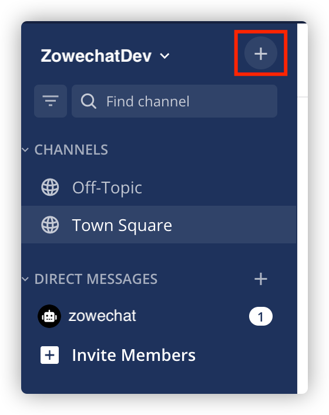
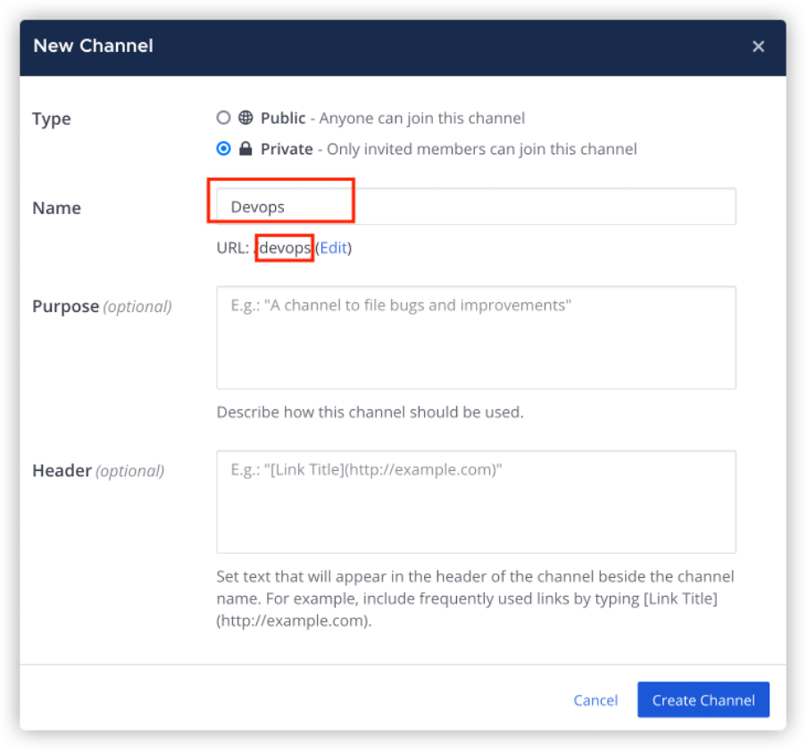
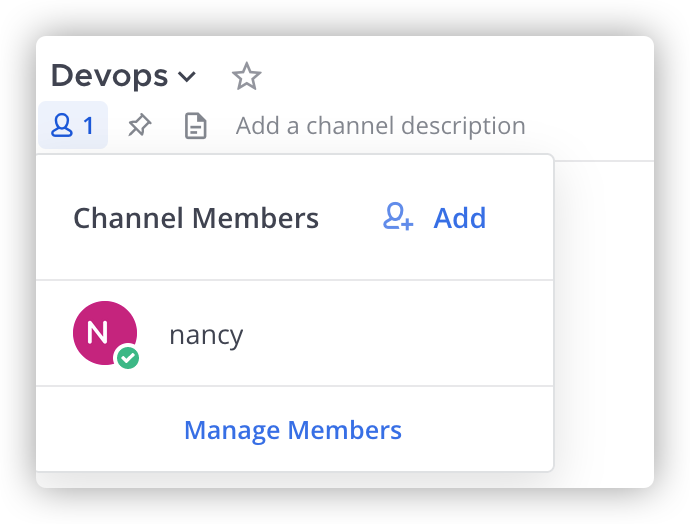
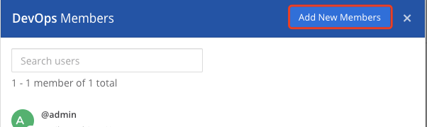
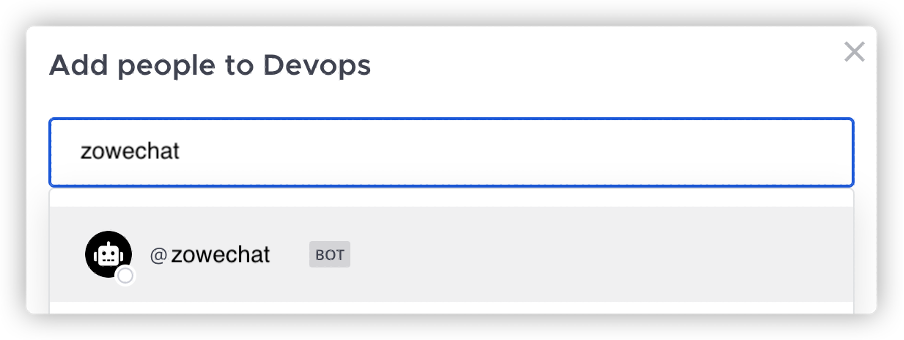

# Inviting the created bot to your Mattermost channel

You can create your own private channel in Mattermost, invite your bot user to your channel by adding new members, and talk with it in the channel.

1.  Create a private channel.

    1.  Click the **+** button to create a new private channel.

        

    2.  Make sure that you select **Private** as the channel type.

    3.  Specify the **Name** of the channel, for example, DevOps.

        

        **Note:** Remember URL under the name. You may use it later when you want to send incident to the channel.

    4.  Click **Create New Channel** and your new private channel is created.

2.  On the upper-left corner, click the Members icon and you can see the members that are in this channel. Click **Manage Members**.

    

3.  Click **Add New Members** on the upper-right corner.

    

4.  Enter the name of your bot account to add it to this channel, for example, bnz. You can see bnz in the list. Select it and click **Add**.

    

You add your bot account to your channel successfully.

