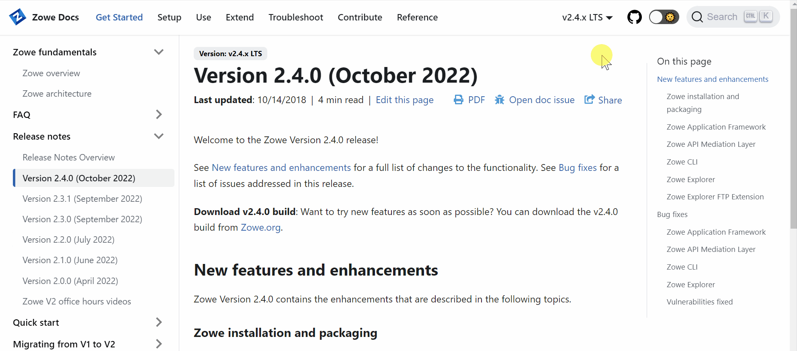

# Release Notes

The release notes for all Zowe V2 minor releases are published in this section.

Release notes detail all the new features, enhancements, bug fixes, and security vulnerabilities fixed in a particular Zowe minor release.

Select a Zowe release version on the **Table of Contents** located on the left of the page to view its release notes.

## Accessing older release notes

To access notes for an older release, go to the **Zowe Docs Version** dropdown menu at the top right of the page and select a release. The release notes for the selected version display under the **Release Notes** section in the **Table of Contents**.

