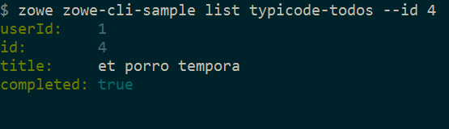

# Extending a plug-in
Before you begin, be sure to complete the [Installing the sample plug-in](cli-installing-sample-plugin.md) tutorial.

## Overview

This tutorial demonstrates how to extend the plug-in that is bundled with this sample by:

1. Creating a Typescript interface for the Typicode response data
2. Creating a programmatic API
3. Creating a command definition
4. Creating a command handler

We'll do this by using `@zowe/imperative` infrastructure to surface REST API data on our Zowe&trade; CLI plug-in.

Specifically, we're going to show data from [this URI](https://jsonplaceholder.typicode.com/todos) by [Typicode](https://jsonplaceholder.typicode.com/).
Typicode serves sample REST JSON data for testing purposes.

At the end of this tutorial, you will be able to use a new command from the Zowe CLI interface: `zowe zowe-cli-sample list typicode-todos`

Completed source for this tutorial can be found on the `typicode-todos` branch of the zowe-cli-sample-plugin repository.

### Creating a Typescript interface for the Typicode response data

First, we'll create a Typescript interface to map the response data from a server.

Within `zowe-cli-sample-plugin/src/api`, create a folder named `doc` to contain our interface (sometimes referred to as a "document" or "doc"). Within the doc folder, create a file named `ITodo.ts`.

The `ITodo.ts` file will contain the following:

```typescript
export interface ITodo {
    userId: number;
    id: number;
    title: string;
    completed: boolean;
}
```

### Creating a programmatic API

Next, we'll create a Node.js API that our command handler uses. This API can also be used in any Node.js application, because these Node.js APIs make use of REST APIs, Node.js APIs, other NPM packages, or custom logic to provide higher level functions than are served by any single API.

Adjacent to the existing file named `zowe-cli-sample-plugin/src/api/Files.ts`, create a file `Typicode.ts`.

`Typicode.ts`should contain the following:

```typescript
import { ITodo } from "./doc/ITodo";
import { RestClient, AbstractSession, ImperativeExpect, Logger } from "@zowe/imperative";

export class Typicode {

    public static readonly TODO_URI = "/todos";

    public static getTodos(session: AbstractSession): Promise<ITodo[]> {
        Logger.getAppLogger().trace("Typicode.getTodos() called");
        return RestClient.getExpectJSON<ITodo[]>(session, Typicode.TODO_URI);
    }

    public static getTodo(session: AbstractSession, id: number): Promise<ITodo> {
        Logger.getAppLogger().trace("Typicode.getTodos() called with id " + id);
        ImperativeExpect.toNotBeNullOrUndefined(id, "id must be provided");
        const resource = Typicode.TODO_URI + "/" + id;
        return RestClient.getExpectJSON<ITodo>(session, resource);
    }
}

```

The `Typicode` class provides two programmatic APIs, `getTodos` and `getTodo`, to get an array of `ITodo` objects or a specific
`ITodo` respectively. The Node.js APIs use `@zowe/imperative` infrastructure to provide logging, parameter validation,
and to call a REST API. See the [Imperative CLI Framework documentation](https://github.com/zowe/imperative/wiki) for more information.

#### Exporting interface and programmatic API for other Node.js applications

Update [zowe-cli-sample-plugin/src/index.ts](https://github.com/zowe/zowe-cli-sample-plugin/src/index.ts) to contain the following:

```typescript
export * from "./api/doc/ITodo";
export * from "./api/Typicode";
```

A sample invocation of your API might look similar to the following, if it were used by a separate, standalone Node.js application:
```typescript
import { Typicode } from "@zowe/zowe-cli-sample-plugin";
import { Session, Imperative } from "@zowe/imperative";
import { inspect } from "util";

const session = new Session({ hostname: "jsonplaceholder.typicode.com"});
(async () => {
    const firstTodo = await Typicode.getTodo(session, 1);
    Imperative.console.debug("First todo was: " + inspect(firstTodo));
})();
```

### Checkpoint one

Issue `npm run build` to verify a clean compilation and confirm that no lint errors are present. At this point in this tutorial, you have a programmatic API
that will be used by your handler or another Node.js application. Next you'll define the command syntax for the command that will use your programmatic Node.js APIs.

### Creating a command definition

Within Zowe CLI, the full command that we want to create is `zowe zowe-cli-sample list typicode-todos`. Navigate to `zowe-cli-sample-plugin/src/cli/list` and create a folder
`typicode-todos`. Within this folder, create `TypicodeTodos.definition.ts`. Its content should be as follows:
```typescript
import { ICommandDefinition } from "@zowe/imperative";
export const TypicodeTodosDefinition: ICommandDefinition = {
    name: "typicode-todos",
    aliases: ["td"],
    summary: "Lists typicode todos",
    description: "List typicode REST sample data",
    type: "command",
    handler: __dirname + "/TypicodeTodos.handler",
    options: [
        {
            name: "id",
            description: "The todo to list",
            type: "number"
        }
    ]
};
```
This describes the syntax of your command.

#### Defining command to list group

Within the file `zowe-cli-sample-plugin/src/cli/list/List.definition.ts`, add the following code below other `import` statements near the top of the file:
```typescript
import { TypicodeTodosDefinition } from "./typicode-todos/TypicodeTodos.definition";
```

Then add `TypicodeTodosDefinition` to the children array. For example:
```
children: [DirectoryContentsDefinition, TypicodeTodosDefinition]
```

### Creating a command handler

Also within the `typicode-todos` folder, create `TypicodeTodos.handler.ts`. Add the following code to the new file:
```typescript
import { ICommandHandler, IHandlerParameters, TextUtils, Session } from "@zowe/imperative";
import { Typicode } from "../../../api/Typicode";
export default class TypicodeTodosHandler implements ICommandHandler {

    public static readonly TYPICODE_HOST = "jsonplaceholder.typicode.com";
    public async process(params: IHandlerParameters): Promise<void> {

        const session = new Session({ hostname: TypicodeTodosHandler.TYPICODE_HOST});
        if (params.arguments.id) {
            const todo = await Typicode.getTodo(session, params.arguments.id);
            params.response.data.setObj(todo);
            params.response.console.log(TextUtils.prettyJson(todo));
        } else {
            const todos = await Typicode.getTodos(session);
            params.response.data.setObj(todos);
            params.response.console.log(TextUtils.prettyJson(todos));
        }
    }
}
```
The `if` statement checks if a user provides an `--id` flag. If yes, we call `getTodo`. Otherwise, we call `getTodos`. If the
Typicode API throws an error, the `@zowe/imperative` infrastructure will automatically surface this.


### Checkpoint two

Issue `npm run build` to verify a clean compilation and confirm that no lint errors are present. You now have a handler, definition, and your command has been defined to the `list` group of the command.

## Using the installed plug-in

Issue the command: `zowe zowe-cli-sample list typicode-todos`

Refer to `zowe zowe-cli-sample list typicode-todos --help` for more information about your command and to see how text in the command definition
is presented to the end user. You can also see how to use your optional `--id` flag:



## Summary

You extended an existing Zowe CLI plug-in by introducing a Node.js programmatic API, and you created a command definition with a handler.
For an official plugin, you would also add [JSDoc](http://usejsdoc.org/) to your code and create automated tests.

## Next steps

Try the [Developing a new plug-in](cli-developing-a-plugin.md) tutorial next to create a new plug-in for Zowe CLI.
