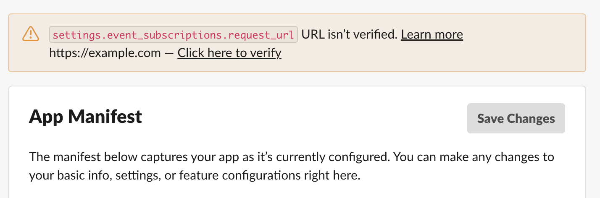

# Connecting to Slack using public HTTP endpoint

Complete this task after your Zowe Chat server is configured and started.

If you are using HTTP endpoint to receive Slack events, you must enable interactivity and configure the event request URL and the interactivity request URL in your Slack App.

If the IP address of your Zowe Chat server is public, you can use the Chatbot messaging endpoint URL `<httpEndpoint.protocol>://<httpEndpoint.hostName>:<httpEndpoint.port><httpEndpoint.basePath>` directly. Otherwise, you must configure your own network firewall or use some proxy servers to make sure that your Slack App of your Slack workspace in public cloud can access the messaging endpoint of Zowe Chat server from Internet.

:::note

You can find the values for `protocol`, `hostName`, `port`, and `basePath` in the configuration file `<ZOWE_CHAT_HOME>/config/chatTools/slack.yaml`. 

:::

1. Open [Slack API](https://www.ibm.com/links?url=https%3A%2F%2Fapi.slack.com%2Fapps) in your browser.

2. Click your Slack App.
   
   Remember that you must log in your Slack workspace before you can see your App in Slack.

3. Configure your Slack App.

    1. In the left sidebar of Slack app dashboard, click **Features** > **App Manifest** to configure your Slack App.
    2. In the text field, fill in the following manifest:.

    ```
    display_information:
    name: Zowe Chat
    description: Zowe Chat
    background_color: "#302d2e"
    features:
    app_home:
        home_tab_enabled: false
        messages_tab_enabled: true
        messages_tab_read_only_enabled: false
    bot_user:
        display_name: bnz
        always_online: true
    oauth_config:
    scopes:
        bot:
        - channels:history
        - channels:read
        - chat:write
        - groups:history
        - groups:read
        - im:history
        - im:read
        - mpim:history
        - mpim:read
        - users:read
        - users:read.email
    settings:
    event_subscriptions:
        request_url: https://example.com
        bot_events:
        - message.channels
        - message.groups
        - message.im
        - message.mpim
    interactivity:
        is_enabled: true
        request_url: https://example.com
    org_deploy_enabled: false
    socket_mode_enabled: false
    token_rotation_enabled: false
    ```
   
    :::note: 
   
    You should delete the default manifest, and then fill in the manifest above.

    :::

    In the manifest, specify values for the following fields:

    - `display_information.name`: your app name, for example, Zowe Chat
    - `display_information.description`: your app description, for example, Zowe Chat
    - `features.bot_user.display_name`: your bot name, for example, zowe-chat
   
   3. Click **Save Changes**.
   
      You will be prompted with a notification that the URL is not verified. You can ignore this notification, and configure the request URL after your Zowe Chat server is configured and started.

      

4. Configure the request URL for the interactivity for your created Slack App. You can do this after your Zowe Chat is configured and started.
   
    1. In the left sidebar of Slack app dashboard, click **Features** > **Interactivity&Shortcuts**.
    2. In the request URL input field, use the Zowe Chat messaging-endpoint URL directly if it is publicly accessible. Otherwise, you must fill in with your public proxy URL that transmits network payload to Zowe Chat web hook URL.
    3. Click **Save Changes**.

5. Configure the request URL for events subscriptions for your created Slack App. You can do this after your Zowe Chat server is configured and started.

    1. In the left sidebar of Slack app dashboard, click **Features** > **Event Subscriptions**.
    2. In the request URL input field, use the Zowe Chat messaging-endpoint URL directly if it is publicly accessible. Otherwise, you must fill in with your public proxy URL that transmits network payload to Zowe Chat web hook URL. 
    3. Click **Save Changes**.

You have successfully configured your Slack app.
