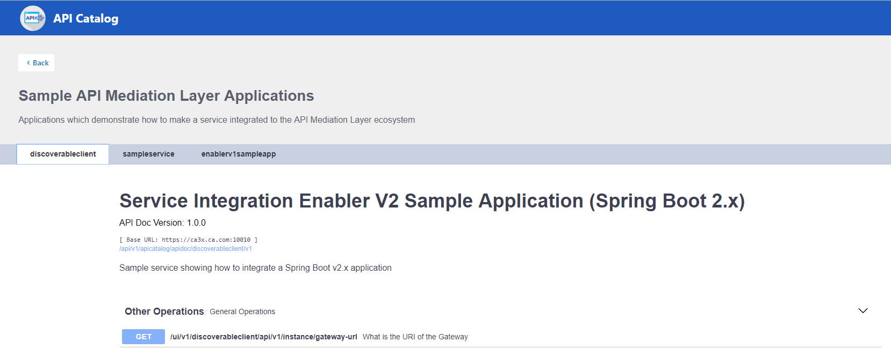
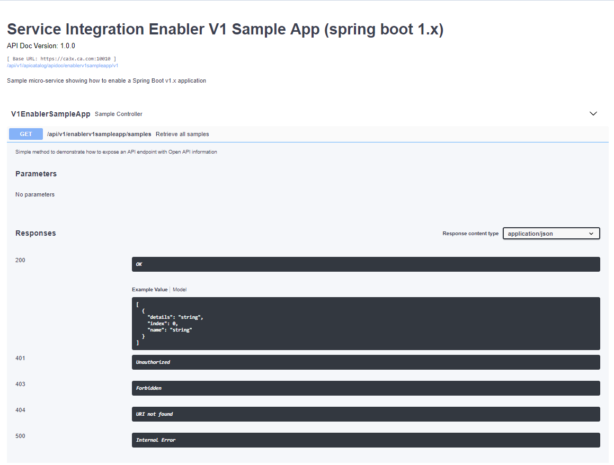

# API Catalog

As an application developer, use the API Catalog to view what services are running in the
 API Mediation Layer. Through the API Catalog, you can also view the associated API documentation
  corresponding to a service, descriptive information about the service, and the current state
   of the service. The tiles in the API Catalog can be customized by changing values in
   the mfaas.catalog-ui-tile section defined in the application.yml of a service. A microservice that
   is onboarded with the API Mediation Layer and configured appropriately, registers automatically with the API Catalog
   and a tile for that service is added to the Catalog.

**Note:** For more information about how to configure the API Catalog in the application.yml, see: [Add API Onboarding Configuration](../extend/extend-apiml/api-mediation-onboard-a-spring-boot-rest-api-service.md).

## View Service Information and API Documentation in the API Catalog

Use the API Catalog to view services, API documentation, descriptive information about the service, the current state of the service, service endpoints, and detailed descriptions of these endpoints.

**Note:** Verify that your service is running. At least one started and registered instance with the Discovery Service
           is needed for your service to be visible in the API Catalog.

**Follow these steps:**

1. Use the search bar to find the service that you are looking for.
Services that belong to the same product family are displayed on the same tile.

    **Example:** `Sample Applications, Endevor, SDK Application`

2. Click the tile to view header information, the registered services under that family ID,
 and API documentation for that service.

    **Notes:**

    * The state of the service is indicated in the service tile on the dashboard page.
    If no instances of the service are currently running, the tile displays a message displays that no services are running.
    * At least one instance of a service must be started and registered with the discovery service for it to be visible
     in the API Catalog. If the service that you are onboarding is running, and
     the corresponding API documentation is displayed, this API documentation is cached and remains visible
     even when the service and all service instances stop.  
    * Descriptive information about the service and a link to the home page of the service is displayed.

    **Example:**

    

3. Expand the endpoint panel to see a detailed summary with responses and parameters of each endpoint,
 the endpoint description, and the full structure of the endpoint.

    **Example:**

    

    **Notes:**

    * If a lock icon is visible on the right side of the endpoint panel, the endpoint requires authentication.  

    * The structure of the endpoint is displayed relative to the base URL.

    * The URL path of the abbreviated endpoint relative to the base URL is displayed in the following format:

        **Example:**

        `/api/v1/{yourServiceId}/{endpointName}`

        The path of the full URL that includes the base URL is also displayed in the following format:

        `https://hostName:basePort/api/v1/{yourServiceId}/{endpointName}`

        Both links target the same endpoint location.
