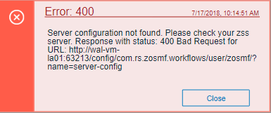

# Error reporting UI

The `zLUX Widgets` repository contains shared widget-like components of the Zowe&trade; Desktop, including Button, Checkbox, Paginator, various pop-ups, and others. To maintain consistency in desktop styling across all applications, use, reuse, and customize existing widgets to suit the purpose of the application's function and look.

Ideally, a program should have little to no logic errors. Once in a while a few occur, but more commonly an error occurs from misconfigured user settings. A user might request an action or command that requires certain prerequisites, for example: a proper ZSS-Server configuration. If the program or method fails, the program should notify the user through the UI about the error and how to fix it. For the purposes of this discussion, we will use the Workflow application plug-in in the `zlux-workflow` repository.


## ZluxPopupManagerService

The `ZluxPopupManagerService` is a standard popup widget that can, through its `reportError()` method, be used to display errors with attributes that specify the title or error code, severity, text, whether it should block the user from proceeding, whether it should output to the logger, and other options you want to add to the error dialog. `ZluxPopupManagerService` uses both `ZluxErrorSeverity` and `ErrorReportStruct`.
```
`export declare class ZluxPopupManagerService {`

    eventsSubject: any;
    listeners: any;
    events: any;
    logger: any;
    constructor();
    setLogger(logger: any): void;
    on(name: any, listener: any): void;
    broadcast(name: any, ...args: any[]): void;
    processButtons(buttons: any[]): any[];
    block(): void;
    unblock(): void;
    getLoggerSeverity(severity: ZluxErrorSeverity): any;
    reportError(severity: ZluxErrorSeverity, title: string, text: string, options?: any): Rx.Observable<any>;
`}`
```
## ZluxErrorSeverity

`ZluxErrorSeverity` classifies the type of report. Under the popup-manager, there are the following types: error, warning, and information. Each type has its own visual style. To accurately indicate the type of issue to the user, the error or pop-up should be classified accordingly.
```
`export declare enum ZluxErrorSeverity {`

    ERROR = "error",
    WARNING = "warning",
    INFO = "info",
`}`
```
## ErrorReportStruct

`ErrorReportStruct` contains the main interface that brings the specified parameters of `reportError()` together.
```
`export interface ErrorReportStruct {`

    severity: string;
    modal: boolean;
    text: string;
    title: string;
    buttons: string[];
`}`
```
## Implementation

Import `ZluxPopupManagerService` and `ZluxErrorSeverity` from widgets. If you are using additional services with your error prompt, import those too (for example, `LoggerService` to print to the logger or `GlobalVeilService` to create a visible semi-transparent gray veil over the program and pause background tasks). Here, widgets is imported from `node_modules\@zlux\` so you must ensure zLUX widgets is used in your `package-lock.json` or `package.json` and you have run `npm install`.

`import { ZluxPopupManagerService, ZluxErrorSeverity } from '@zlux/widgets';`

### Declaration

Create a member variable within the constructor of the class you want to use it for. For example, in the Workflow application plug-in under `\zlux-workflow\src\app\app\zosmf-server-config.component.ts` is a `ZosmfServerConfigComponent` class with the pop-up manager service variable. To automatically report the error to the console, you must set a logger.
```
`export class ZosmfServerConfigComponent {`

    constructor(
    private popupManager: ZluxPopupManagerService, )
    {  popupManager.setLogger(logger); } //Optional
`}`
```
### Usage

Now that you have declared your variable within the scope of your program's class, you are ready to use the method. The following example describes an instance of the `reload()` method in Workflow that catches an error when the program attempts to retrieve a configuration from a `configService` and set it to the program's `this.config`. This method fails when the user has a faulty zss-Server configuration and the error is caught and then sent to the class' `popupManager` variable from the constructor above.
```
`reload(): void {`

    this.globalVeilService.showVeil();
    this.configService
      .getConfig()
      .then(config => (this.config = config))
      .then(_ => setTimeout(() => this.test(), 0))
      .then(_ => this.globalVeilService.hideVeil())
      .catch(err => {
        this.globalVeilService.hideVeil()
        let errorTitle: string = "Error";
        let errorMessage: string = "Server configuration not found. Please check your zss server.";
        const options = {
          blocking: true
        };
          this.popupManager.reportError(ZluxErrorSeverity.ERROR, errorTitle.toString()+": "+err.status.toString(), errorMessage+"\n"+err.toString(), options);  
        });
`}`
```
Here, the `errorMessage` clearly describes the error with a small degree of ambiguity as to account for all types of errors that might occur from that method. The specifics of the error are then generated dynamically and are printed with the `err.toString()`, which contains the more specific information that is used to pinpoint the problem. The `this.popupManager.report()` method triggers the error prompt to display. The error severity is set with `ZluxErrorSeverity.ERROR` and the `err.status.toString()` describes the status of the error (often classified by a code, for example: `404`). The optional parameters in `options` specify that this error will block the user from interacting with the application plug-in until the error is closed or it until goes away on its own. `globalVeilService` is optional and is used to create a gray veil on the outside of the program when the error is caused. You must import `globalVeilService` separately (see the `zlux-workflow` repository for more information).

### HTML

The final step is to have the recently created error dialog display in the application plug-in. If you do `this.popupManager.report()` without adding the component to your template, the error will not be displayed. Navigate to your component's `.html` file. On the Workflow application plug-in, this file will be in `\zlux-workflow\src\app\app\zosmf-server-config.component.html` and the only item left is to add the popup manager component alongside your other classes.

`<zlux-popup-manager></zlux-popup-manager>`

So now when the error is called, the new UI element should resemble the following:




The order in which you place the pop-up manager determines how the error dialog will overlap in your UI. If you want the error dialog to overlap other UI elements, place it at the end of the `.html` file. You can also create custom styling through a CSS template, and add it within the scope of your application plug-in.
