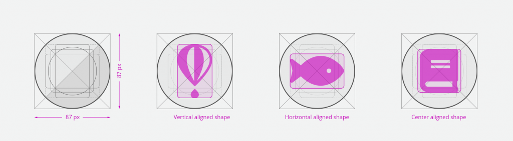
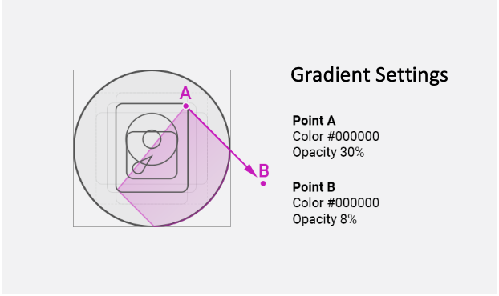

# Application icon

## General rules

**Embrace simplicity.** Use a simple, unique shape or element that represents the essence of the application. Avoid excessive details and redundant shading.

**Use the Zowe&trade; color palette.** Avoid using a monochromatic palette for your icons. Use the Zowe color palette to ensure that the icons have a consistent look.

**Use unique shapes and design elements.** Avoid using single commonly used design elements, such as the gear, document, or folder. These elements can reduce recognizability. Do not use photos and screenshots. Keep icons simple and abstract.

**Avoid labels and text.** Short, commonly used abbreviations are acceptable, if necessary. Remember that all icons have center-aligned labels beneath them.

**Use brand identity.** If your Zowe application has a brand identity element such as a logo, you can use it. Remember to include the copyright symbol.

## Shape, size, and composition

**Use a flat design style.** Flat design focuses on open space, bright colors, and flat graphics or illustrations. Our minimalistic design approach puts the emphasis on usability.

A flat icon has clean, crisp edges and a flat dimensional layout.

**Use solid fill shapes.** Most Zowe App icons have solid fill shapes, which are more readable on dark backgrounds.

Use the circle shape for the background application icons.
Set the outer corners to 100% opacity. Create an image file that is 87x87 pixels, and save the file in PNG format.

**Maintain consistent visual proportions.**

## Colors and shades

### Verify the contrast

Verify that the background color of the icon provides enough contrast against the desktop.

### Use the Zowe palette
To ensure that your app icons are clear and consistent, use the [Zowe color palette](colors.md#color-palette).
If you need to use well-established brand identity elements, you can use the colors that are associated with the brand.

### Layer Shadows
Use smooth shadows to represent that some elements are on different layers and should be visually separated. Avoid using too many layers because they can overcomplicate the icon.

### Use the long shadow for consistency.
Although the long shadow effect does not have any semantic meaning, it adds focus to the main icon shape and identifies the central,most meaningful element.

Use the gradient shadow settings shown in the following image, or use a flat non-gradient shadow with 20% opacity and #000000 color.

