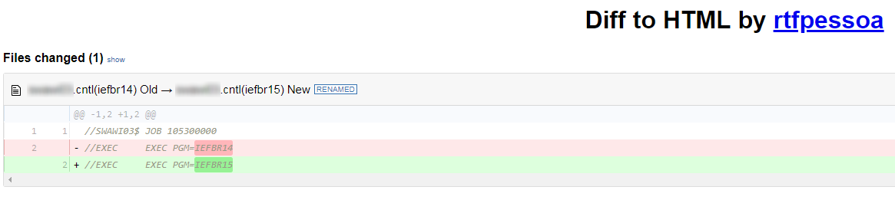
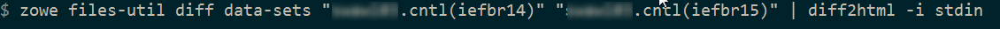
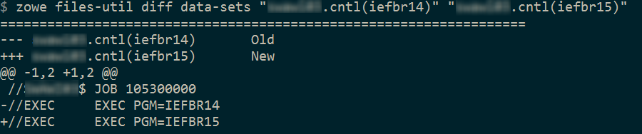

# Developing a new plug-in
Before you begin this tutorial, complete the [Extending an existing plug-in](cli-extending-a-plugin.md) tutorial.

## Overview
This tutorial demonstrates how to create a brand new Zowe&trade; CLI plug-in that uses Zowe CLI Node.js programmatic APIs.

At the end of this tutorial, you will have created a data set diff utility plug-in for Zowe CLI, from which you can pipe
your plugin's output to a third-party utility for a side-by-side diff of data set member contents.



Completed source for this tutorial can be found on the `develop-a-plugin` branch of the zowe-cli-sample-plugin repository.

### Cloning the sample plug-in source
 Clone the sample repo, delete the irrelevant source, and create a brand new plug-in. Follow these steps:

1. `cd` into your `zowe-tutorial` folder
2. `git clone https://github.com/zowe/zowe-cli-sample-plugin files-util`
3. `cd files-util`
4. Delete the `.git` (hidden) folder.
5. Delete all content within the `src/api`, `src/cli`, and `docs` folders.
6. Delete all content within the `__tests__/__system__/api`, `__tests__/__system__/cli`, `__tests__/api`, and `__tests__/cli` folders
7. `git init`
8. `git add .`
9. `git commit -m "initial"`

### Changing package.json
Use a unique `npm` name for your plugin. Change `package.json` name field as follows:

```typescript
  "name": "@zowe/files-util",
```

Issue the command `npm install` against the local repository.

### Adjusting Imperative CLI Framework configuration
Change `imperative.ts` to contain the following:
```typescript
import { IImperativeConfig } from "@zowe/imperative";

const config: IImperativeConfig = {
    commandModuleGlobs: ["**/cli/*/*.definition!(.d).*s"],
    rootCommandDescription: "Files utility plugin for Zowe CLI",
    envVariablePrefix: "FILES_UTIL_PLUGIN",
    defaultHome: "~/.files_util_plugin",
    productDisplayName: "Files Util Plugin",
    name: "files-util"
};

export = config;
```
Here we adjusted the description and other fields in the `imperative` JSON configuration to be relevant to this plug-in.

### Adding third-party packages

We'll use the following packages to create a programmatic API:

- `npm install --save diff`
- `npm install -D @types/diff`


### Creating a Node.js programmatic API
In `files-util/src/api`, create a file named `DataSetDiff.ts`. The content of `DataSetDiff.ts` should be the following:
```typescript
import { AbstractSession } from "@zowe/imperative";
import { Download, IDownloadOptions, IZosFilesResponse } from "@zowe/cli";
import * as diff from "diff";
import { readFileSync } from "fs";

export class DataSetDiff {

    public static async diff(session: AbstractSession, oldDataSet: string, newDataSet: string) {

        let error;
        let response: IZosFilesResponse;

        const options: IDownloadOptions = {
            extension: "dat",
        };

        try {
            response = await Download.dataSet(session, oldDataSet, options);
        } catch (err) {
            error = "oldDataSet: " + err;
            throw error;
        }

        try {
            response = await Download.dataSet(session, newDataSet, options);
        } catch (err) {
            error = "newDataSet: " + err;
            throw error;
        }

        const regex = /\.|\(/gi; // Replace . and ( with /
        const regex2 = /\)/gi;   // Replace ) with .

        // convert the old data set name to use as a path/file
        let file = oldDataSet.replace(regex, "/");
        file = file.replace(regex2, ".") + "dat";
        // Load the downloaded contents of 'oldDataSet'
        const oldContent = readFileSync(`${file}`).toString();

        // convert the new data set name to use as a path/file
        file = newDataSet.replace(regex, "/");
        file = file.replace(regex2, ".") + "dat";
        // Load the downloaded contents of 'oldDataSet'
        const newContent = readFileSync(`${file}`).toString();

        return diff.createTwoFilesPatch(oldDataSet, newDataSet, oldContent, newContent, "Old", "New");
    }
}
```

### Exporting your API
In `files-util/src`, change `index.ts` to contain the following:
```typescript
export * from "./api/DataSetDiff";
```

## Checkpoint
At this point, you should be able to rebuild the plug-in without errors via `npm run build`. You included third party dependencies, created a programmatic API, and customized this new plug-in project. Next, you'll define the command to invoke your programmatic API.

### Defining commands
In `files-util/src/cli`, create a folder named `diff`. Within the `diff` folder, create a file `Diff.definition.ts`. Its content should be as follows:
```typescript
import { ICommandDefinition } from "@zowe/imperative";
import { DataSetsDefinition } from "./data-sets/DataSets.definition";
const IssueDefinition: ICommandDefinition = {
    name: "diff",
    summary: "Diff two data sets content",
    description: "Uses open source diff packages to diff two data sets content",
    type: "group",
    children: [DataSetsDefinition]
};

export = IssueDefinition;
```

Also within the `diff` folder, create a folder named `data-sets`. Within the `data-sets` folder create `DataSets.definition.ts` and `DataSets.handler.ts`.

`DataSets.definition.ts` should contain:
```typescript
import { ICommandDefinition } from "@zowe/imperative";

export const DataSetsDefinition: ICommandDefinition = {
    name: "data-sets",
    aliases: ["ds"],
    summary: "data sets to diff",
    description: "diff the first data set with the second",
    type: "command",
    handler: __dirname + "/DataSets.handler",
    positionals: [
        {
            name: "oldDataSet",
            description: "The old data set",
            type: "string"
        },
        {
            name: "newDataSet",
            description: "The new data set",
            type: "string"
        }
    ],
    profile: {
        required: ["zosmf"]
    }
};
```

`DataSets.handler.ts` should contain the following:
```typescript
import { ICommandHandler, IHandlerParameters, TextUtils, Session } from "@zowe/imperative";
import { DataSetDiff } from "../../../api/DataSetDiff";

export default class DataSetsDiffHandler implements ICommandHandler {
    public async process(params: IHandlerParameters): Promise<void> {

        const profile = params.profiles.get("zosmf");
        const session = new Session({
            type: "basic",
            hostname: profile.host,
            port: profile.port,
            user: profile.user,
            password: profile.pass,
            base64EncodedAuth: profile.auth,
            rejectUnauthorized: profile.rejectUnauthorized,
        });
        const resp = await DataSetDiff.diff(session, params.arguments.oldDataSet, params.arguments.newDataSet);
        params.response.console.log(resp);
    }
}

```

## Trying your command
Be sure to build your plug-in via `npm run build`.

Install your plug-in into Zowe CLI via `zowe plugins install`.

Issue the following command. Replace the data set names with valid mainframe data set names on your system:



The raw diff output is displayed as a command response:



## Bringing together new tools!
The advantage of Zowe CLI and of the CLI approach in mainframe development is that it allows for combining different developer tools for new and interesting uses.

[diff2html](https://diff2html.xyz/) is a free tool to generate HTML side-by-side diffs to help see actual differences in diff output.

Install the `diff2html` CLI via `npm install -g diff2html-cli`. Then, pipe your Zowe CL plugin's output into `diff2html` to generate diff HTML and launch a web browser that contains the content in the screen shot at the [top of this file](#overview).

- `zowe files-util diff data-sets "kelda16.work.jcl(iefbr14)" "kelda16.work.jcl(iefbr15)" | diff2html -i stdin`

## Next steps
Try the [Implementing profiles in a plug-in](cli-implement-profiles.md) tutorial to learn about using profiles with your plug-in.
