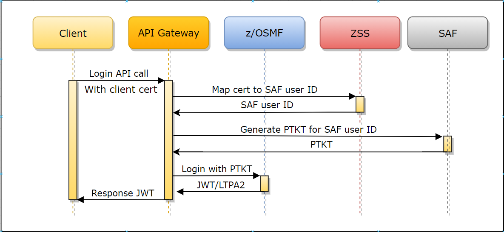

# Zowe API Mediation Layer Security

- [Zowe API Mediation Layer Security](#zowe-api-mediation-layer-security)
  * [How API ML transport security works](#how-api-ml-transport-security-works)
    + [Transport layer security](#transport-layer-security)
    + [Authentication](#authentication)
    + [Zowe API ML services](#zowe-api-ml-services)
    + [Zowe API ML TLS requirements](#zowe-api-ml-tls-requirements)
    + [Authentication for API ML services](#authentication-for-api-ml-services)
      - [Authentication endpoints](#authentication-endpoints)
        - [Supported authentication methods](#supported-authentication-methods)
          - [Authentication with Username Password](#authentication-with-usernamepassword)
          - [Authentication with Client certificate](#authentication-with-client-certificate)
          - [Authentication with JWT Token](#authentication-with-jwt-token)
      - [Authentication parameters](#authentication-parameters)
      - [Authentication providers](#authentication-providers)
        * [z/OSMF Authentication Provider](#z-osmf-authentication-provider)
        * [SAF Authentication Provider](#saf-authentication-provider)
        * [Dummy Authentication Provider](#dummy-authentication-provider)
    + [Authorization](#authorization)
    + [JWT Token](#jwt-token)
    + [z/OSMF JSON Web Tokens Support](#z-osmf-json-web-tokens-support)
    + [API ML truststore and keystore](#api-ml-truststore-and-keystore)
    + [API ML SAF Keyring](#api-ml-saf-keyring)
    + [Discovery Service authentication](#discovery-service-authentication)
    + [Setting ciphers for API ML services](#setting-ciphers-for-api-ml-services)
  * [ZAAS Client](#zaas-client)
    + [Pre-requisites](#pre-requisites)
    + [API Documentation](#api-documentation)
      - [Obtain a JWT token (`login`)](#obtain-a-jwt-token---login--)
      - [Validate and get details from the token (`query`)](#validate-and-get-details-from-the-token---query--)
      - [Invalidate a JWT token (`logout`)](#invalidate-a-jwt-token---logout--)
      - [Obtain a PassTicket (`passTicket`)](#obtain-a-passticket---passticket--)
    + [Getting Started (Step by Step Instructions)](#getting-started--step-by-step-instructions-)
  * [Certificate management in Zowe API Mediation Layer](#certificate-management-in-zowe-api-mediation-layer)
    + [Running on localhost](#running-on-localhost)
      - [How to start API ML on localhost with full HTTPS](#how-to-start-api-ml-on-localhost-with-full-https)
      - [Certificate management script](#certificate-management-script)
      - [Generate certificates for localhost](#generate-certificates-for-localhost)
      - [Generate a certificate for a new service on localhost](#generate-a-certificate-for-a-new-service-on-localhost)
      - [Add a service with an existing certificate to API ML on localhost](#add-a-service-with-an-existing-certificate-to-api-ml-on-localhost)
      - [Service registration to Discovery Service on localhost](#service-registration-to-discovery-service-on-localhost)
    + [Zowe runtime on z/OS](#zowe-runtime-on-zos)
      - [Import the local CA certificate to your browser](#import-the-local-ca-certificate-to-your-browser)
      - [Generate a keystore and truststore for a new service on z/OS](#generate-a-keystore-and-truststore-for-a-new-service-on-z-os)
      - [Add a service with an existing certificate to API ML on z/OS](#add-a-service-with-an-existing-certificate-to-api-ml-on-z-os)
      - [Procedure if the service is not trusted](#procedure-if-the-service-is-not-trusted)

## How API ML transport security works

Security within the API Mediation Layer (API ML) is performed on several levels. This article describes how API ML uses Transport Layer Security (TLS). As a system administrator or API developer, use this guide to familiarize yourself with the following security concepts:

### Transport layer security

The TLS protocol should be used to ensure secure data-transport for all connections to API Mediation Layer services. While it is possible to disable the TLS protocol for debugging purposes or other use-cases, the enabled TLS protocol is the default mode.

### Authentication

Authentication is how an entity, whether it be a user (API Client), or an application (API Service), proves its true identity.

API ML uses the following authentication methods:

- **User ID and password**
    - The user ID and password are used to retrieve authentication tokens
    - Requests originate from a user
    - The user ID and password are validated by a z/OS security manager whereby
    a token is issued that is then used to access the API service

- **TLS client certificates**
    - Certificates are used for service-only requests

### Zowe API ML services

The following range of service types apply to the Zowe&trade; API ML:

- **Zowe API ML services**

  - **Gateway Service (GW)**
    The Gateway is the access point for API clients that require access to API services.
    API services can be accessed through the Gateway by API Clients. The Gateway receives information about an API Service
    from the Discovery Service.

  - **Discovery Service (DS)**
    The Discovery Service collects information about API services and provides this information to the Gateway
    and other services. API ML internal services also register to the Discovery Service.

  - **API Catalog (AC)**
    The Catalog displays information about API services through a web UI. The Catalog receives information
    about an API service from the Discovery Service.

- **Authentication and Authorization Service (AAS)**

  AAS provides authentication and authorization functionality to check user access to resources on z/OS.
  The API ML uses z/OSMF API for  authentication. For more information, see the [API ML wiki](https://github.com/zowe/api-layer/wiki/Zowe-Authentication-and-Authorization-Service)

- **API Clients**

  API Clients are external applications, users, or other API services that access API services through the API Gateway

- **API Services**

  API services are applications that are accessed through the API Gateway. API services register themselves to the
  Discovery Service and can access other services through the Gateway. If an API service is installed
  so that direct access is possible, API services can access other services without the Gateway.
  When APIs access other services, they can also function as API clients.

### Zowe API ML TLS requirements

The API ML TLS requires servers to provide HTTPS ports. Each API ML service has the following specific requirements:

- **API Client**
    - The API Client is not a server
    - Requires trust of the API Gateway
    - Has a truststore or SAF keyring that contains certificates required to trust the Gateway

- **Gateway Service**
    - Provides an HTTPS port
    - Has a keystore or SAF keyring with a server certificate
        - The certificate needs to be trusted by API Clients
        - This certificate should be trusted by web browsers because the API Gateway can be used to display web UIs
    - Has a truststore or SAF keyring that contains certificates needed to trust API Services

- **API Catalog**
    - Provides an HTTPS port
    - Has a keystore or SAF keyring with a server certificate
        - The certificate needs to be trusted by the API Gateway
        - This certificate does not need to be trusted by anyone else

- **Discovery Service**
    - Provides an HTTPS port
    - Has a keystore or SAF keyring with a server certificate
    - Has a truststore or SAF keyring that contains certificates needed to trust API services

- **API Service**
    - Provides an HTTPS port
    - Has a keystore or SAF keyring with a server and client certificate
        - The server certificate needs to be trusted by the Gateway
        - The client certificate needs to be trusted by the Discovery Service
        - The client and server certificates can be the same
        - These certificates do not need to be trusted by anyone else
    - Has a truststore or SAF keyring that contains one or more certificates that are required to trust the Gateway and Discovery Service

### Authentication for API ML services

- **API Gateway**

    - The API Gateway handles authentication
    - There are two authentication endpoints that allow authentication of the resource by providers
    - Diagnostic endpoints `https://{gatewayUrl}:{gatewayPort}/application/**` in API Gateway are protected by basic authentication, Zowe JWT token, or a client certificate

- **API Catalog**

    - API Catalog is accessed by users and requires a login
    - Protected access is performed by the Authentication and Authorization Service

- **Discovery Service**

    - Discovery Service is accessed by API Services
    - This access (reading information and registration) requires protection by means of a client certificate
    - (Optional) Access can be granted to users (administrators)
    - Diagnostic endpoints `https://{gatewayUrl}:{gatewayPort}/application/**` in Discovery Service are protected by basic authentication, Zowe JWT token, or a client certificate

- **API Services**

    - Authentication is service-dependent
    - It is recommended to use the Authentication and Authorization Service for authentication


#### Authentication endpoints

The API Gateway contains the following REST API authentication endpoints:

- `auth/login`
  
  The full path of the `auth/login` endpoint appears as `https://{gatewayUrl}  :{gatewayPort}/gateway/api/v1/auth/login`.

  The `auth/login` endpoint authenticates mainframe user credentials and   returns an authentication token. The login request requires user   credentials though one of the following methods:
    * Basic access authentication
    * JSON with user credentials
    * Client certificate
  
  When authentication is successful, the response to the request is an empty body and a token is contained in a secure `HttpOnly` cookie named `apimlAuthenticationToken`. When authentication fails, the user receives a 401 status code.

- `auth/query`

   The full path of the `auth/query` endpoint appear as `https://{gatewayUrl}:   {gatewayPort}/gateway/api/v1/auth/query`.

   The `auth/query` endpoint validates the token and retrieves the    information associated with the token.
   The query request requires the token through one of the following methods:
     * A cookie named `apimlAuthenticationToken`
     * Bearer authentication

   When authentication is successful, the response to the request is a JSON object which contains information associated with the token. When authentication fails, the user receives a 401 status code.

- `auth/ticket`

  The `auth/ticket` endpoint generates a PassTicket for the user associated with a token. The full path of the `auth/ticket` endpoint appears as `https://{gatewayUrl}:{gatewayPort}/gateway/api/v1/auth/ticket`.

  This endpoint is protected by a client certificate.
  The ticket request requires the token in one of the following formats:
  
  - Cookie named `apimlAuthenticationToken`.
  - Bearer authentication
  
  The request takes the `applicationName` parameter, which is the name of the application for which the PassTicket should be generated. Supply this parameter.

  The response is a JSON object, which contains information associated with the ticket.

- `auth/refresh`

  **Notes:** 
  
   - The endpoint is disabled by default. For more information, see [Enable JWT token endpoint](../../user-guide/api-mediation/api-gateway-configuration.md#enable-jwt-token-refresh-endpoint).
   - The endpoint is protected by a client certificate.
  
  The `auth/refresh` endpoint generates a new token for the user based on valid jwt token. The full path of the `auth/refresh` endpoint appears as `https://{gatewayUrl}:{gatewayPort}/gateway/api/v1/auth/refresh`. The new token overwrites the old cookie with a `Set-Cookie` header. As part of the process, the old token gets invalidated and is not usable anymore.

  The refresh request requires the token in one of the following formats:
  
  - Cookie named `apimlAuthenticationToken`.
  - Bearer authentication
  
  For more information, see the OpenAPI documentation of the API Mediation Layer in the API Catalog.

#### Supported authentication methods

The API Mediation Layer provides multiple methods which clients can use to authenticate. When the API ML is run as part
of Zowe, all of the following methods are enabled and supported. All methods are supported at least to some extent
with each authentication provider. 

##### Authentication with Username/Password

The client can authenticate via Username and password. There are multiple methods which can be used to deliver  
credentials. For more details, see the ZAAS Client documentation. 

##### Authentication with Client certificate

Beginning with release 1.19 LTS, it is possible to perform authentication with client certificates. This feature is functional and tested, but automated testing on various security systems is not yet complete. As such, the feature is provided as a beta release for early preview. If you would like to offer feedback using client certificate authentication, please create an issue against the api-layer repository. Client Certificate authentication will move out of Beta once test automation is fully implemented across different security systems.

If the keyring or a truststore contains at least one valid certificate authority (CA) other than the CA of the API ML, it is possible to use the client certificates issued by this CA to authenticate to the API ML. This feature is not enabled by default and needs to be configured.

When providing credentials in any form together with client certificate on the same login request, the credentials take precedence and client certificate is ignored.

Authentication is performed in the following ways:

* The client calls the API ML Gateway login endpoint with the client certificate.
* The client certificate and private key are checked as a valid TLS client certificate against the Gateway's trusted CAs.
* The public part of the provided client certificate is checked against SAF, and SAF subsequently returns a user ID that owns this certificate. ZSS  provides this API for the Mediation Layer.
* The Gateway performs the login of the mapped user and returns a valid JWT token.



**Prerequisites:**

* Alter the Zowe runtime user and set protection by password. The user is created with the `NOPASSWORD` parameter by the Zowe installer. It is necessary to change this password. For RACF, issue the following TSO command: 
  
      ALTUSER <ZOWE_RUNTIME_USER (ZWESVUSR by default)> PASSWORD(<NEWPASSWORD>)
  
  For other security systems, please refer to the documentation for an equivalent command.
* Ensure that the Zowe runtime user is allowed to log in to z/OSMF (For example user is member of the default IZUUSER group)
* Ensure that you have an external Certificate Authority and signed client certificates, or generate these certificates in SAF. The client certificate has to have correct `Extended Key Usage` metadata to allow being used for TLS client authentication. (`OID: 1.3.6.1.5.5.7.3.2`)
* Import the client certificates to SAF, or add them to a user profile. (Examples: `RACDCERT ADD` or `RACDCERT GENCERT`). For more information, see your security system documentation.
* Import the external CA to the truststore or keyring of the API Mediation Layer.
* [Configure Gateway for client certificate authentication](../../user-guide/api-mediation/api-gateway-configuration.md#gateway-client-certificate-authentication).
* To upgrade from Zowe 1.18 or lower, see the [Additional security rights that need to be granted](../../user-guide/configure-zos-system.md#configure-main-Zowe-server-use-identity-mapping).
* PassTicket generation must be enabled for the Zowe runtime user. The user has to be able to generate PassTicket for itself and for the APPLID of z/OSMF. For more information, see [Configure Passticket](api-mediation-passtickets.md).
* The Zowe runtime user has to be enabled to perform identity mapping in SAF. For more information, see [Additional security rights that need to be granted](../../user-guide/configure-zos-system.md#configure-main-Zowe-server-use-identity-mapping).
* ZSS has to be configured to participate in Zowe SSO. For more information, see [Using web tokens for sso on Zlux and ZSS](../../user-guide/configure-certificates-keystore.md#using-web-tokens-for-sso-on-zlux-and-zss).

##### Authentication with JWT Token

When the client authenticates with the API ML, the client receives the JWT token in exchange. This token can be used for further authentication. If z/OSMF is configured as the authentication provider and the client already received a JWT token produced by z/OSMF, it is possible to reuse this token within API ML for authentication.  

### Authentication parameters
Parameters are specified in the onboarding enablers.

Authentication parameters enable a service to accept a Zowe JWT or client certificate. The API Gateway translates the authentication token to an authentication method supported by a service.

The following example shows the parameters that define the service authentication method:

**Example:**

```yaml
authentication:
    scheme: httpBasicPassTicket
    applid: ZOWEAPPL
```

* **authentication.scheme**

  The value of this parameter specifies a service authentication scheme. Any valid headers or `X-Zowe-Auth-Failure` error headers are set and passed to southbound services. In addition, any `X-Zowe-Auth-Failure` error headers coming from the northbound service are also be passed to the southbound services without setting the valid headers. The `X-Zowe-Auth-Failure` error header contains details about the error and suggests potential actions.
  The following schemes are supported by the API Gateway:

    * **bypass**

      This value specifies that the token is passed unchanged to service.

      **Note:** This is the default scheme when no authentication parameters are specified.

    * **zoweJwt**

        * When a Zowe JWT is provided, this scheme value specifies that the service accepts the Zowe JWT. No additional processing is done by the API Gateway.
        * When a client certificate is provided, the certificate is transformed into a Zowe JWT, and the southbound service performs the authentication.

    * **httpBasicPassTicket**

      This value specifies that a service accepts PassTickets in the Authorization header of the HTTP requests using the basic authentication scheme.
      It is necessary to provide a service APPLID in the `authentication.applid` parameter to prevent passticket generation errors.

        * When a JWT is provided, the service validates the Zowe JWT to use for passticket generation.
        * When a client certificate is provided, the service validates the certificate by mapping it to a mainframe user to use for passticket generation.

      For more information, see [Enabling PassTicket creation for API Services that Accept PassTickets](api-mediation-passtickets.md)

    * **zosmf**

      This value specifies that a service accepts z/OSMF LTPA (Lightweight Third-Party Authentication).
      This scheme should only be used only for a z/OSMF service used by the API Gateway Authentication Service and other z/OSMF services that use the same LTPA key.

        * When a JWT is provided, the token extracts the LTPA and forwards it to the service.
        * When a client certificate is provided, the certificate translates into a z/OSMF token, and also extracts the LTPA for the service to use.

      For more information about z/OSMF Single Sign-on, see [Establishing a single sign-on environment](https://www.ibm.com/support/knowledgecenter/SSLTBW_2.4.0/com.ibm.zosmfcore.multisysplex.help.doc/izuG00hpManageSecurityCredentials.html)

    * **safIdt**

      This value specifies that the service accepts SAF IDT, and expects that the token produced by the SAF IDT provider implementation is in the `X-SAF-Token` header. It is necessary to provide a service APPLID in the `authentication.applid` parameter.

      For more information, see [Implement a SAF IDT provider](implement-new-saf-provider.md).

    * **x509**

      This value specifies that a service accepts client certificates forwarded in the HTTP header. The Gateway service extracts information from a valid client certificate. For validation, the certificate needs to be trusted by API Mediation Layer, and needs to contain a Client Authentication (1.3.6.1.5.5.7.3.2) entry in Extended Key Usage. To use this scheme, it is also necessary to specify which headers to include. Specify these parameters in `headers`.

* **authentication.headers**

  When the `x509` scheme is specified, use the `headers` parameter to select which values to send to a service. Use one of the following values:

    * `X-Certificate-Public`

      The public part of client certificate base64 encoded

    * `X-Certificate-DistinguishedName`

      The distinguished name from client certificate

    * `X-Certificate-CommonName`

      The common name from the client certificate

* **authentication.applid**

  This parameter specifies a service APPLID.
  This parameter is valid only for the `httpBasicPassTicket` authentication scheme.

### Authentication providers

API ML contains the following providers to handle authentication for the API Gateway:
* `z/OSMF Authentication Provider`
* `SAF Authentication Provider`
* `Dummy Authentication Provider`

#### z/OSMF Authentication Provider

The `z/OSMF Authentication Provider` allows the API Gateway to authenticate with the z/OSMF service. The user needs z/OSMF access in order to authenticate.

Use the following properties of the API Gateway to enable the `z/OSMF Authentication Provider`:
```
apiml.security.auth.provider: zosmf
apiml.security.auth.zosmfServiceId: zosmf  # Replace me with the correct z/OSMF service id
```

#### SAF Authentication Provider

The `SAF Authentication Provider` allows the API Gateway to authenticate directly with the z/OS SAF provider that is installed on the system. The user needs a SAF account to authenticate. 

Use the following property of the API Gateway to enable the `SAF Authentication Provider`:
```
apiml.security.auth.provider: saf
```
**Note:** To provide your own implementation of the SAF IDT provider, see the [Implement new SAF provider](implement-new-saf-provider.md) guidelines.

#### Dummy Authentication Provider

The `Dummy Authentication Provider` implements simple authentication for development purposes using dummy credentials (username:  `user`, password `user`). The `Dummy Authentication Provider` makes it possible for the API Gateway to run without authenticating with the z/OSMF service.

Use the following property of API Gateway to enable the `Dummy Authentication Provider`:
```
apiml.security.auth.provider: dummy
```

### Authorization

Authorization is a method used to determine access rights of an entity.

In the API ML, authorization is performed by the z/OS security manager ([ACF2](https://www.broadcom.com/products/mainframe/identity-access/acf2), [IBM RACF](https://www.ibm.com/support/knowledgecenter/zosbasics/com.ibm.zos.zsecurity/zsecc_042.htm), [Top Secret](https://www.broadcom.com/products/mainframe/identity-access/top-secret)). An authentication token is used as proof of valid authentication. The authorization checks, however, are always performed by the z/OS security manager.

### JWT Token

The JWT secret that signs the JWT Token is an asymmetric private key that is generated during Zowe keystore configuration. The JWT token is signed with the RS256 signature algorithm.

You can find the JWT secret, alias `localhost`, in the PKCS12 keystore that is stored in `${KEYSTORE_DIRECTORY}/localhost/localhost.keystore.p12`. The public key necessary to validate the JWT signature is read from the keystore.

You can also use the `/gateway/api/v1/auth/keys/public/all` endpoint to obtain all public keys that can be used to verify JWT tokens signature in standard [JWK format](https://openid.net/specs/).

### z/OSMF JSON Web Tokens Support

Your z/OSMF instance can be enabled to support JWT tokens as described at [Enabling JSON Web Token support](https://www.ibm.com/support/knowledgecenter/SSLTBW_2.4.0/com.ibm.zos.v2r4.izua300/izuconfig_EnableJSONWebTokens.htm).
In this case, the Zowe API ML uses this JWT token and does not generate its own Zowe JWT token. All authentication APIs, such as `/gateway/api/v1/login` and `/gateway/api/v1/check` function in the same way as without z/OSMF JWT.
Gateway service endpoint `/gateway/api/v1/auth/keys/public/all` serves the z/OSMF JWK that can be used for JWT signature validation.

### API ML truststore and keystore

A _keystore_ is a repository of security certificates consisting of either authorization certificates or public key certificates with corresponding private keys (PK), used in TLS encryption. A _keystore_ can be stored in Java specific format (JKS) or use the standard format (PKCS12). The Zowe API ML uses PKCS12 to enable the keystores to be used
by other technologies in Zowe (Node.js).

### API ML SAF Keyring

As an alternative to using a keystore and truststore, API ML can read certificates from a SAF keyring. The user running the API ML must have rights to access the keyring. From the java perspective, the keyring behaves as the `JCERACFKS` keystore. The path to the keyring is specified as `safkeyring:////user_id/key_ring_id`. The content of SAF keyring is equivalent to the combined contents of the keystore and the truststore.

**Note:** When using JCERACFKS as the keystore type, ensure that you define the class to handle the RACF keyring using the `-D` options to specify the `java.protocol.handler.pkgs property`:

    -Djava.protocol.handler.pkgs=com.ibm.crypto.provider

The elements in the following list, which apply to the API ML SAF Keyring, have these corresponding characteristics:

**The API ML local certificate authority (CA)**

- The API ML local CA contains a local CA certificate and a private key that needs to be securely stored.
- The API ML local certificate authority is used to sign certificates of services.
- The API ML local CA certificate is trusted by API services and clients.

**The API ML keystore or API ML SAF Keyring**

- Server certificate of the Gateway (with PK). This can be signed by the local CA or an external CA.
- Server certificate of the Discovery Service (with PK). This can be signed by the local CA.
- Server certificate of the Catalog (with PK). This can be signed by the local CA.
- The API ML keystore is used by API ML services.

**The API ML truststore or API ML SAF Keyring**

- Local CA public certificate
- External CA public certificate (optional)
- Can contain self-signed certificates of API Services that are not signed by the local or external CA
- Used by API ML services

**Zowe core services**

- Services can use the same keystore and truststore or the same keyring as APIML for simpler installation and management.
- When using a keystore and truststore, services have to have rights to access and read them on the filesystem.
- When using a keyring, the user of the service must have authorization to read the keyring from the security system.
- Alternatively, services can have individual stores for higher security.

**API service keystore or SAF keyring** (for each service)

- The API service keystore contains a server and client certificate signed by the local CA.

**API service truststore or SAF keyring** (for each service)

- (Optional) The API service truststore contains a local CA and external CA certificates.

**Client certificates**

- A client certificate is a certificate that is used for validation of the HTTPS client. The client certificate of a Discovery Service client can be the same certificate as the server certificate of the services which the Discovery Service client uses.

### Discovery Service authentication

There are several authentication mechanisms, depending on the desired endpoint, as described by the following matrix:

| Endpoint | Authentication method | Note |
|----|-----|------|
| UI (eureka homepage)                 | basic auth(MF), token              | see note about mainframe authentication  |
| application/**                       | basic auth(MF), token              |  see note about mainframe authentication  |
| application/health, application/info | none                          |     |
| eureka/**                            | client certificate                   | Allows for the other services to register without mainframe credentials or token. API ML's certificate can be used. It is stored in the `keystore/localhost/localhost.keystore.p12` keystore or in the SAF keyring. It is exported to .pem format for convenience. Any other certificate which is valid and trusted by Discovery service can be used. |
| discovery/**                         | certificate, basic auth(MF), token | see note about mainframe authentication |

**Note:** Some endpoints are protected by mainframe authentication. The authentication function is provided by the API Gateway. This functionality is not available until the Gateway registers itself to the Discovery Service.

Since the Discovery Service uses HTTPS, your client also requires verification of the validity of its certificate. Verification is performed by validating the client certificate against certificates stored in the truststore or SAF keyring.

  Some utilities including HTTPie require the certificate to be in PEM format. The exported certificate in .pem format is located here: `keystore/localhost/localhost.pem`.

 The following example shows the HTTPie command to access the Discovery Service endpoint for listing registered services and provides the client certificate:

 ```
 http --cert=keystore/localhost/localhost.pem --verify=false -j GET https://localhost:10011/eureka/apps/
 ```

### Setting ciphers for API ML services

You can override ciphers that are used by the HTTPS servers in API ML services by configuring properties of the Gateway, Discovery Service, and API Catalog.

**Note:** You do not need to rebuild JAR files when you override the default values in shell scripts.

The *application.yml* file contains the default value for each service, and can be found [here](https://github.com/zowe/api-layer/blob/master/gateway-service/src/main/resources/application.yml). The default configuration is packed in .jar files. On z/OS, you can override the default configuration in `<RUNTIME_DIR>/components/<APIML_COMPONENT>/bin/start.sh`.
Add the launch parameter of the shell script to set a cipher:

```
-Dapiml.security.ciphers=<cipher-list>
```

On localhost, you can override the default configuration in [config/local/gateway-service.yml](https://github.com/zowe/api-layer/blob/master/config/local/gateway-service.yml) (including other YAML files for development purposes).

The following list shows the default ciphers. API ML services use the following cipher order:

**Note:** Ensure that the version of Java you use is compatible with the default cipherset.

```
   TLS_ECDHE_RSA_WITH_AES_128_GCM_SHA256,TLS_ECDHE_ECDSA_WITH_AES_128_GCM_SHA256,
   TLS_ECDHE_RSA_WITH_AES_256_GCM_SHA384,TLS_ECDHE_ECDSA_WITH_AES_256_GCM_SHA384,
   TLS_ECDHE_RSA_WITH_AES_128_CBC_SHA256,TLS_ECDHE_ECDSA_WITH_AES_128_CBC_SHA256,
   TLS_ECDHE_ECDSA_WITH_AES_256_CBC_SHA384
```

Only IANA ciphers names are supported. For more information, see [Cipher Suites](https://wiki.mozilla.org/Security/Server_Side_TLS#Cipher_suites) or [List of Ciphers](https://testssl.net/openssl-iana.mapping.html).

## ZAAS Client

The ZAAS client is a plain Java library that provides authentication through a simple unified interface without the need
for detailed knowledge of the REST API calls presented in this section. The Client function has only a few dependencies including Apache HTTP Client, Lombok, and their associated dependencies. The client contains methods to perform the following actions:

- To obtain a JWT token
- To validate and get details from a JWT token
- To invalidate the JWT token
- To obtain a PassTicket

### Pre-requisites

- Java SDK version 1.8.
- An active instance of the API ML Gateway Service.
- A property file which defines the keystore or truststore certificates.

### API Documentation

The plain java library provides the `ZaasClient` interface with following public methods:

```java
public interface ZaasClient {
    String login(String userId, String password) throws ZaasClientException;
    String login(String authorizationHeader) throws ZaasClientException;
    ZaasToken query(String token) throws ZaasClientException;
    ZaasToken query(HttpServletRequest request) throws ZaasClientException;
    String passTicket(String jwtToken, String applicationId) throws ZaasClientException, ZaasConfigurationException;
    void logout(String token) throws ZaasClientException, ZaasConfigurationException;
}
```

This Java code enables your application to add the following functions:

- **Obtain a JWT token (`login`)**
- **Validate and get details from the token (`query`)**
- **Invalidate a JWT token (`logout`)**
- **Obtain a PassTicket (`passTicket`)**

#### Obtain a JWT token (`login`)

To integrate login, call one of the following methods for login in the `ZaasClient` interface:

- If the user provides credentials in the request body, call the following method from your API:

  ```java
  String login(String userId, String password) throws ZaasClientException;
  ```

- If the user provides credentials as Basic Auth, use the following method:

    ```java
    String login(String authorizationHeader) throws ZaasClientException;
    ```

These methods return the JWT token as a String. This token can then be used to authenticate the user in subsequent APIs.

**Note:** Both methods automatically use the truststore file to add a security layer, which requires configuration in the `ConfigProperties` class.

#### Validate and get details from the token (`query`)

Use the `query` method to get the details embedded in the token. These details include creation time of the token, expiration time of the token, and the user who the token is issued to.

Call the `query` method from your API in the following format:

```java
ZaasToken query(String token) throws ZaasClientException;
```

In return, you receive the `ZaasToken` Object in JSON format.

This method automatically uses the truststore file to add a security layer, which you configured in the `ConfigProperties` class.

The `query` method is overloaded, so you can provide the `HttpServletRequest` object that contains the token in the `apimlAuthenticationToken`
cookie or in an Authorization header. You then receive the `ZaasToken` Object in JSON format.

```java
ZaasToken query(HttpServletRequest request) throws ZaasClientException;
```

#### Invalidate a JWT token (`logout`)

The `logout` method is used to invalidate the JWT token. The token must be provided in the Cookie header and must follow the format accepted by the API ML. 

Call the `logout` method from your API in the following format:

```java
void logout(String token) throws ZaasClientException, ZaasConfigurationException;   
```

If the token is successfully invalidated, you receive a `204` HTTP status code in return. 

#### Obtain a PassTicket (`passTicket`)

The `passTicket` method has an added layer of protection. To use this method, call the method of the interface, and provide
a valid APPLID of the application and JWT token as input.

The APPLID is the name of the application (up to 8 characters) that is used by security products to differentiate certain security operations (like PassTickets) between applications.

This method has an added layer of security, whereby you do not have to provide an input to the method since you already initialized the `ConfigProperties` class. As such, this method automatically fetches the truststore and keystore files as an input.

In return, this method provides a valid pass ticket as a String to the authorized user.

**Tip:** For additional information about PassTickets in API ML see [Enabling PassTicket creation for API Services that Accept PassTickets](https://docs.zowe.org/stable/extend/extend-apiml/api-mediation-passtickets.html).

### Getting Started (Step by Step Instructions)

To use this library, use the procedure described in this section.

**Follow these steps:**

1. Add `zaas-client` as a dependency in your project.

    You will need to specify the version of the `zaas-client` you want. `zaas-client` versioning following the semantic versioning format of `major.minor.patch`. For example, `1.22.0`.

    Gradle:

      1. Create a `gradle.properties` file in the root of your project if one does not already exist.

      2. In the `gradle.properties` file, set the URL of the specific Artifactory containing the _SpringEnabler_ artifact.

      ```
      # Repository URL for getting the enabler-java artifact
      artifactoryMavenRepo=https://zowe.jfrog.io/zowe/libs-release/
      ```

      3. Add the following _Gradle_ code block to the `repositories` section of your `build.gradle` file:

        ```gradle
        repositories {
            ...

            maven {
                url artifactoryMavenRepo
            }
        }
        ```

      4. Add the following _Gradle_ dependency:

        ```groovy
        dependencies {
            compile 'org.zowe.apiml.sdk:zaas-client:{{version}}'
        }
        ```

    Maven:

      1. Add the following _XML_ tags within the newly created `pom.xml` file:

        ```xml
        <repositories>
            <repository>
                <id>libs-release</id>
                <name>libs-release</name>
                <url>https://zowe.jfrog.io/zowe/libs-release/</url>
                <snapshots>
                    <enabled>false</enabled>
                </snapshots>
            </repository>
        </repositories>
        ```
    
        **Tip:** If you want to use snapshot version, replace libs-release with libs-snapshot in the repository url and change snapshots->enabled to true.
      
      2. Then add the following _Maven_ dependency:
    
        ```xml
        <dependency>
                    <groupId>org.zowe.apiml.sdk</groupId>
                    <artifactId>zaas-client</artifactId>
                    <version>{{version}}</version>
        </dependency>
        ```

2. In your application, create your Java class which will be used to create an instance of `ZaasClient`, which enables you to use its method to login, query, and to issue a PassTicket.

3. To use `zaas-client`, provide a property file for configuration.

   **Tip:** Check `org.zowe.apiml.zaasclient.config.ConfigProperites` to see which properties are required in the property file.

   **Configuration Properties:**

    ```java
    public class ConfigProperties {
        private String apimlHost;
        private String apimlPort;
        private String apimlBaseUrl;
        private String keyStoreType;
        private String keyStorePath;
        private String keyStorePassword;
        private String trustStoreType;
        private String trustStorePath;
        private String trustStorePassword;
        private boolean httpOnly;
    }
    ```
    
    **Note:** If `httpOnly` property is set to true, the ZAAS Client will access the API ML via HTTP protocol without TLS. 
    This meant for z/OS configuration with AT-TLS that will ensure that TLS and the required client certificates are used.

4. Create an instance of `ZaasClient` in your class and provide the `configProperties` object.

   **Example:**

    ```java
    ZaasClient zaasClient = new ZaasClientImpl(getConfigProperties());
    ```

You can now use any method from `ZaasClient` in your class.

**Example:**

For login, use the following code snippet:

```java
   String zaasClientToken = zaasClient.login("user", "user");
 ```

The following codeblock is an example of a `SampleZaasClientImplementation`.

**Example:**

```java
import org.zowe.apiml.zaasclient.config.ConfigProperties;
import org.zowe.apiml.zaasclient.exception.ZaasClientException;
import org.zowe.apiml.zaasclient.exception.ZaasConfigurationException;
import org.zowe.apiml.zaasclient.service.ZaasClient;

public class SampleZaasClientImplementation {

    /**
     * This method is used to fetch token from zaasClient
     * @param username
     * @param password
     * @return valid JWT token returned from the authentication service
     */
    public String login(String username, String password) {
        try {
            ZaasClient zaasClient = new ZaasClientImpl(getConfigProperties());
            String zaasClientToken = zaasClient.login(username, password);
            //Use this token  in subsequent calls
            return zaasClientToken;
        } catch (ZaasClientException | ZaasConfigurationException exception) {
            exception.printStackTrace();
        }
    }

    private ConfigProperties getConfigProperties() {
        // Load the values for configuration properties
     }
}
```

## Certificate management in Zowe API Mediation Layer

### Running on localhost

#### How to start API ML on localhost with full HTTPS

The https://github.com/zowe/api-layer repository already contains pre-generated certificates that can be used to start API ML with HTTPS on your computer. The certificates are not trusted by your browser so you can either ignore the security warning or generate your own certificates and add them to the truststore of your browser or system.

The certificates are described in more detail in the [TLS Certificates for localhost](https://github.com/zowe/api-layer/blob/master/keystore/README.md).

**Note:** When running on localhost, only the combination of using a keystore and truststore is supported.


#### Certificate management script

Zowe API Mediation Layer provides a script that can be used on Windows, Mac, Linux, and z/OS
to generate a certificate and keystore for the local CA, API Mediation Layer, and services.

This script is stored in `zowe/zowe-install-packaging` repository [bin/apiml_cm.sh](https://github.com/zowe/zowe-install-packaging/blob/master/bin/apiml_cm.sh).
It is a UNIX shell script that can be executed by Bash or z/OS Shell. For Windows, install Bash by going to the following link: [cmder](http://cmder.net/).


#### Generate certificates for localhost

**Follow these steps:**

1. Clone the `zowe-install-packaging` repository to your local machine.
2. Place the `bin/apiml_cm.sh` script intoto `scripts` directory in your API Mediation Layer repository folder
3. Use the following script in the root of the `api-layer` repository to generate certificates for localhost:

`scripts/apiml_cm.sh --action setup`

This script creates the certificates and keystore for the API Mediation Layer in your current workspace.


#### Generate a certificate for a new service on localhost

To generate a certificate for a new service on localhost, see [Generating certificate for a new service on localhost](https://github.com/zowe/api-layer/blob/master/keystore/README.md#generating-certificate-for-a-new-service-on-localhost).


#### Add a service with an existing certificate to API ML on localhost

For more information about adding a service with an existing certificate to API ML on localhost, see [Trust certificates of other services](https://github.com/zowe/api-layer/blob/master/keystore/README.md#trust-certificates-of-other-services).


#### Service registration to Discovery Service on localhost

To register a new service to the Discovery Service using HTTPS, provide a valid client certificate that is trusted by the Discovery Service.


### Zowe runtime on z/OS

Certificates for the API ML local CA and API ML service are managed by installing the Zowe runtime on z/OS. Follow the instructions in [Installing the Zowe runtime on z/OS](../../user-guide/install-zos.md).

There are two ways to set up certificates on a z/OS machine:

- Certificates in SAF keyring
- Certificates in UNIX files (keystore and truststore)
 
The [Configuring PKCS12 certificates](../../user-guide/configure-certificates-keystore) and [Configuring JCERACFS certificates in a key ring](../../user-guide/configure-certificates-keyring) contain instructions about how to set up certificates during installation. Follow the procedure in the applicable section described in this article during installation.


#### Import the local CA certificate to your browser

Trust in the API ML server is a necessary precondition for secure communication between Browser or API Client application. Ensure this trust through the installation of a Certificate Authority (CA) public certificate. By default, API ML creates a local CA. Import the CA public certificate to the truststore for REST API clients and to your browser. You can also import the certificate to your root certificate store.

**Notes:** 

- If a SAF keyring is being used and set up with `ZWEKRING` JCL, the procedure to obtain the certificate does not apply. It is recommended that you work with your security system administrator to obtain the certificate. Start the procedure at step 2.

- The public certificate in the [PEM format](https://en.wikipedia.org/wiki/Privacy-Enhanced_Mail) is stored at `<KEYSTORE_DIRECTORY>/local_ca/localca.cer` where `<KEYSTORE_DIRECTORY>` is defined in a customized `<RUNTIME_DIR>/bin/zowe-setup-certificates.env` file during the installation step that generates Zowe certificates. The certificate is stored in UTF-8 encoding so you need to transfer it as a binary file. Since this is the certificate to be trusted by your browser, it is recommended to use a secure connection for transfer.

**Follow these steps:**

1. Download the local CA certificate to your computer. Use one of the following methods to download the local CA certificate to your computer:

    - **Use [Zowe CLI](https://github.com/zowe/zowe-cli#zowe-cli--) (Recommended)**
    Issue the following command:

    `zowe zos-files download uss-file --binary $KEYSTORE_DIRECTORY/local_ca/localca.cer`

    - **Use `sftp`**
    Issue the following command:

    ```
    sftp <system>
    get $KEYSTORE_DIRECTORY/local_ca/localca.cer
    ```

    To verify that the file has been transferred correctly, open the file. The following heading and closing should appear:

    ```
    -----BEGIN CERTIFICATE-----
    ...
    -----END CERTIFICATE-----
    ```

2. Import the certificate to your root certificate store and trust it.

    - **For Windows**, run the following command:

      `certutil -enterprise -f -v -AddStore "Root" localca.cer`

      **Note:** Ensure that you open the terminal as **administrator**. This will install the certificate to the Trusted Root Certification Authorities.

    - **For macOS**, run the following command:

      `$ sudo security add-trusted-cert -d -r trustRoot -k /Library/Keychains/System.keychain localca.cer`

    - **For Firefox**, manually import your root certificate via the Firefox settings, or force Firefox to use the Windows truststore.

      **Note:** Firefox uses its own certificate truststore.

        Create a new Javascript file firefox-windows-truststore.js at `C:\Program Files (x86)\Mozilla Firefox\defaults\pref` with the   following content:

      ```
      /* Enable experimental Windows truststore support */
      pref("security.enterprise_roots.enabled", true);
      ```

#### Generate a keystore and truststore for a new service on z/OS

**Note:** This procedure applies to UNIX file keystore and truststore only. For the SAF keyring option, it is recommended that you perform the actions manually using your security system commands.	

You can generate a keystore and truststore for a new service by calling the `apiml_cm.sh` script in the directory with API Mediation Layer:

Call the `apiml_cm.sh` script in the directory with the API Mediation Layer as in the following example.

**Example:**
```
cd $RUNTIME_DIR
bin/apiml_cm.sh --action new-service --service-alias <alias> --service-ext <ext> \
--service-keystore <keystore_path> --service-truststore <truststore_path> \
--service-dname <dname> --service-password <password> --service-validity <days> \
--local-ca-filename $KEYSTORE_DIRECTORY/local_ca/localca
 ```
where:

* **`service-alias`**

 is a unique string to identify the key entry. All keystore entries (key and trusted certificate entries) are accessed via unique aliases. Since the keystore has only one certificate, you can omit this parameter and use the default value `localhost`.

* **`service-keystore`**

 Specifies repository of security certificates plus corresponding private keys. The `<keystore_path>` is the path excluding the extension to the keystore that is generated. It can be an absolute path or a path relative to the current working directory. The key store is generated in PKCS12 format with the `.p12` extension. Ensure that the path is in an existing directory where your service expects the keystore.

  **Example:** `/opt/myservice/keystore/service.keystore`.

* **`service-truststore`**

 Contains certificates from other parties that you expect to communicate with, or from Certificate Authorities that you trust to identify other parties. The `<truststore_path>` is the path excluding the extension to the trust store that is generated. It can be an absolute path or a path relative to the current working directory. The truststore is generated in PKCS12 format.

* **`service-ext`**

 Specifies the X.509 extension that should be the Subject Alternate Name (SAN). The SAN contains host names that are used to access the service. You need to specify the same hostname that is used by the service during API Mediation Layer registration.

  **Example:** `"SAN=dns:localhost.localdomain,dns:localhost,ip:127.0.0.1"`

  **Note:** For more information about SAN, see *SAN or SubjectAlternativeName* at [Java Keytool - Common Options](https://www.ibm.com/support/knowledgecenter/en/SSYKE2_8.0.0/com.ibm.java.security.component.80.doc/security-component/keytoolDocs/commonoptions.html).

* **`service-dname`**

 Specifies the X.509 Distinguished Name and is used to identify entities, such as those which are named by the subject and issuer (signer) fields of X.509 certificates.

  **Example:** `"CN=Zowe Service, OU=API Mediation Layer, O=Zowe Sample, L=Prague, S=Prague, C=CZ"`

* **`service-validity`**

 Specifies the number of days until the certificate expires.

* **`service-password`**

 Specifies the keystore password. The purpose of the password is the integrity check. The access protection for the keystore and keystore need to be achieved by making them accessible only by the ZOVESVR user ID and the system administrator.

The `local-ca-filename` is the path to the keystore that is used to sign your new certificate with the local CA private key. It should point to the `$KEYSTORE_DIRECTORY/local_ca/localca` where `$KEYSTORE_DIRECTORY` is defined in a customized `$ZOWE_ROOT_DIR/bin/zowe-setup-certificates.env` file during the installation step that generates Zowe certificates.


#### Add a service with an existing certificate to API ML on z/OS

**Note:** This procedure applies only to UNIX file keystore/truststore. For the SAF keyring option, we recommend to perform the actions manually using your security system commands.

The API Mediation Layer requires validation of the certificate of each service that it accessed by the API Mediation Layer. The API Mediation Layer requires validation of the full certificate chain. Use one of the following methods:

- Import the public certificate of the root CA that has signed the certificate of the service to the APIML truststore.

- Ensure that your service has its own certificate. If it was signed by intermediate CA, ensure that all intermediate CA certificates are contained in the service's keystore.

  **Note:** If the service does not provide an intermediate CA certificates to the API ML, then validation fails. This can be circumvented by importing the intermediate CA certificates to the API ML truststore.

The following path is an example of importing a public certificate to the API ML truststore by calling in the directory with API Mediation Layer.

**Example:**

```
cd <RUNTIME_DIR>
bin/apiml_cm.sh --action trust --certificate <path-to-certificate-in-PEM-format> --alias <alias>
```

#### Procedure if the service is not trusted

If your service is not trusted, you may receive a response with the HTTP status code [502 Bad Gateway](https://developer.mozilla.org/en-US/docs/Web/HTTP/Status/502) and a JSON response in the standardized format for error messages. The following request is an example of when this errror response may occur.

**Example:**

```http --verify=$KEYSTORE_DIRECTORY/local_ca/localca.cer GET https://<gatewayHost>:<port>/<untrustedService>/api/v1/greeting```

In this example, you receive a similar response:

```
    HTTP/1.1 502
    Content-Type: application/json;charset=UTF-8

    {
        "messages": [
            {
                "messageContent": "The certificate of the service accessed by HTTPS using URI '/<untrustedService>/api/v1/greeting' is not trusted by the API Gateway: sun.security.validator.ValidatorException: PKIX path building failed: sun.security.provider.certpath.SunCertPathBuilderException: unable to find valid certification path to requested target",
                "messageKey": "apiml.common.tlsError",
                "messageNumber": "AML0105",
                "messageType": "ERROR"
            }
        ]
    }
```

The message has the key `apiml.common.tlsError`, and the message number `AML0105`, and content that explains details about the message.

If you receive this message, import the certificate of your service or the CA that signed it to the truststore of the API Mediation Layer as described previously.
