# Creating Microsoft Teams bot app with Developer Portal

To create a bot app for Microsoft™ Teams, you need to use the tool Developer Portal to create a new app, specify app details, enable bot capabilities, and add it to your teams.

Developer Portal is a Teams app that makes it easy to create or integrate your own Microsoft Teams apps whether you develop custom apps for your enterprise or SaaS applications for teams around the world. It streamlines the creation of the manifest and package for your app and provides several useful tools like the Card Editor. You can find Developer Portal in the Teams store.

1.  Find and add Developer Portal to your Microsoft Teams.

    1.  Launch and log in your Microsoft Teams client.

    2.  Click the Apps icon at the bottom left of your Microsoft Teams window to open the Apps pane.

        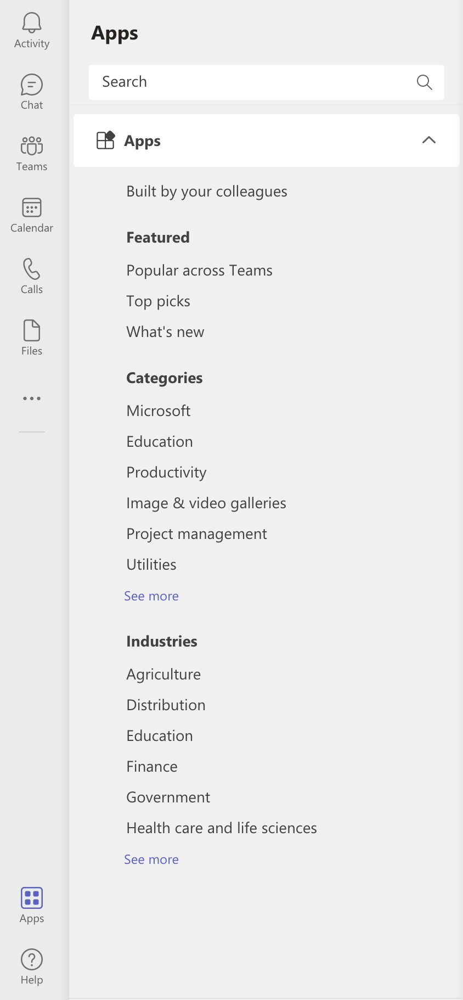

    3.  Search for Developer Portal with the search bar.

        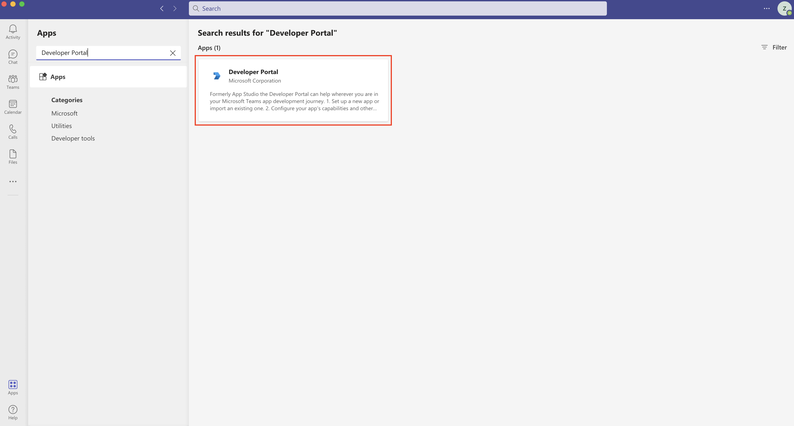

    4.  Select Developer Portal and click **Add**.

        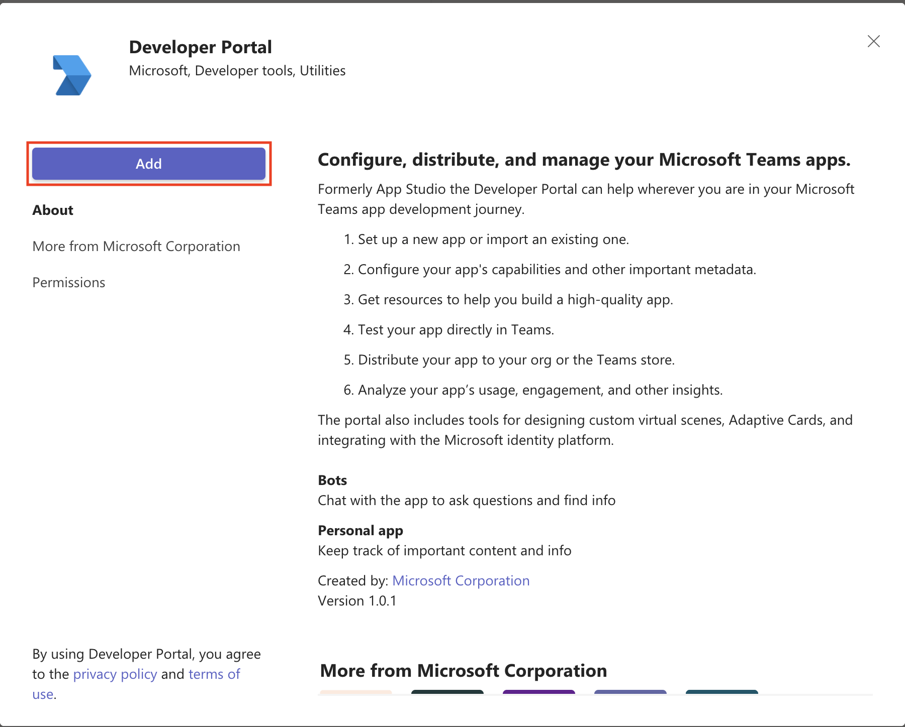

        You can see the home page of Developer Portal.

2.  Create a new app.

    1.  Click the **Apps** icon at the top of the home page of Developer Portal to open the Apps pane.

        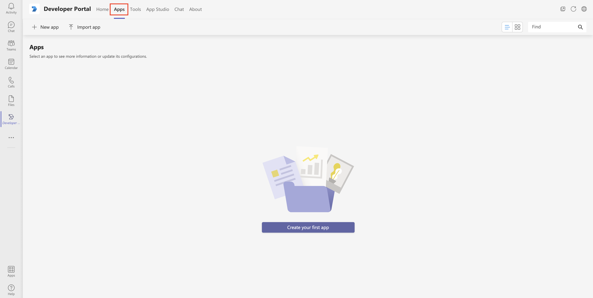

    2.  Click the **New app** icon to create a new app.

        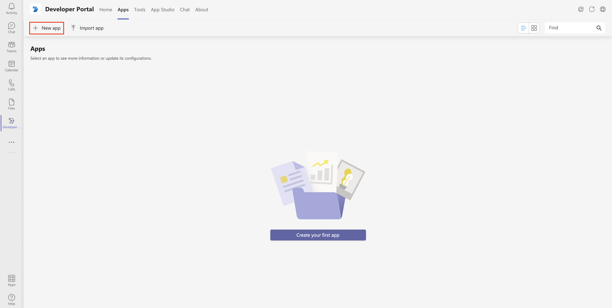

    3.  In the prompted dialog, specify a short name for your app that is used for configuration in Zowe Chat as the bot username, and then click **Add**.

    4.  Specify the required values for your app, and then click **Save**.

        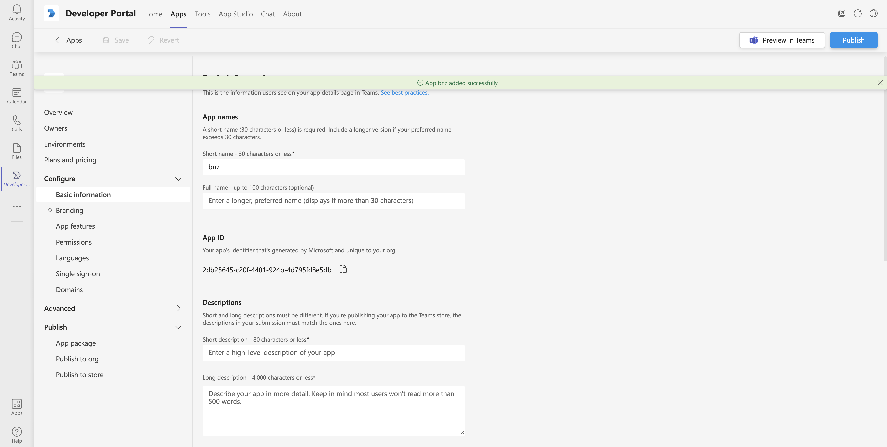

        - For **Descriptions**, specify a short description for your app.

        - Specify all the required information accordingly.

          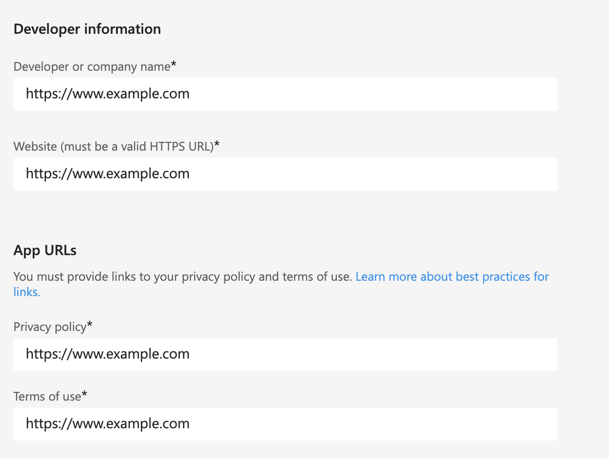

3.  Configure your app.

    1.  Switch to **Apps** pane and select the app that you created.

        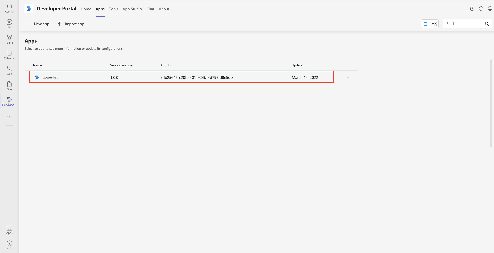

    2.  Click the **App features** icon under **Configure**, and select **Bot** in App features pane.

        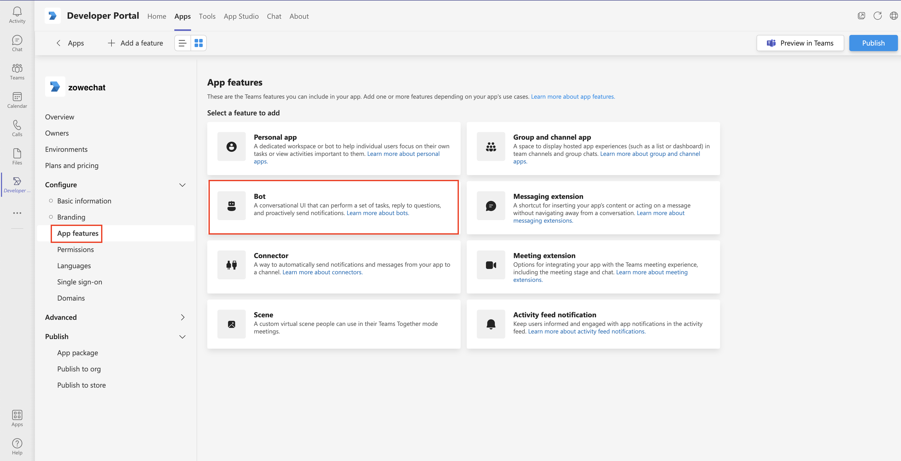

    3.  Select the bot that you created in **Identify your bot** section.

        Select **Personal**, **Team** and **Group Chat** for **Scope** so that you can add the bot app to your teams. Save your settings and you can see your bot in the **Bots** panel.

        **Remember:** You need to create a bot if you don't have one. You can either create a bot with Microsoft Bot Framework or with Microsoft Azure. For specific steps, see [Creating a bot with Microsoft Bot Framework](chat_prerequisite_teams_create_bot_framework.md) or [Creating a bot with Microsoft Azure](chat_prerequisite_teams_create_bot_azure.md).

4.  Publish your app.

    1.  Click the **App package** icon under **Publish**.

        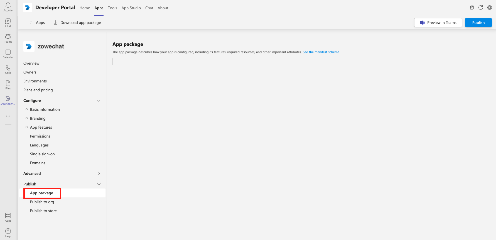

    2.  Click **Download app package** to download your app package.

        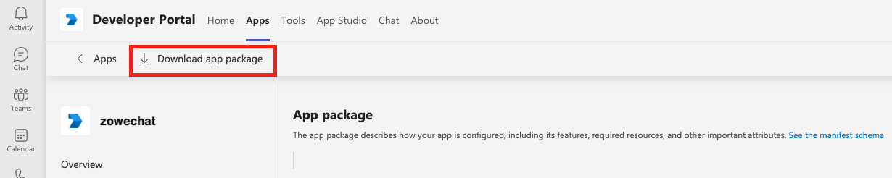

    3.  Click the Apps icon at the bottom left of your Microsoft Teams window, and click **Manage your apps**.

        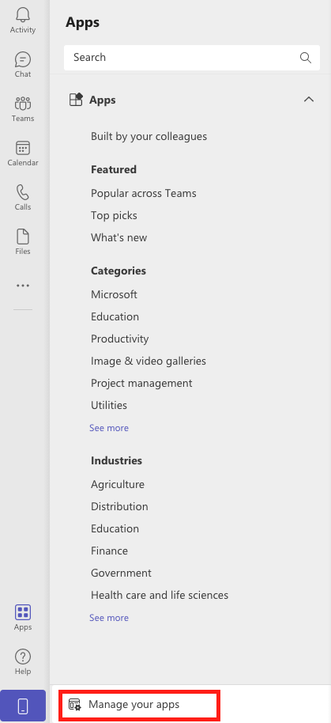

    4.  Select **Upload a custom app** to add the app to a team. Upload the app package that you download in substep b.

        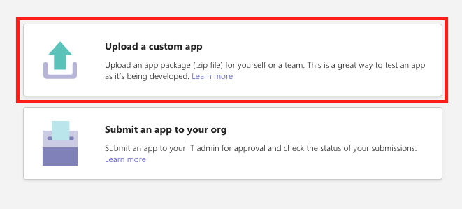

    5.  Select **Add to a team** in the drill-down options.

        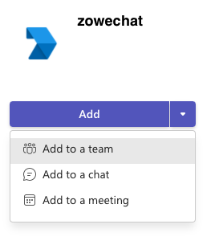

    6.  Type or select a team to set up your bot.

        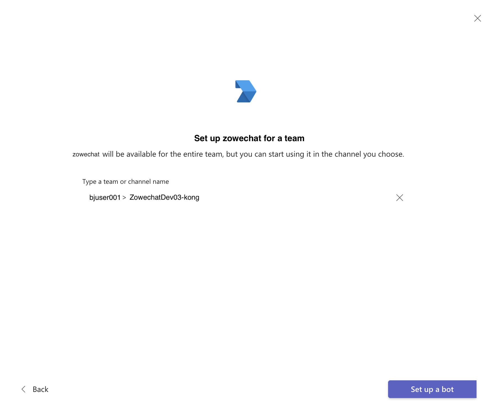

5.  Optional: You can also choose to publish your app to your organization's app catalog so that people in your organization can share it.

    1.  Click the Apps icon at the bottom left of your Microsoft Teams window, and click **Manager your apps**.

        

    2.  Select **Submit an app to your org** to publish your app.

        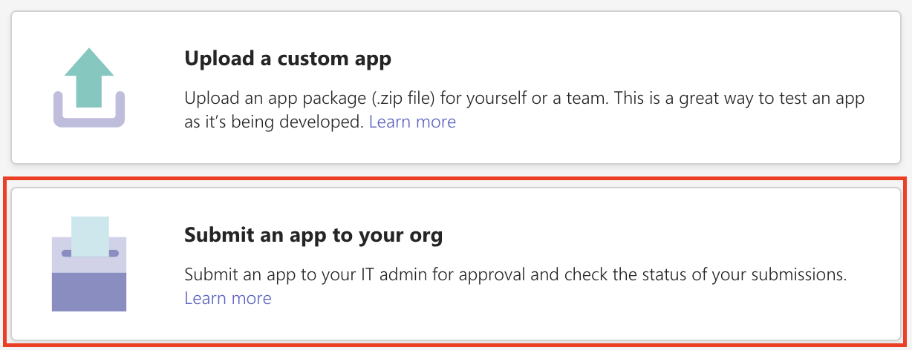

        Your app will appear on your Apps homepage when the IT admin of your organization approves.

        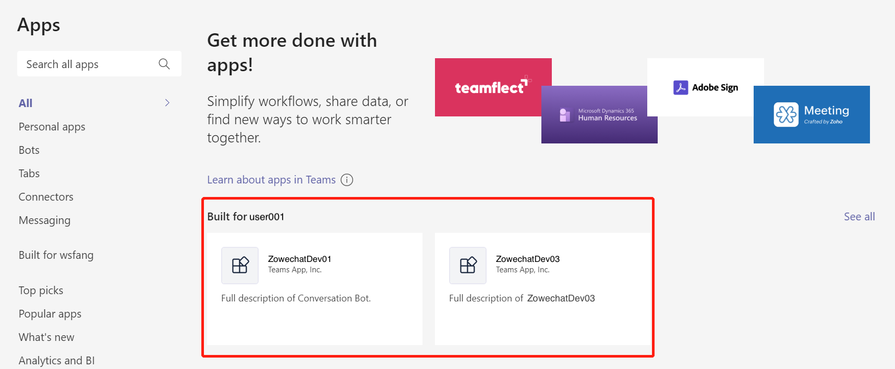

        Now, people in your tenant can see this app and can use it.

You have successfully created a bot app for Microsoft Teams and can talk to it in your teams.
