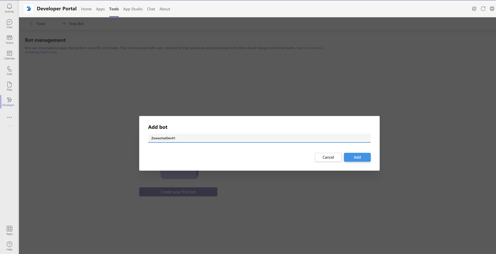
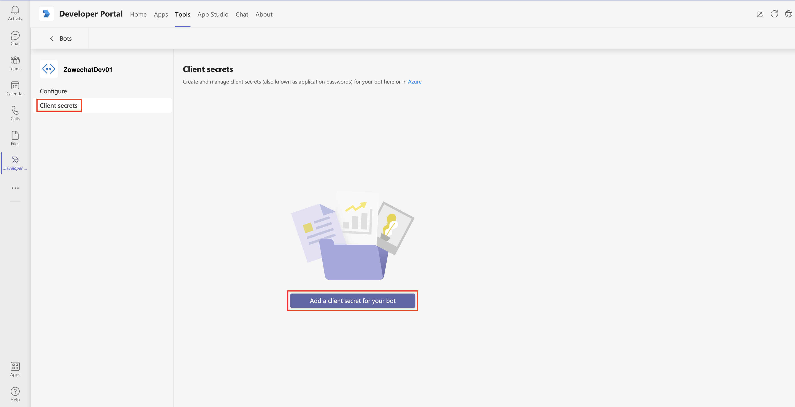

# Creating a bot with Microsoft Bot Framework

You can use the tool Microsoft™ Developer Portal to create a bot with Microsoft Bot Framework and set it up for your bot app.

1.  Click the **Tools** icon at the top of the home page of Developer Portal to open the Tools pane.

    

2.  Click **Bot management** to create your bot.

    

3.  Click **New bot** to create a new bot.

4.  In the prompted dialog, specify a short name for your bot and then click **Add**.

    

5.  Click **Client secrets** at the left of the Developer Portal, and click **Add a client secret for your bot** to generate a client secret for your bot.

    

6.  Copy the new client secret.

    <!-->-->

    **Remember:** Save the client secret for later use. You will need it when you configure your Microsoft Teams. The client secret appears only once here.

Your Microsoft Bot Framework bot is successfully created.

You can continue with installing or publishing your bot app in your Microsoft Teams. For specific steps, refer to the step 4 and 5 in [Creating Microsoft Teams bot app with Developer Portal](chat_prerequisite_teams_create_app_developer_portal.md).