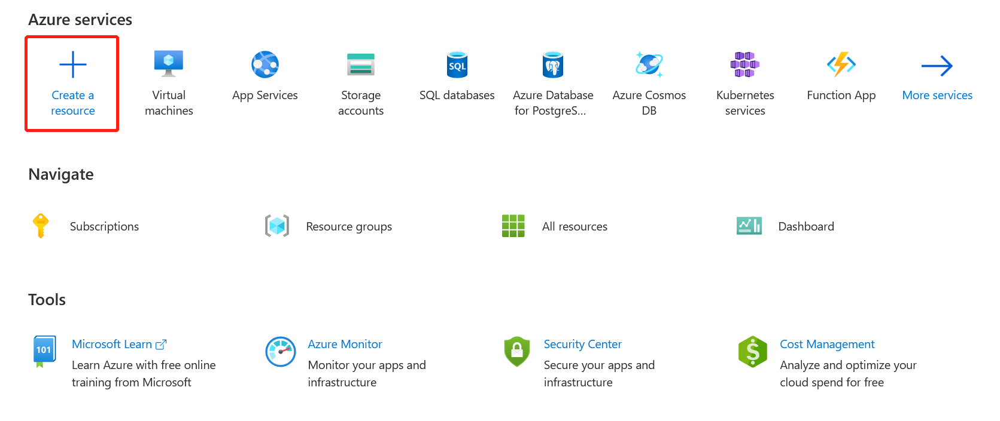
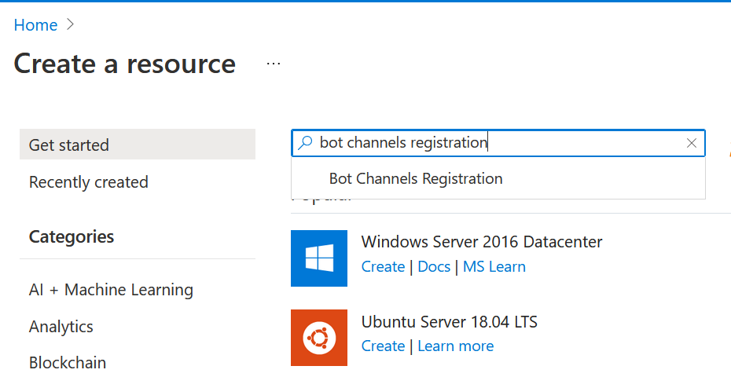
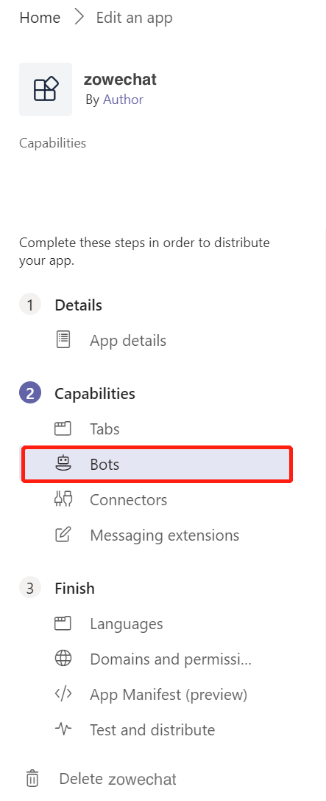

# Creating a bot with Microsoft Azure

To create a bot with Microsoft™ Azure, you need to use Microsoft Azure portal to create a resource with the Bot Channels Registration service, configure the resource, get the bot password, and configure channels.

1.  Create a new resource.

    1.  Launch the Microsoft Azure portal at [portal.azure.com](http://portal.azure.com).

    2.  Click **Create a resource** under **Azure services**.

        

    3.  Search for **Bot Channels Registration** with the search bar and select it.

        

    4.  Click **Create** to create a new resource.

        

    5.  Specify the required values, where

        -   **Bot handler** is a unique identifier for your bot. You can set it to be your bot name.
        -   **Resource group** is a container that holds related resources for an Azure solution. You can create a new one if you don't have one.
        -   **Messaging endpoint** needs to be configured later. You can leave it blank for now.
        -   **Microsoft App ID and password** is required. Set it as **Auto create App ID and password**. Otherwise, you can create one manually.
    6.  Click **Create**.

        It takes a while to complete the creating process. You can see a notice in the **Notification** at the upper right of the menu bar.

2.  Configure the resource.

    1.  Click **Go to resource** when you see the notification. You can also check the resource from the portal home page. Click **All resources** and you can see the one you just created. Select it to start configuration.

    2.  Select **Configuration** in **Settings**.

    3.  Specify the required values for your resource.

        1.  Check the **Enable Streaming Endpoint** box.
        2.  To specify the messaging endpoint, you need to do this step after you install Zowe Chat.
        3.  Click **Apply** to make the settings effective.
    4.  To get the bot password, click **Manage** next to **Microsoft App ID**and open the **Certificates & secrets** pane.

        1.  Click **New client secret** under **Client secrets** and the **Add a client secret** displays.
        2.  Specify the description for your resource.
        3.  Set the **Expires** value for **24 months**.
        4.  Click **Add**.
        You can see the resource information listed in the table with **Description**, **Expires**, **Value**, and **ID**. **Value** is your bot password. Save it for later use when you configure Zowe Chat. It only appears once here.

        **Remember:** The **Microsoft App ID** is the bot ID in the App Studio of Microsoft Teams. You will need it when you configure your Microsoft Teams in later steps.

3.  Configure the channels.

    1.  Go back to the resource page, click **Channels** under **Settings**. Now, only Web Chat is listed in the table.

    2.  Click the MS Teams icon under **Add a featured channel**.

    3.  Click **Save** to connect to MS Teams channels.

4.  Set up the bot for your bot app in Microsoft Teams.

    1.  Open the App Studio tool in your Microsoft Teams client.

    2.  Click your resource that is listed on the pane to open it.

    3.  Click the **Bots** icon under **Capabilities** and click **Edit**.

        

    4.  Select **Connect to a different bot id** and specify with the Microsoft App ID that you have for your Azure bot.

    5.  Select **Team** for **Scope** so that you can add the bot app to your teams.

    6.  Save your settings.

Your Microsoft Azure bot is successfully created.

You can continue with installing or publishing your bot app in your Microsoft Teams.

