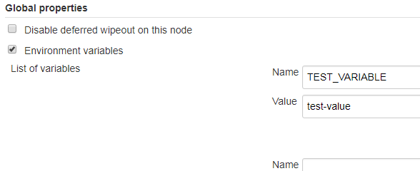

# Setting environment variables in an automation server

You can use environment variables in an automation server, such as Jenkins, to write more efficient scripts and make use of secure credential storage. Automation tools such as Jenkins automation server usually provide a mechanism for securely storing configuration (for example, credentials). In Jenkins, you can use withCredentials to expose credentials as an environment variable (ENV) or Groovy variable.

You can either set environment variables using the `SET` command within your scripts, or navigate to **Manage Jenkins \> Configure System \> Global Properties** and define an environment variable in the Jenkins GUI. For example:
