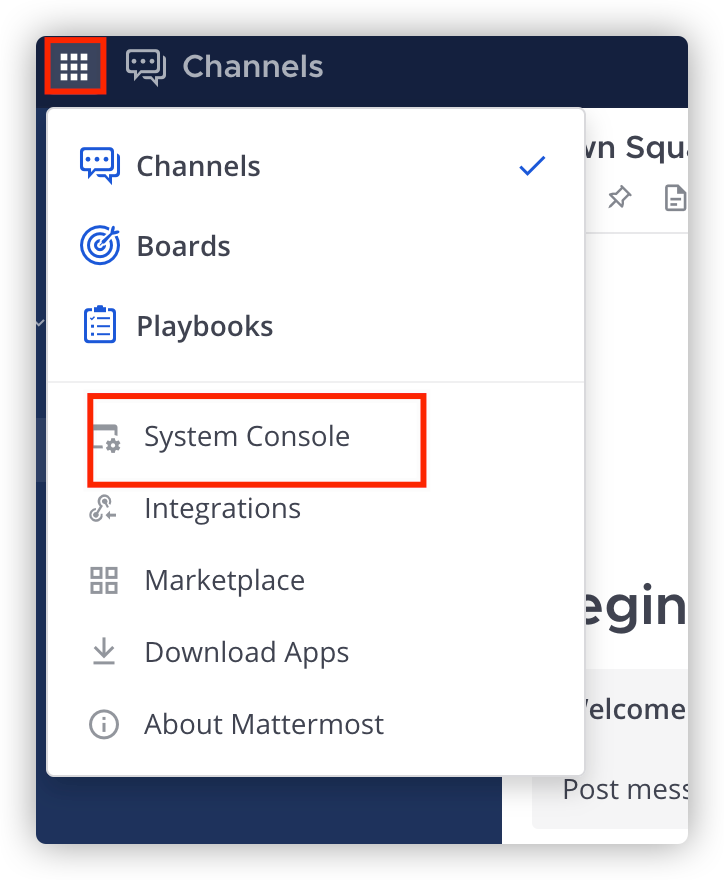
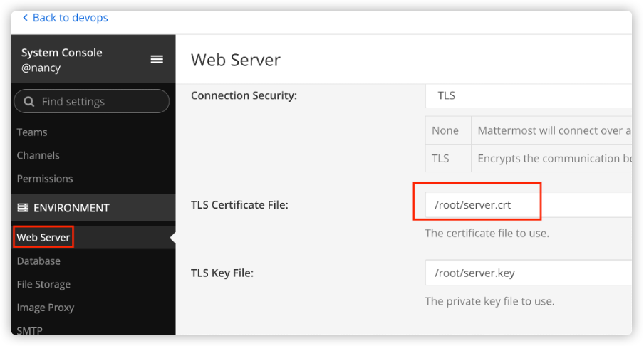
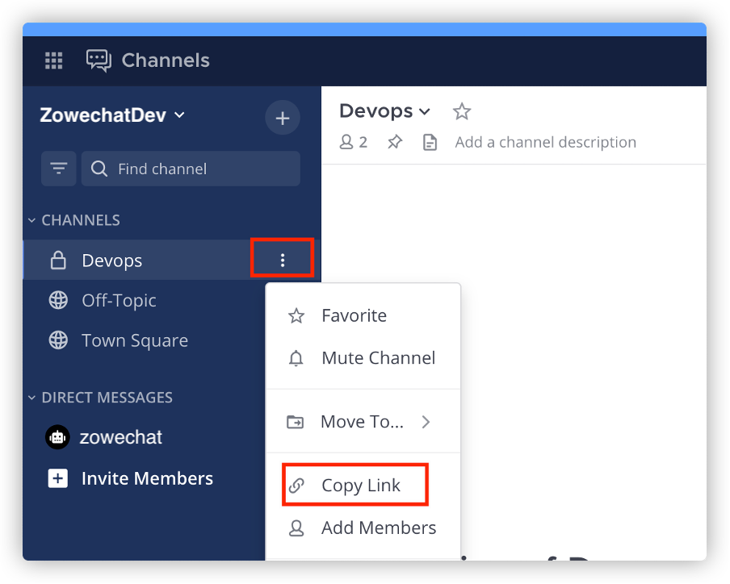

# Configuring Zowe Chat with Mattermost

This step is for Mattermost users only. You configure your chat platform by editing the `mattermost.yaml` file.

## Prerequisite

Make sure that you have configured your chat tool when configuring the Zowe Chat server. For details, see [Configuring Zowe Chat server](chat_configure_server.md).

## Configuring Mattermost

1. Go to the Zowe Chat configuration directory.

   ```
   cd $ZOWE_CHAT_HOME/config/chatTools
   ```

2. If you enabled TLS on the Mattermost Server when you [create an administrator account](chat_prerequisite_mattermost_admin_account.md), you can download the SSL certificate of Mattermost server. 

   1. Log in to Mattermost with your administrator account.
   2. Click Main Menu icon and then click System Console. 

      

   3. Scroll down to **ENVIRONMENT** section and click **Web Server**. Find your certificate according to the path configured in **TLS Certificate File**.
      
      
   
   4. Copy the certificate to your Zowe Chat Server. You can place it in any directory that your Zowe Chat server can access.

3. Edit the `mattermost.yaml` file by cutomizing the following fields: 

   - `hostName`: your Mattermost server hostname
   - `tlsCertificate`: the absolute file path of the TLS certificate (PEM) of your Mattermost server if HTTPS protocol is specified.
   - `botAccessToken`: the access token to connect to your bot
   - HTTP endpoint `hostName`: the host name or IP address of your HTTP endpoint

   You can also specify other configurations such as the protocol, port number, team URL, bot user name, and HTTP endpoint of your Mattermost server. 

   :::tip

   Team URL is what you got when you create your team. If you don't remember that, you can just select any channel in your team and copy link. Paste the link into a text editor, and then you will find the team URL. 

   

   :::

   ```
   # Specify the protocol of your Mattermost server. The value can be https or http.
   # The default value is https.
   protocol: https

   # Specify the host name or IP address of your Mattermost server.
   hostName: <Your mattermost server hostname>

   # Specify the port number of your Mattermost server.
   # The default value is 443.
   port: 443

   # Specify the base path of your Mattermost web service API server. Only '/api/v4' is supported by Mattermost at present.
   # The default value is /api/v4.
   basePath: /api/v4

   # Specify the absolute file path of the TLS certificate (PEM) of your Mattermost server if HTTPS protocol is specified.
   tlsCertificate: <Your absolute certificate file path of your Mattermost server>

   # Specify the team URL of your team created in your Mattermost server.
   # The default value is devops.
   teamUrl: devops

   # Specify the bot user name or account that is used in your chat tool server.
   # The default value is zowechat.
   botUserName: zowechat

   # Specify the access token to connect to your bot.
   botAccessToken: <Your bot token>

   # Configure the messaging application which your Mattermost server will communicate with when some user clicking actions occur.
   messagingApp:
     # Specify the protocol of your HTTP endpoint. The value can be https or http.
     # The default value is https.
     protocol: https

     # Specify the host name or IP address of your HTTP endpoint.
     hostName: <Your host name>

     # Specify the port number of your HTTP endpoint.
     # The default value is 7701.
     port: 7701
  
     # Specify the base path of your HTTP endpoint.
     # The default value is /zowe/chat/api/v1.
     basePath: /zowe/chat/api/v1

     # Specify the absolute file path of the TLS key (PEM) if HTTPS protocol is specified.  
     tlsKey: <Your absolute TLS key file path of your messaging server>

     # Specify the absolute file path of the TLS certificate (PEM) if HTTPS protocol is specified.
     tlsCert: <Your absolute TLS cert file path of your messaging server>
   ``` 

<!--https://github.com/zowe/zowe-chat/main/packages/chat/src/config/chatTools/mattermost.yaml-->
