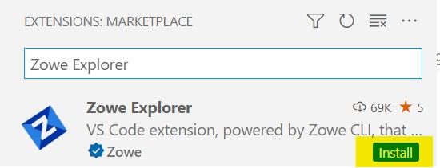

# Using Zowe Explorer

Review this section to familiarize yourself with Zowe Explorer and make the best use of its available options and features.

## Supported operating systems, environments, and platforms

### Operating systems

- MacOS 10.15 (Catalina), 11 (Big Sur), 12 (Monterey)
- Unix-like:
   - [CentOS](https://www.centos.org/) 8+
   - [RHEL](https://www.redhat.com/en/technologies/linux-platforms/enterprise-linux) 8+
   - [Ubuntu](https://ubuntu.com/) 20.04+
- Windows 10+

### Integrated development environments:

- [VS Code](https://code.visualstudio.com/) 1.53.2+
- [Eclipse Che](https://www.eclipse.org/che/)
- [Red Hat CodeReady Workspaces](https://www.redhat.com/en/technologies/jboss-middleware/codeready-workspaces)
- [Theia](https://theia-ide.org/) 1.18+

:::note
   
Zowe Explorer is compatible with Theia 1.18.0 or higher. However, we recommend using a [Theia community release](https://theia-ide.org/releases/) as Zowe Explorer could experience possible unexpected behaviors with the latest Theia releases.

:::

## Using Zowe Explorer in remote environments

As of Zowe Version 2.11, Zowe Explorer and the Zowe Explorer API no longer use `node-keytar`, which was used to manage mainframe credentials. This change might cause some users issues when trying to interact with remote environments.

See [Usage in Remote Environments](https://github.com/zowe/vscode-extension-for-zowe/wiki/Usage-in-Remote-Environments) to learn more about how to resolve credential errors.

## Using a specific version of Zowe Explorer

Depending on their circumstances, developers might want to keep using a specific version of Zowe Explorer. To ensure that a particular version remains installed on VS Code, refer to the procedure for one of the following scenarios:

### Zowe Explorer is installed

#### **Preventing automatic version updates**

By default, VS Code automatically updates extensions as new versions are released. Refer to the following steps to prevent automatic updates:

1. On the VS Code menu bar, click **File**, **Preferences**, and click **Settings** to display the Settings editor.

2. Select the **User** or **Workspace** tab, depending on which settings you want to update.
3. In the Settings navigation menu, click **Features** and click **Extensions**.
4. In the **Auto Update** dropdown menu, select **None**. This prevents VS Code from updating your extensions automatically.

#### **Installing a specific previous version**

1. Select the **Extensions** tab on the **Activities Bar** to display a list of installed extensions.

2. In the **Side Bar**, click the **Gear** icon next to Zowe Explorer to open a dropdown menu that lists available options.
3. Select **Install Another Version…** to open a dropdown menu that lists previous versions of Zowe Explorer.
4. Click the version of Zowe Explorer you want to install.

### Zowe Explorer is not installed

If Zowe Explorer is not installed, you can install the current release of the extension and then revert to a previous version.

#### **Installing a previous version of Zowe Explorer**

1. Select the **Extensions** tab on the **Activities Bar** to display the **Search Extensions in Marketplace** field.
2. In the **Side Bar**, search for `Zowe Explorer`. Click the **Install** button on the Zowe Explorer search result item. This opens a Zowe Explorer tab in the **Editor** area.

   
  

3. Click the **Down** arrow next to the **Uninstall** button. Select **Install Another Version…** to open a dropdown menu that lists previous versions of Zowe Explorer.
4. Search for and click the version of Zowe Explorer you want to install.

## Credentials in Zowe Explorer

When working in remote or virtualized environments &mdash; such as Eclipse Che, GitHub Codespaces, CodeReady Workspaces &mdash; administrators may find the configuration process for storing credentials securely too cumbersome. Instead, they may prefer to rely on the security tools integrated with these environments, such as file access permissions. To do so, administrators need to disable Zowe Explorer's credential management functionality.

### Preventing Zowe Explorer from storing credentials

1. Open the `zowe.config.json` file in Visual Studio Code.

2. Find the `autoStore` property.
3. Set the `autoStore` property to `false`.

   Credentials will be stored on a per profile/per panel basis until one of the following takes place:

   - Data Sets/USS/Jobs tree refresh caused by an update to the `zowe.config.json` file
   - Zowe Explorer refresh in the **Command Palette**
   - Reload of the Visual Studio Code window
   - Closing and reopening the VS Code window

### Disabling Secure Credential Storage of credentials

#### Zowe Explorer v2

1. Navigate to **Settings** in VS Code.

2. In Zowe Explorer Settings, uncheck the **Zowe Security: Secure Credentials Enabled** checkbox.

   When disabled and `autoStore` is set to True in `zowe.config.json`, z/OS credentials are stored as plain text in the configuration file.

#### Zowe Explorer v1

1. Navigate to **Settings** in VS Code.

2. In Zowe Explorer Settings, leave the **Zowe Security: Credential Key** field blank.
