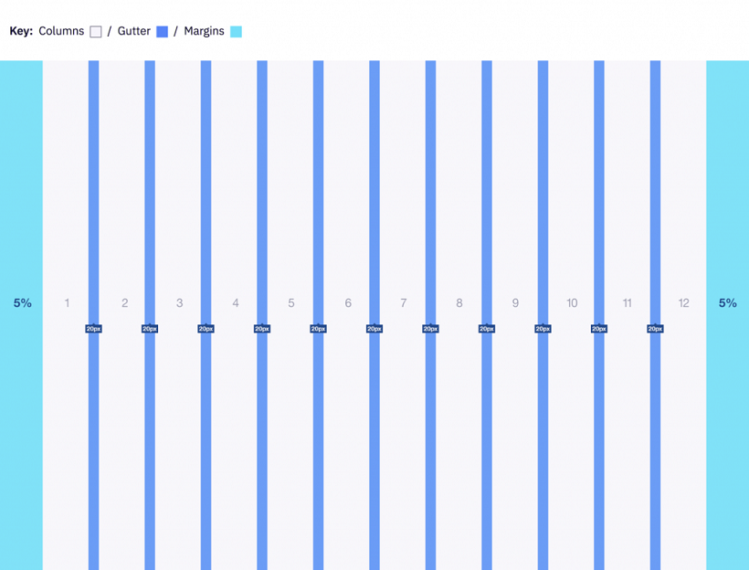

# Grid

Grid systems are used for creating page layouts through a series of rows and columns that house your content. Zowe&trade; uses a responsive, mobile-first, fluid grid system that appropriately scales up to 12 columns as the device or view port size increases.

## 12 column grid

A 12 column grid is recommended. 12 is a well-distributed division that provides a good range of widths to assign to content. It is dividable by 2, 3, 4 and 6, which allows flexibility. Many frameworks, such as Bootstrap and Pure, use a 12 column grid by default. Other grid systems like a 5 column grid can reduce flexibility, balance, and consistency.

## Gutters

Columns create gutters (gaps between column content) through padding. For devices with a screen width greater than 768px, the column padding is 20px. For devices with a screen width less than 768px, the column padding is 10px.

Screen width ≥ 768px = 20px gutters

Screen width 768px = 10px gutters

## Columns

Zowe designs should be limited to 12 columns. If designers feel that they need fewer columns in their grid, they can specify the number of 12 available columns they wish to span.

This can translate to percentages of the twelve columns. Using this method, a designer can create a folded, less granular grid. For example, if your component spans three equal columns, that is equal to 25% of twelve columns.

Column count: 12 

## Margins

The 12 column grid does not have a maximum width. It has a width of 100%, with built in margins that create padding between column count and the edges of the viewport.

In devices with a screen width greater than 768px, the margins are **5%** on the left, and **5%** on the right.

In devices with a screen width less than 768px, the margins are **3%** on the left, and **3%** on the right.

**Example: Screen Width  > 768px**

    5% left = 38px (rounded to nearest whole pixel)
    5% right = 38px (rounded to nearest whole pixel)
    12 columns + gutters = 768px - 38px - 38px = 692px (rounded to nearest whole pixel)

**Example: Screen Width 320px**

    3% left = 10px (rounded to nearest whole pixel)
    3% right = 10px (rounded to nearest whole pixel)
    12 columns + gutters = 320px - 10px - 10px = 300px (rounded to nearest whole pixel)

