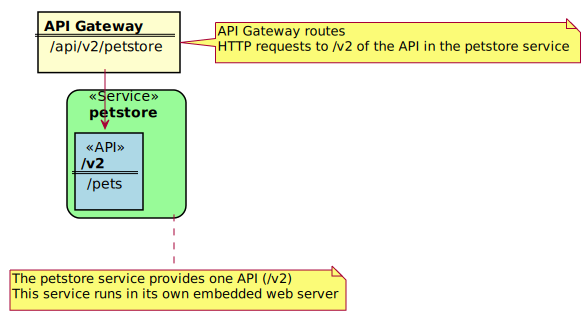

# Onboarding Overview

As an API developer, you can onboard a REST API service to the Zowe&trade; API Mediation Layer (API ML). Onboarding your REST service to the Zowe&trade; API Mediation Layer will make your service discoverable by the API ML Discovery Service, enable routing through the API Gateway, and make service information and API documentation available through the API Catalog.

The specific method you use to onboard a REST API to the API ML depends on the programming language or framework used to build your REST service.


:::note
To streamline the process of onboarding new REST API services to the Zowe API Mediation Layer, see [Onboarding a REST API service with the YAML Wizard](../../user-guide/onboard-wizard.md)
:::

This Onboarding Overview article addresses the following topics:

- [Prerequisites](#prerequisites)
- [Service Onboarding Guides](#service-onboarding-guides) to onboard your REST service with the API ML
- [Verify successful onboarding to the API ML](#verify-successful-onboarding-to-the-api-ml)
- Using the [Sample REST API Service](#sample-rest-api-service)  to learn how to onboard a REST service to the API ML 

## Prerequisites

Meet the following prerequisites before you onboard your service:

- Running instance of Zowe
  
  **Note**: For [static onboarding](onboard-static-definition.md), access to Zowe runtime is required to create the static service definition.
  
- A certificate that is trusted by Zowe and certificate(s) to trust Zowe services

  Zowe uses secured communication over TLSv1.2. As such, the protocol version and the certificate is required. For more information, see [Certificate management in API Mediation Layer](../extend-apiml/certificate-management-in-zowe-apiml.md) and [Zowe API ML TLS requirements](./zowe-api-mediation-layer-security-overview.md#zowe-api-ml-tls-requirements)
  
- A REST API-enabled service that you want to onboard

  If you do not have a specific REST API service, you can use the [sample service](#sample-rest-api-service). 
  
  Your service should be documented in a valid `OpenApi 2.0/3.0` Swagger JSON format.

- Access to the Zowe artifactory

    ```
    Repository URL: https://zowe.jfrog.io/zowe/libs-release
    ```

- Either the _Gradle_ or _Maven_ build automation system
  
## Service Onboarding Guides

Services can be updated to support the API Mediation Layer natively by updating the service code. Use one of the following guides to onboard your REST service to the Zowe API Mediation Layer:

### Recommended guides for services using Java

- [Onboard a REST API service with the Plain Java Enabler (PJE)](onboard-plain-java-enabler.md)
- [Onboard a Spring Boot based REST API Service](onboard-spring-boot-enabler.md)
- [Onboard a Micronaut based REST API service](onboard-micronaut-enabler.md)

### Recommended guides for services using Node.js

- [Onboard a Node.js based REST API Service](onboard-nodejs-enabler.md)

### Guides for Static Onboarding and Direct Call Onboarding

Use one of the following guides if your service is not built with Java, or you do not want to change your codebase or use the previously mentioned libraries:

- [Onboard a REST API using static definition without code changes](onboard-static-definition.md)
- [Onboard a REST API directly calling Zowe Discovery Service](onboard-direct-eureka-call.md)

### Documentation for legacy enablers

Enabler version 1.2 and previous versions are no longer supported.

:::tip
We recommend you use the enabler version 1.3 or higher to onboard your REST API service to the Zowe API Medaition Layer.
:::

## Verify successful onboarding to the API ML

Verifying that your service was successfully onboraded to the API ML can be done by ensuring service registration in the API ML Discovery Service or visibility of the service in the API ML Catalog.

### Verifying service discovery through Discovery Service

Verify that your service is discovered by the Discovery Service with the following procedure.

 1. Issue a HTTP GET request to the Discovery Service endpoint `/eureka/apps` to get service instance information:

    ```
    https://{zowe-hostname}:{discovery-service-port}/eureka/apps/{serviceId}
    ```
    **Note:** The endpoint is protected by client certificate verification. A valid trusted certificate must be provided with the HTTP GET request.

 2. Check your service metadata.

    **Response example:**

    ```xml
    <application>
        <name>{serviceId}</name>
        <instanceId>{hostname}:{serviceId}:{port}</instanceId>
        <hostName>{hostname}</hostName>
        <app>{serviceId}</app>
        <ipAddr>{ipAddress}</ipAddr>
        <status>UP</status>
        <port enabled="false">{port}</port>
        <securePort enabled="true">{port}</securePort>
        <vipAddress>{serviceId}</vipAddress>
        <secureVipAddress>{serviceId}</secureVipAddress>
        <metadata>
                <apiml.service.description>Sample API service showing how to onboard the service</apiml.service.description>
                <apiml.routes.api__v1.gatewayUrl>api/v1</apiml.routes.api__v1.gatewayUrl>
                <apiml.catalog.tile.version>1.0.1</apiml.catalog.tile.version>
                <apiml.routes.ws__v1.serviceUrl>/sampleclient/ws</apiml.routes.ws__v1.serviceUrl>
                <apiml.routes.ws__v1.gatewayUrl>ws/v1</apiml.routes.ws__v1.gatewayUrl>
                <apiml.catalog.tile.description>Applications which demonstrate how to make a service integrated to the API Mediation Layer ecosystem</apiml.catalog.tile.description>
                <apiml.service.title>Sample Service ©</apiml.service.title>
                <apiml.routes.ui__v1.gatewayUrl>ui/v1</apiml.routes.ui__v1.gatewayUrl>
                <apiml.apiInfo.0.apiId>zowe.apiml.sampleclient</apiml.apiInfo.0.apiId>
                <apiml.apiInfo.0.gatewayUrl>api/v1</apiml.apiInfo.0.gatewayUrl>
                <apiml.apiInfo.0.documentationUrl>https://www.zowe.org</apiml.apiInfo.0.documentationUrl>
                <apiml.catalog.tile.id>samples</apiml.catalog.tile.id>
                <apiml.routes.ui__v1.serviceUrl>/sampleclient</apiml.routes.ui__v1.serviceUrl>
                <apiml.routes.api__v1.serviceUrl>/sampleclient/api/v1</apiml.routes.api__v1.serviceUrl>
                <apiml.apiInfo.0.swaggerUrl>https://hostname/sampleclient/api-doc</apiml.apiInfo.0.swaggerUrl>
                <apiml.catalog.tile.title>Sample API Mediation Layer Applications</apiml.catalog.tile.title>
        </metadata>
    </application>
    ```
    :::tip Tips:
    - Ensure that addresses and user credentials for individual API ML components correspond to your target runtime environment.
    - If you work with local installation of API ML and you use our dummy identity provider, enter `user` for both `username` and `password`. If API ML was installed by system administrators, ask them to provide you with actual addresses of API ML components and the respective user credentials.
    :::

### Verifying service discovery through the API Catalog

 Services may not be immediately visible in the API Catalog. We recommend you wait for 2 minutes as it may take a moment for your service to be visible in the Catalog. If your service still does not appear in the Catalog, ensure that your configuration settings are correct.

  1. Check to see that your API service is displayed in the API Catalog UI, and that all information including API documentation is correct.

  2. Ensure that you can access your API service endpoints through the Gateway.


## Sample REST API Service

To demonstrate the concepts that apply to REST API services, we use an  [example of a Spring Boot REST API service](https://github.com/swagger-api/swagger-samples/tree/master/java/java-spring-boot). This example is used in the REST API onboarding guide [REST APIs without code changes required](onboard-static-definition.md) (static onboarding).  

You can build this service using instructions in the source code of the [Spring Boot REST API service example](https://github.com/swagger-api/swagger-samples/blob/master/java/java-spring-boot/README.md).

The Sample REST API Service has a base URL. When you start this service on your computer, the _service base URL_ is: `http://localhost:8080`. 

:::note
If a service is deployed to a web application server, the base URL of the service (application) has the following format: `https://application-server-hostname:port/application-name`.
:::

This sample service provides one API that has the base path `/v2`, which is represented in the base URL of the API as `http://localhost:8080/v2`. In this base URL, `/v2` is a qualifier of the base path that was chosen by the developer of this API. Each API has a base path depending on the particular implementation of the service. 

This sample API has only one single endpoint:

- `/pets/{id}` - *Find pet by ID*. 

This endpoint in the sample service returns information about a pet when the `{id}` is between 0 and 10. If `{id}` is greater than 0 or a non-integer, an error is returned. These are conditions set in the sample service.

:::tip
Access http://localhost:8080/v2/pets/1 to see what this REST API endpoint does. You should get the following response:

```json
{
    "category": {
        "id": 2,
        "name": "Cats"
    },
    "id": 1,
    "name": "Cat 1",
    "photoUrls": [
        "url1",
        "url2"
    ],
    "status": "available",
    "tags": [
        {
            "id": 1,
            "name": "tag1"
        },
        {
            "id": 2,
            "name": "tag2"
        }
    ]
}
```
:::

:::note
The onboarding guides demonstrate how to add the Sample REST API Service to the API Mediation Layer to make the service available through the `petstore` service ID.
:::

The following diagram shows the relations between the Sample REST API Service and its corresponding API, REST API endpoint, and API Gateway:



This sample service provides a Swagger document in JSON format at the following URL:

 ```
 http://localhost:8080/v2/swagger.json
 ```

The Swagger document is used by the API Catalog to display API documentation.
