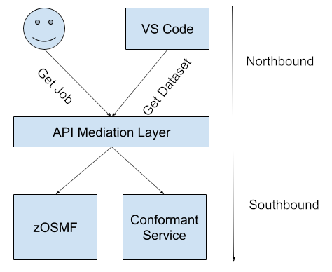
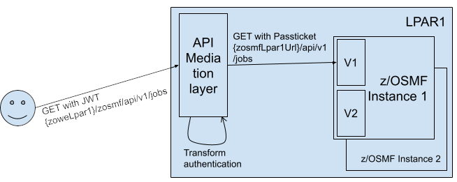

# API ML Routing Overview

The API Mediation Layer (API ML) in Zowe acts as a Level 7 Load Balancer, using the API Gateway to route requests to backend 
services. The routing feature supports both single and multiple API ML instances.

The following diagram shows a request for a specific job from a customer and the services involved in the delivery of the request.



**Key Concepts**
- **Service**

  A service provides one or more APIs and is identified by a service ID. Note that sometimes the term "service name" refers to the service ID.

  The default service ID is provided by the service developer in the service configuration file.

  A system administrator can replace the service ID with a specific name of the deployment environment using additional configuration that is external to the service deployment unit. Typically, this name is configured in a JAR or WAR file. 
  Ensure that you detail how to specify the name in your service documentation. 

  Services are deployed using one or more service instances, which share the same service ID and implementation.

- **Instance**  
  Refers to the instance of a specific service providing one or more APIs
- **Service ID**  
  The unique identifier for each service
- **Instance Routing**  
  Routes requests based on service instances
- **Versioning**  
  Supports routing to specific service versions

## Basic Routing

In basic routing, requests are routed using the service ID and optionally, the service version:

**Example:** `https://gateway-url/api/v1/service-id`

**Routing Mechanism**
Routing can be configured for either single or multiple API ML instances

* **Single API ML Instance**  
Uses Eureka metadata for direct routing to a service based on the service ID

* **Multiple API ML Instances**  
Uses Eureka metadata for service discovery and load balancing

**Implementation Details**  
Routing configuration is defined in Eureka metadata.
Ensure proper setup for accurate routing. The following yaml file is an example of Eureka metadata configuration:

```yaml
apiml:
    service:                               
        routes:
            -   gateway-url: "ui/v1"
                service-url: ${apiml.service.contextPath}
            -   gateway-url: "api/v1"
                service-url: ${apiml.service.contextPath}/api/v1
            -   gateway-url: "ws/v1"
                service-url: ${apiml.service.contextPath}/ws
```

This part of the service metadata configuration defines how the request coming from the upstream (northbound) service will be
accepted and then passed to the downstream (southbound) service.

The following shows service URL tansformations if the downstream (southbound) service has the contextPath zosmf: 
- The request `https://apiml/zosmf/ui/v1/desktop` from the user is transformed to `https://service/zosmf/desktop`
- The request `https://apiml/zosmf/api/v1/desktop` from the user is transformed to `https://service/zosmf/api/v1/desktop`
- The request `https://apiml/zosmf/ws/v1/desktop` from the user is transformed to `https://service/zosmf/ws/desktop`

**Instance Routing**  
API ML supports routing to multiple instances of the same service, thereby distributing requests based on load balancing policies. Ensure each service instance registers with a unique instance ID in Eureka.

**Versioning**  
API ML makes it possible to specify the version of a service in the route. If a version is not specified, the latest version is used by default. Version specified routing provides flexibility in deploying and updating services without affecting existing clients.

**Example Usage**  
The following URL is an example of routing to a specific version of a service:

```http
https://gateway-url/service-id/api/v1?version=1.2
```

Note that if no version is specified, as in the following example, the request defaults to the latest service version:

```http
https://gateway-url/service-id/api/v1
```

## Deployments

Deployment can be for single or multiple instances.

- **A single instance** of the API Mediation Layer with one or more instances of the services onboarded
- **Multiple instances** of the API Mediation Layer in High Availability setup with one or more instances of the services onboarded

The onboarded services may be onboarded in one or more instances and the APIs that the services provide may be versioned. API Mediation Layer supports distinction on the major version boundary. 

### Making a GET call to a service through single instance of API ML

When there is one instance of the API Mediation Layer in the system, the API ML is expected to be the entry point to the system. The following diagrams show the process of making a `GET` call to a service available on a single instance. 

#### A GET call to a service with a single version on a single instance 

The following diagram shows the flow of a `GET` request through different involved components to the z/OSMF service deployed on one LPAR with one instance. z/OSMF in this case does not version the API. 


#### A GET call to a service with multiple versions on a single instance

The following diagram shows the flow of a `GET` request through different involved components to the z/OSMF service deployed on one LPAR with one instance. In this case, z/OSMF versions the API and the request is intended for a specific major version.  


#### GET calls to multiple instances of a service

The following diagram shows the flow of a `GET` request through different involved components to the z/OSMF service deployed on one LPAR with multiple instances. In this case, z/OSMF versions the API and the request is intended for a specific major version.



### A GET call to a service through multiple API Mediation Layer Instances

When there are multiple API Mediation Layer Instances in the system, DVIPA is expected as the load balancer which distributes requests to API Mediation Layer instances. API Mediation Layer subsequently distributes the requests to the running instances of the specific service. The following diagrams shows the flow of a single request. 

#### Same LPAR Multiple API Mediation Layer Instances

The following diagram shows the flow of the `GET` request through different involved components to the z/OSMF service deployed on multiple LPARs with multiple instances on one LPAR, and one instance on another LPAR. In this case, z/OSMF versions the API and the request is intended for a specific major version. DVIPA randomly selects one of the available API Mediation Layer instances, which then randomly selects one of the available service instances (in this case on the same LPAR). 


#### Different LPAR Multiple API Mediation Layer Instances

The following diagram shows the flow of the `GET` request through different involved components to the z/OSMF service deployed on multiple LPARs with multiple instances on one LPAR, and one instance on another LPAR. In this case, z/OSMF versions the API and the request is intended for a specific major version. DVIPA randomly selects one of the available API Mediation Layer instances, which subsequently randomly selects one of the available service instances regardless whether the 
instance resides on the same LPAR. In this case the selected instance is on another LPAR. 


## Advanced Configuration

Advanced routing configurations can include custom load balancing rules, fallback options, and route-specific policies. 
Refer to the detailed configuration guide for more advanced settings and examples.

By default, routing through the API Mediation Layer selects the instance to route to in Round-robin fashion for each
specific request. It is possible to change this behavior to assign a specific user to a specific instance or to change 
the behavior by providing the option to go to a specific instance of a service.