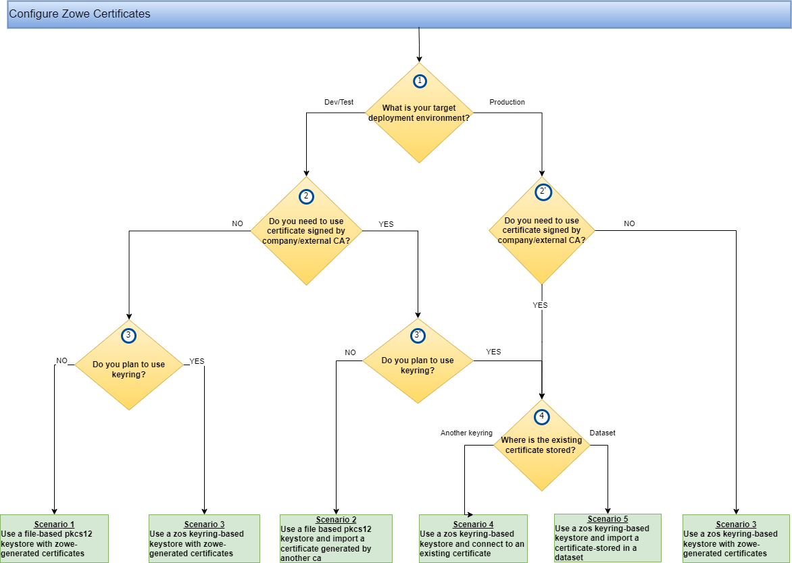

# Zowe certificates configuration questionnaire

To properly configure Zowe to use certificates for server-side component installation, review the  certificate setup options presented in this article. 
Understanding these options makes it possible to select the best certificate configuration scenario that fits your Zowe deployment use case. 

:::info Required roles: system programmer, security administrator

If you know that you will be using certificates in a production deployment environment, and that you will be using an external certificate authority (CA), we recommend you consult with your organization's security administrator before you start certificate configuration.
:::

Review the Configure Zowe Certificates diagram and answer the questions presented in the questionnaire at the end of this article.

:::tip
Before determining which scenario best suits your use case, it is practical to have a general understanding of the certificate configuration basics and Zowe certificates configuration overview. For more information, see the following articles: 
- [Certificates concepts](../appendix/zowe-security-glossary.md#certificate-concepts) in the [Zowe Security Glossary](../appendix/zowe-security-glossary.md)
- [Zowe certificates overview](../getting-started/zowe-certificates-overview.md)
:::

The numerated decision blocks (yellow diamonds) in the following diagram correspond to the questions in the questionnaire.
Follow this sequence of questions to determine which certificate configuration scenario best suits your certificate use case.

Each of the following certificate configuration scenarios are available in the article [Certificate configuration scenarios](./certificate-configuration-scenarios.md).

* [Scenario 1: Use a file-based (PKCS12) keystore with Zowe generated certificates](./certificate-configuration-scenarios.md#scenario-1-use-a-file-based-pkcs12-keystore-with-zowe-generated-certificates)
* [Scenario 2: Use a file-based (PKCS12) keystore and import a certificate generated by another CA](./certificate-configuration-scenarios.md#scenario-2-use-a-file-based-pkcs12-keystore-and-import-a-certificate-generated-by-another-ca)
* [Scenario 3: Use a z/OS keyring-based keystore with Zowe generated certificates](./certificate-configuration-scenarios.md#scenario-3-use-a-zos-keyring-based-keystore-with-zowe-generated-certificates)
* [Scenario 4: Use a z/OS keyring-based keystore and connect an existing certificate](./certificate-configuration-scenarios.md#scenario-4-use-a-zos-keyring-based-keystore-and-connect-to-an-existing-certificate)
* [Scenario 5: Use a z/OS keyring-based keystore and import a certificate stored in a data set](./certificate-configuration-scenarios.md#scenario-5-use-a-zos-keyring-based-keystore-and-import-a-certificate-stored-in-a-data-set)
 
## Certificate configuration questionnaire 
Answer each question and find which scenarios are relevant for the selected option:

**Question 1:** What is your target deployment environment?  
Depending on your target environment type (DEV/TEST or PROD), you can create your certificates (self-signed option), acquire new ones from a trusted CA, or use existing certificates.

**Question 2:** Do you need to use a certificate signed by the CA of the company or by an external CA?  
If you plan to use Zowe generated self-signed certificates and your target environment is production, we strongly recommend that you acquire new certificates from your trusted CA.

**Question 3:** Do you plan to use a keyring?  
Decide if you want to store the certificate in a z/OS keyring or to a file based keystore/truststore.

:::tip 
While using a keystore/truststore pair is possible to store your certificates, we recommend that you use z/OS keyrings for production deployments.
:::

**Question 4:** Do you plan to use an existing certificate from another keyring or from a dataset?  
If you have an existing certificate, you can import or connect this certificate to the planned z/OS keyring based storage.

Before you import your certificates, check to make sure that the certificate format, type, and properties correspond to the required protection and acceptability depending on the planned deployment environment (DEV, TEST, PROD).
For example, use Zowe generated self-signed certificates only with development or testing environments and not with production environments.

For more information, see [Import and configure an existing certificate](./import-certificates.md).
## Next steps

After you select your applicable certificate configuration scenario and review the certificate configurate sample in the article [Certificate configuration scenarios](./certificate-configuration-scenarios.md), you can continue to  [Configure Zowe Certificates](./configure-certificates.md).  

:::tip
If you encounter issues when configuring your certificate, see [Troubleshooting the certificate configuration](../troubleshoot/troubleshoot-zos-certificate.md), to find resolution of errors.
:::
