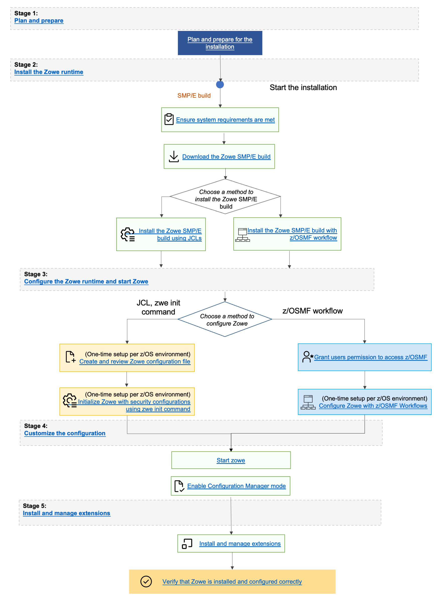

# Installing Zowe SMP/E overview

This program directory is intended for system programmers who are responsible for program installation and maintenance. It contains information about the material and procedures associated with the installation of Zowe Open Source Project (Base). This publication refers to Zowe Open Source Project (Base) as Zowe.

### End-to-end installation diagram

### Zowe FMIDs

Zowe consists of the following FMIDs:

  * AZWE002

## Program materials

Basic Machine-Readable Materials are materials that are supplied under the base license and are required for the use of the product.

### Basic machine-readable material

The distribution medium for this program is via downloadable files. This program is in SMP/E RELFILE format and is installed using SMP/E. See [Installation instructions](./install-zowe-smpe.md) for more information about how to install the program.

### Program source materials

No program source materials or viewable program listings are provided for Zowe in the SMP/E installation package. However, program source materials can be downloaded from the Zowe GitHub repositories at [https://github.com/zowe/](https://github.com/zowe/).

### Publications useful during installation

Publications listed below are helpful during the installation of Zowe.

Publication Title | Form Number  
---|---
[IBM SMP/E for z/OS User's Guide](https://www.ibm.com/servers/resourcelink/svc00100.nsf/pages/zOSV2R3sa232277/$file/gim3000_v2r3.pdf) | SA23-2277
[IBM SMP/E for z/OS Commands](https://www-01.ibm.com/servers/resourcelink/svc00100.nsf/pages/zOSV2R3sa232275/$file/gim1000_v2r3.pdf)  | SA23-2275
[IBM SMP/E for z/OS Reference](https://www-01.ibm.com/servers/resourcelink/svc00100.nsf/pages/zOSV2R3sa232276/$file/gim2000_v2r3.pdf) | SA23-2276
[IBM SMP/E for z/OS Messages, Codes, and Diagnosis](https://www-01.ibm.com/servers/resourcelink/svc00100.nsf/pages/zOSV2R3ga320883/$file/gim0000_v2r3.pdf) | GA32-0883

These and other publications can be obtained from [IBM Publications Center](https://www.ibm.com/resources/publications/?mhsrc=ibmsearch_a&mhq=publications).

## Program support

This section describes the support available for Zowe.

Because this is an alpha release of the Zowe FMID package for early testing and adoption, no formal support is offered.  Support is available through the Zowe community.  See [Community Engagement](https://github.com/zowe/community/blob/master/README.md#communication-channels) for details. Slack is the preferred interaction channel.

Additional support may be available through other entities outside of the Open Mainframe Project and Linux Foundation which offers no warranty and provides the package under the terms of the EPL v2.0 license.

<!--TODO - Needs more legalese here-->

### Statement of support procedures

Report any problems which you feel might be an error in the product materials to the Zowe community via the Zowe GitHub community repo at [https://github.com/zowe/community/issues/new/choose](https://github.com/zowe/community/issues/new/choose). You may be asked to gather and submit additional diagnostics to assist the Zowe Community for analysis and resolution.

## Program and service level information

This section identifies the program and relevant service levels of Zowe. The program level refers to the APAR fixes that have been incorporated into the program. The service level refers to the PTFs that have been incorporated into the program. 

### Program level information

All issues of previous releases of Zowe that were resolved before August 2019 have been incorporated into this packaging of Zowe.

### Service level information

The Zowe SMP/E package is a distribution of Zowe version 2.0.0 with an FMID of AZWE002.

Subsequent releases of the Zowe z/OS components are delivered as rollup PTFs on [zowe.org](https://www.zowe.org/download.html).
<!-- packaged as two co-requisite PTFs, which are made available in a single .zip file.

Zowe release | PTF 1 | PTF 2 
---|---|---
[2.0.1](https://www.zowe.org/legal.html?type=smpe&version=1.10.0) | TBD | TBD
[2.0.2](https://www.zowe.org/legal.html?type=smpe&version=1.11.0) | TBD | TBD
-->

## Installation requirements and considerations

The following sections identify the system requirements for installing and activating Zowe.  The following terminology is used:

  * *Driving System:* the system on which SMP/E is executed to install the program.
  * *Target system:* the system on which the program is configured and run.

Use separate driving and target systems in the following situations:

  * When you install a new level of a product that is already installed, the new level of the product will replace the old one. By installing the new level onto a separate target system, you can test the new level and keep the old one in production at the same time.
  * When you install a product that shares libraries or load modules with other products, the installation can disrupt the other products. By installing the product onto a separate target system, you can assess these impacts without disrupting your production system.

### Driving system requirements

This section describes the environment of the driving system required to install Zowe.

#### Driving system machine requirements

The driving system can be run in any hardware environment that supports the required software.

#### Driving system programming requirements

Program Number| Product Name | Minimum VRM | Minimum Service Level will satisfy these APARs | Included in the shipped product?
---|---|---|---|---
5650-ZOS | z/OS | V2.2.0 or later | N/A | No 

**Notes:**
- SMP/E is a requirement for Installation and is an element of z/OS but can also be ordered as a separate product, 5655-G44, minimally V03.06.00.
- Installation might require migration to a new z/OS release to be service supported. See [https://www-01.ibm.com/software/support/lifecycle/index_z.html](https://www-01.ibm.com/software/support/lifecycle/index_z.html).

Zowe is installed into a file system, either HFS or zFS. Before installing Zowe, you must ensure that the target system file system data sets are available for processing on the driving system. OMVS must be active on the driving system and the target system file data sets must be mounted on the driving system.

If you plan to install Zowe in a zFS file system, this requires that zFS be active on the driving system. Information on activating and using zFS can be found in [z/OS Distributed File Service zSeries File System Administration](https://www.ibm.com/servers/resourcelink/svc00100.nsf/pages/zOSV2R3SC236887/$file/ioea700_v2r3.pdf) (SC24-5989).

### Target system requirements

This section describes the environment of the target system required to install and use Zowe.

Zowe installs in the z/OS (Z038) SREL.

#### Target system machine requirements

The target system can run in any hardware environment that supports the required software.

#### Target system programming requirements

**Installation requisites**  

Installation requisites identify products that are required and must be present on the system or products that are not required but should be present on the system for the successful installation of Zowe.

Mandatory installation requisites identify products that are required on the system for the successful installation of Zowe. These products are specified as PREs or REQs.

*Zowe has no mandatory installation requisites.*

Conditional installation requisites identify products that are not required for successful installation of Zowe but can resolve such things as certain warning messages at installation time. These products are specified as IF REQs.

*Zowe has no conditional installation requisites.*

**Operational requisites**  

Operational requisites are products that are required and must be present on the system, or, products that are not required but should be present on the system for Zowe to operate all or part of its functions.

Mandatory operational requisites identify products that are required for this product to operate its basic functions. The following table lists the target system mandatory operational requisites for Zowe.

Program Number |Product Name and Minimum VRM/Service Level
---|---
5650-ZOS |  IBM z/OS Management Facility V2.2.0 or higher
5655-SDK |	IBM SDK for Node.js - z/OS V12 or higher
5655-DGH |	IBM 64-bit SDK for z/OS Java Technology Edition V8.0.0

Conditional operational requisites identify products that are not required for Zowe to operate its basic functions but are required at run time for Zowe to operate specific functions. These products are specified as IF REQs. Zowe has no conditional operational requisites.

**Toleration/coexistence requisites**

Toleration/coexistence requisites identify products that must be present on sharing systems. These systems can be other systems in a multi-system environment (not necessarily Parallel SysplexTM), a shared DASD environment (such as test and production), or systems that reuse the same DASD environment at different time intervals.

Zowe has no toleration/coexistence requisites.

**Incompatibility (negative) requisites**

Negative requisites identify products that must *not* be installed on the same system as Zowe.

Zowe has no negative requisites.

#### DASD storage requirements

Zowe libraries can reside on all supported DASD types.

**Total DASD space required by Zowe**

Library Type | Total Space Required in 3390 Trks | Description
---|---|---
Target |45 Tracks	| /
Distribution | 12045 Tracks	| /
File System(s) | 21000 Tracks | /
Web Download | 38666 Tracks | These are temporary data sets, which can be removed after the SMP/E install.

**Notes:**

  1. For non-RECFM U data sets, we recommend using system-determined block sizes for efficient DASD utilization. For RECFM U data sets, we recommend using a block size of 32760, which is most efficient from the performance and DASD utilization perspective.

  2. Abbreviations used for data set types are shown as follows.  
     - **U** - Unique data set, allocated by this product and used by only this product. This table provides all the required information to determine the correct storage for this data set. You do not need to refer to other tables or program directories for the data set size.
     - **S** - Shared data set, allocated by this product and used by this product and other products. To determine the correct storage needed for this data set, add the storage size given in this table to those given in other tables (perhaps in other program directories). If the data set already exists, it must have enough free space to accommodate the storage size given in this table.
     - **E** - Existing shared data set, used by this product and other products. This data set is not allocated by this product. To determine the correct storage for this data set, add the storage size given in this table to those given in other tables (perhaps in other program directories). If the data set already exists, it must have enough free space to accommodate the storage size given in this table.

      If you currently have a previous release of Zowe installed in these libraries, the installation of this release will delete the old release and reclaim the space that was used by the old release and any service that had been installed. You can determine whether these libraries have enough space by deleting the old release with a dummy function, compressing the libraries, and comparing the space requirements with the free space in the libraries.

      For more information about the names and sizes of the required data sets, see [Allocate SMP/E target and distribution libraries](./install-zowe-smpe.md#allocate-smpe-target-and-distributions-libraries).

  3. Abbreviations used for the file system path type are as follows.

     - **N**	- New path, created by this product.
     - **X**	- Path created by this product, but might already exist from a previous release.
     - **P**	- Previously existing path, created by another product.

  4. All target and distribution libraries listed have the following attributes:

     * The default name of the data set can be changed.
     * The default block size of the data set can be changed.
     * The data set can be merged with another data set that has equivalent characteristics.
     * The data set can be either a PDS or a PDSE, with some exceptions. If the value in the "ORG" column specifies "PDS", the data set must be a PDS. If the value in "DIR Blks" column specifies "N/A", the data set must be a PDSE.

  5. All target libraries listed have the following attributes:

     * These data sets can be SMS-managed, but they are not required to be SMS-managed.
     * These data sets are not required to reside on the IPL volume.
     * The values in the "Member Type" column are not necessarily the actual SMP/E element types that are identified in the SMPMCS.

  6. All target libraries that are listed and contain load modules have the following attributes:

     * These data sets cannot be in the LPA, with some exceptions. If the value in the "Member Type" column specifies "LPA", it is advised to place the data set in the LPA.
     * These data sets can be in the LNKLST.
     * These data sets are not required to be APF-authorized, with some exceptions. If the value in the "Member Type" column specifies "APF", the data set must be APF-authorized.

**Storage requirements for SMP/E work data sets**

Library DDNAME | TYPE | ORG | RECFM | LRECL | No. of 3390 Trks | No. of DIR Blks
---|---|---|---|---|---|---
SMPWRK6 |	S	| PDS |	FB |80 | (300,3000) |	50
SYSUT1 |U	| SEQ	| -- | --	| (300,3000) | 0

In the table above, (20,200) specifies a primary allocation of 20 tracks, and a secondary allocation of 200 tracks.  

**Storage requirements for SMP/E data sets**

Library DDNAME | TYPE | ORG | RECFM | LRECL | No. of 3390 Trks | No. of DIR Blks
---|---|---|---|---|---|---
SMPPTS | S | PDSE | FB | 80 | (12000,3000) | 50

The following figures describe the target and distribution libraries and file system paths required to install Zowe. The storage requirements of Zowe must be added to the storage required by other programs that have data in the same library or path.

**Note:** Use the data in these tables to determine which libraries can be merged into common data sets. In addition, since some ALIAS names may not be unique, ensure that no naming conflicts will be introduced before merging libraries.

**Storage requirements for Zowe target libraries**

**Note:** These target libraries are not required for the initial FMID install of Zowe SMP/E but will be required for subsequent SYSMODS so are included here for future reference.

Library DDNAME | Member Type | Target Volume | Type | Org | RECFM | LRECL | No. of 3390 Trks | No. of DIR Blks
---|---|---|---|---|---|---|---|---
SZWEAUTH | APF Load Modules	| ANY | U | PDSE | U | 0 | 15 | N/A
SZWESAMP | Samples | ANY | U | PDSE | FB | 80 | 15 | 5
SZWELOAD | Load Modules | ANY | U | PDSE | U | 0 | 30 | N/A

**Zowe file system paths**

DDNAME | TYPE | Path Name
---|---|---
SZWEZFS | X | /usr/lpp/zowe/SMPE

**Storage requirements for Zowe distribution libraries**

**Note:** These target libraries are not required for the initial alpha drop of Zowe SMP/E but will be required for subsequent drops so are included here for future reference.

Library DDNAME | TYPE | ORG | RECFM | LRECL | No. of 3390 Trks | No. of DIR Blks
---|---|---|---|---|---|---
AZWEAUTH | U | PDSE | U | 0 | 15 | N/A
AZWESAMP | U | PDSE | FB | 80 | 15 | 5
AZWEZFS | U | PDSE | VB | 6995 | 12000 | 30

The following figures list data sets that are not used by Zowe, but are required as input for SMP/E.

Data Set Name | TYPE | ORG | RECFM | LRECL | No. of 3390 Trks | No. of DIR Blks
---|---|---|---|---|---|---
hlq.ZOWE.AZWE002.F1 | U | PDSE | FB | 80 | 5 | N/A
hlq.ZOWE.AZWE002.F2 | U | PDSE | FB | 80 | 5 | N/A
hlq.ZOWE.AZWE002.F3 | U | PDSE | U | 0 | 30 | N/A
hlq.ZOWE.AZWE002.F4 | U | PDSE | VB | 6995 | 9900 | N/A
hlq.ZOWE.AZWE002.SMPMCS | U | SEQ | FB | 80 | 1 | N/A
z/OS UNIX file system | U | zFS | N/A | N/A | 28715 | N/A

**Note:** These are temporary data sets, which can be removed after the SMP/E installation.

### FMIDs deleted

Installing Zowe might result in the deletion of other FMIDs. 

To see which FMIDs will be deleted, examine the `++VER` statement in the SMPMCS of the product. If you do not want to delete these FMIDs now, install Zowe into separate SMP/E target and distribution zones.

**Note:** These FMIDs are not automatically deleted from the Global Zone. If you want to delete these FMIDs from the Global Zone, use the SMP/E REJECT NOFMID DELETEFMID command. See the SMP/E Commands book for details.

**Special considerations**

Zowe has no special considerations for the target system.

For details about installing Zowe SMP/E, see [Installing Zowe via SMP/E instructions](./install-zowe-smpe.md).