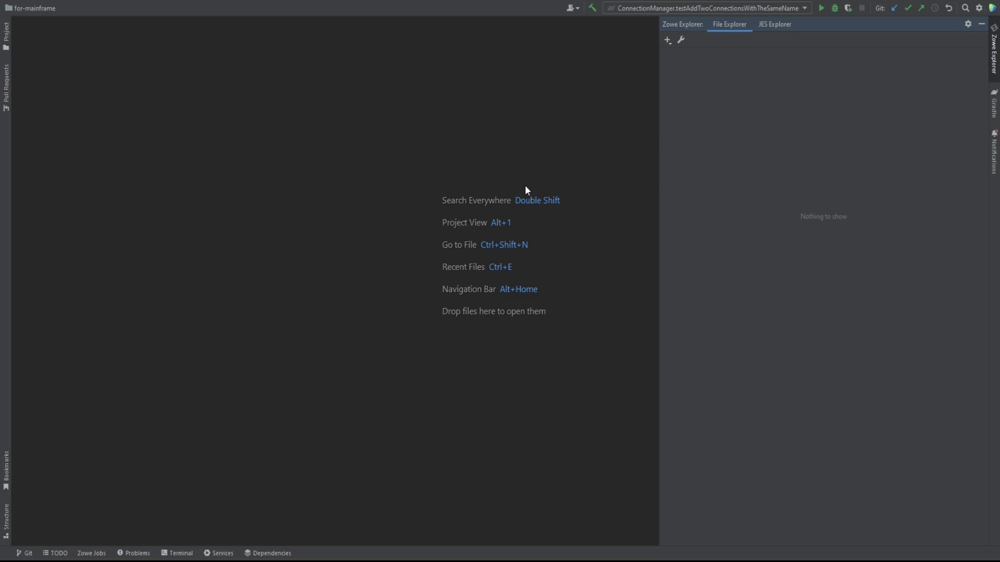

# Working Sets Concept

We use term "Working Sets" to describe the place to store sets of masks and filters. These items are stored separately for each working set. The working set is more like "profile" and is used to logically aggregate sets for each separate need (both for users and to separate the different items to categories, in case it is needed).

There are two types of working sets:
- **Files Working Sets** - are used to store z/OS and USS masks
- **JES Working Sets** - are used to store JCL Job filters

You can create working sets either through **Settings** or by clicking on **+** button.
*Note: you can create a working set only when a connection is set up.*

## Files Working Set

This type of working sets is used to store z/OS and USS masks. **Masks** are similar to filters, they are used to show z/OS datasets and USS files under a specified path.

To create Files working set:

1. Press **+** button
2. Select **Working Set**
3. Type in the Working Set name (it should be unique) and select an appropriate connection
4. Add some masks
5. Click **OK**

## JES Working Set

This type of working sets is used to operate with your JCL jobs, see their logs, view and edit JCL with further job run. It will hold all the filters for the JES Explorer.

To create JES working set:

1. Select **JES Explorer** tab
2. Press **+** button
3. Select **JES Working Set**
4. Type in the Working Set name (it should be unique) and select an appropriate connection
5. Add some JCL filters
6. Click **OK**

