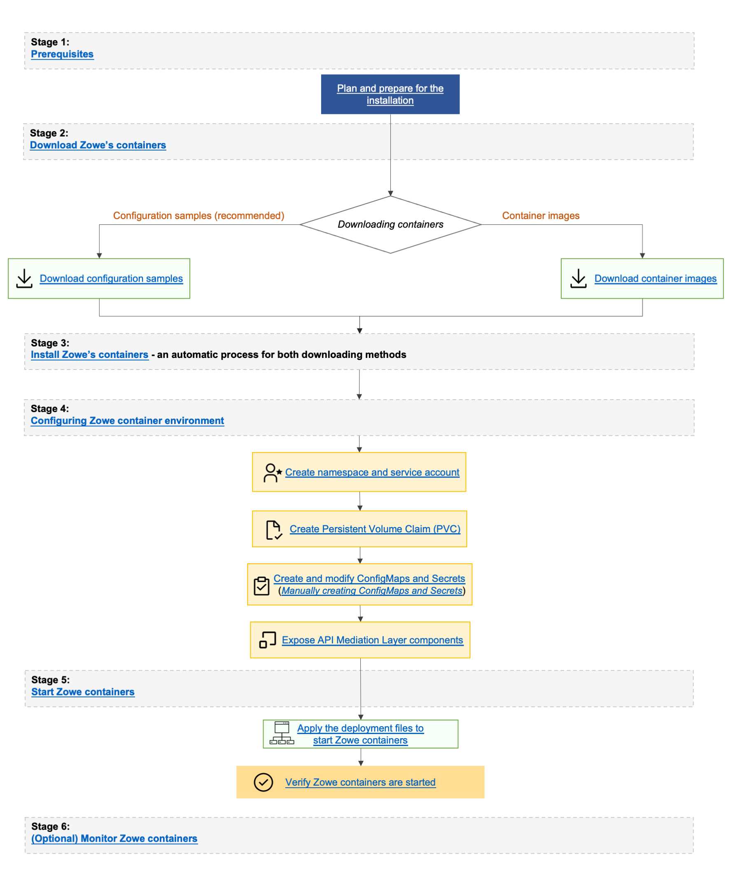

# Installing Zowe via a containerization build (PAX file)

You can download Zowe (server) containers as an alternative to running Zowe servers on z/OS through the Zowe convenience and SMP/E builds. Choose the appropriate installation type for your use case.

:::info Required roles: system programmer
:::

Using containers for installation has the following advantages:

* You can run Zowe servers on other platforms including Linux on Z and your PC.
* You can run Zowe servers locally on your system for rapid development.
* You can run redundant copies of servers for scaling capacity to meet workload requirements.
* You can leverage container monitoring tools.

For more information about containers, see the [Kubernetes website](https://kubernetes.io/docs/concepts/overview/what-is-kubernetes/) to learn about key concepts.

:::tip
You can now perform Zowe installation via the Zowe Server Install Wizard. Using the wizard streamlines the installation process and is an alternative to performing manual Zowe server-side component installation. For more information about the wizard, see [Installing Zowe via Zowe Server Install Wizard](./install-zowe-server-install-wizard.md).
:::

## End-to-end container installation

Zowe containers are designed to run together with extensions and Zowe utilities, and therefore are built for orchestration software that can manage the relationship and lifecycle of the containers. The following topics guide you to set up and use Zowe's containers with the Kubernetes orchestration software.

### Stage 1: Plan and prepare for the installation

Stage 1 ensures that your software and hardware are prepared for installation. For more information, see [Preparing for Zowe server containers installation](k8s-prereqs.md).

### Stage 2: Download Zowe containers

In Stage 2, you download the Zowe containers. Choose from the following download methods:

* [Download Configuration samples](k8s-downloading.md#downloading-configuration-samples).(This is the recommended method) 
* [Download container images](k8s-downloading.md#downloading-container-images).

### Stage 3 & 4: Install and configure Zowe containers

In Stage 3, you do not need to install the Zowe containers if you use Zowe's Kubernetes configuration samples. If you download container images, installation is achieved when the images are findable by Kubernetes. For more information, see the [Installing](k8s-downloading.md#installing) section of **_Downloading and installing containers_**.

In Stage 4, you can [configure the Zowe container environment](../user-guide/k8s-config.md).  
Follow these steps:

1. [Create namespace and service account](k8s-config.md#1-create-namespace-and-service-account)
2. [Create Persistent Volume Claim (PVC)](k8s-config.md#2-create-persistent-volume-claim-pvc)
3. [Create and modify ConfigMaps and Secrets (Manually creating ConfigMaps and Secrets)](k8s-config.md#3-create-and-modify-configmaps-and-secrets)
4. [Expose API Mediation Layer components](k8s-config.md#4-expose-api-mediation-layer-components)

### Stage 5: Start Zowe containers

In Stage 5, you can [start Zowe containers](k8s-using.md#starting-zowe-containers).  

Follow these steps:
1. [Apply the deployment files to start Zowe containers](k8s-using.md#starting-zowe-containers). 
2. After you start Zowe containers, [verify that Zowe containers are started](k8s-using.md#verifying-zowe-containers).

### (Optional) Stage 6: Monitor Zowe containers

In Stage 6, [monitor your containers](k8s-using.md#monitoring-zowe-containers) to verify that the containers are functioning properly.

## Known limitations

* You may encounter an issue that some plugins do not appear in Zowe Desktop. We recommnend you try the **Refresh Applications** icon that appears in the Desktop start menu.
* You may encounter an issue that some services do not appear in Zowe API Catalog. We recommend you try the **Refresh Static APIs** option that appears in the upper-right corner of API Catalog web page.
* `useConfigmgr` is disabled within containers. As such yaml schema validation is not currently supported.

