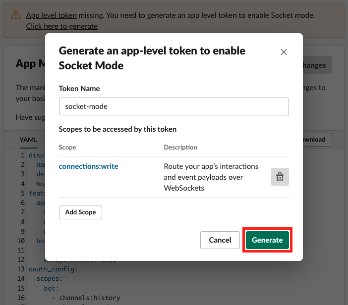

# Connecting to Slack using Socket mode

You can use Socket mode to connect your app to Slack.

1. Open Slack app dashboard at [Slack API](https://www.ibm.com/links?url=https%3A%2F%2Fapi.slack.com%2Fapps).
2. Click the App name that you created.
3. In the left sidebar, click **Features** > **App Manifest** to configure your Slack App.
4. In the text field, fill in the following manifest:
   
   ```
   display_information:
     name: Zowe Chat
     description: Zowe Chat
     background_color: "#302d2e"
   features:
     app_home:
       home_tab_enabled: false
       messages_tab_enabled: true
       messages_tab_read_only_enabled: false
     bot_user:
       display_name: bnz
       always_online: true
   oauth_config:
     scopes:
       bot:
         - channels:history
         - channels:read
         - chat:write
         - groups:history
         - groups:read
         - im:history
         - im:read
         - mpim:history
         - mpim:read
         - users:read
         - users:read.email
   settings:
     event_subscriptions:
       bot_events:
         - message.channels
         - message.groups
         - message.im
         - message.mpim
     interactivity:
       is_enabled: true
     org_deploy_enabled: false
     socket_mode_enabled: true
     token_rotation_enabled: false
   ```
   
   :::note

    You should delete the default manifest, and then fill in the manifest above.
    This is an example manifest for the current version of Slack. If Slack has new changes and this manifest is out of date, you can refer to https://api.slack.com/reference/manifests#creating_manifests to fill out the manifest.

    :::

   In the manifest, specify values for the following fields:

    - `display_information.name`: your app name, for example, Zowe Chat
    - `display_information.description`: your app description, for example, Zowe Chat
    - `features.bot_user.display_name`: your bot name, for example, zowe-chat

5. Click **Save Changes** button, and you will be prompted with a notification asking you to generate an app level token.

6. Click **Click here to generate**, and you will be prompted with a dialog **Generate an app-level token to enable Socket Mode**.
Specify values for the following fields:
   - **Token Name**: socket-mode

   

7. Click **Generate** button and you will be prompted with a dialog **socket-mode**. You will get the token in the dialog. Copy it for the later use. You will need it to configure your Slack in later steps. See [Configuring the chat tool - Slack](chat_configure_slack.md).

8. Click **Done** button.

You have successfully configured your Slack app.
