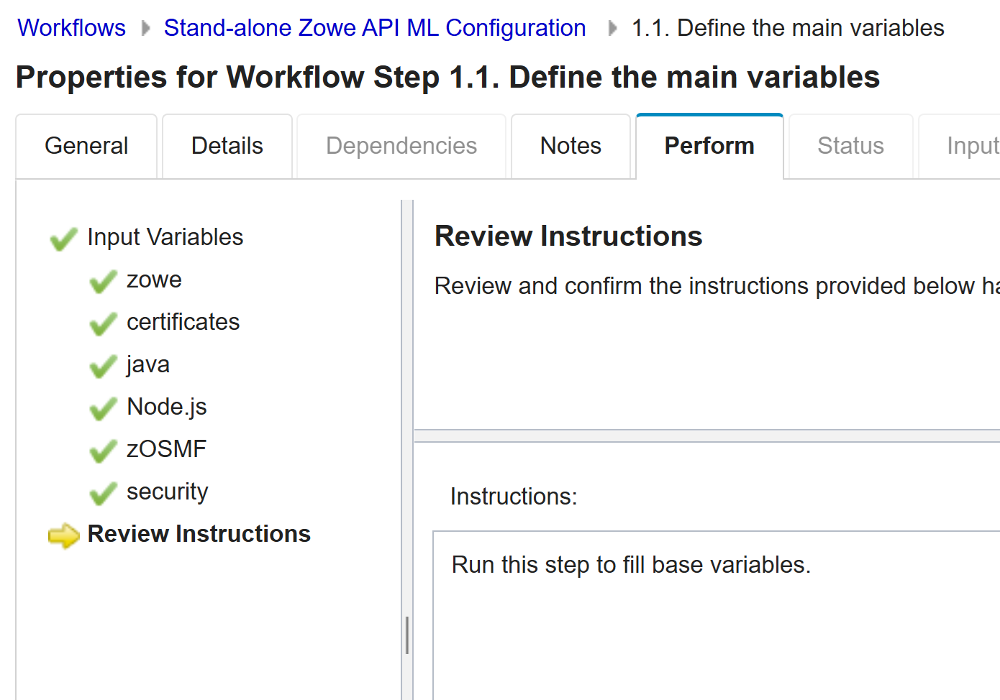
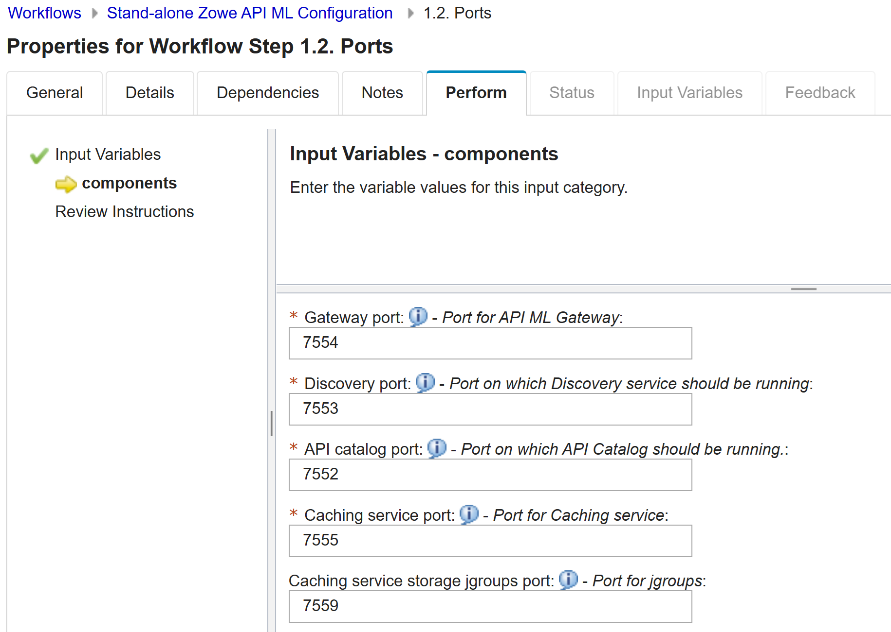

# Configuring API ML with z/OSMF Workflows

After you install Zowe, you can register and execute the z/OSMF workflows in the web interface to perform a range of
API Mediation Layer (API ML) and other Zowe configuration tasks. The **Stand-alone Zowe API ML Configuration** workflow simplifies configuration of Zowe API Mediation Layer and does not require the level of
expertise that is needed to perform manual API ML/Zowe configuration. The **Stand-alone Zowe API ML Configuration** workflow also runs the `zwe install` and `zwe init` command to initialize Zowe z/OS runtime.

:::info Required role: system programmer
:::
## Prerequisites

Ensure that you meet the following requirements before you start your Zowe configuration:

- Install and configure z/OSMF
- Install Zowe with an SMP/E build, PSWI, or a convenience build

## Overview of Stand-alone Zowe API ML Configuration workflow

The following components are automatically enabled after performing the **Stand-alone Zowe API ML Configuration** workflow:

- Zowe configuration manager
- Gateway
- Gateway internal mapper
- API Gateway
- API Catalog
- Discovery service
- Caching service

The following components are automatically disabled:

- Metrics service
- Cloud gateway
- Application server
- Jobs API
- Files API
- ZSS component
- JES Explorer
- MVS Explorer
- USS Explorer
  
:::note
These disabled components can be enabled by performing manual changes in the yaml file. Note that making such changes to the yaml file is not recommended for simplified and optimized configuration of API ML.
:::

You can execute the **Stand-alone Zowe API ML Configuration** workflow either from a PSWI during deployment or later from a created software
instance in z/OSMF. Alternatively, you can execute the configuration workflow in z/OSMF during the workflow registration process.

The configuration workflow described in this article is executed directly from a deployment of the Zowe PSWI.

## Executing Stand-alone Zowe API ML Configuration workflow from PSWI

After Zowe installation, follow this procedure to perform Zowe API ML Configuration workflow from PSWI.

:::tip
For more information about installing Zowe server-side components with z/OSMF, see [Installing Product Software Using z/OSMF Deployments](./install-zowe-pswi-deployment.md).
:::

1. In the **Software Management** panel, click **Actions** and **Add from z/OSMF System**. 
2. Specify your system name and file location path (UNIX file).
3. Click **Retrieve**. 
4. Review the Deployment Jobs and click **Deployment Checklist**.
5. Follow each step outlined in the **Deployment Checklist**.

6. After you complete all of the preceding steps outlined in the Deployment checklist, click **Perform workflows** to leverage configuration of API ML with z/OSMF workflows.

    Each workflow appears in the panel. 

:::note
The **Perform Workflows** step enables you to run either all attached workflows or just the
    post-deployment workflow for mounting, which is required.
:::

:::caution Important
Before you start your configuration, ensure that you first perform the **Zowe Mount** workflow. For more information, see [Configure - UNIX file system mount points](https://www.newera.com/INFO/061422_zOSMF_SM.pdf) in the IBM documentation. 
:::

After you successfully perform the **Zowe Mount** workflow, you can start the **Stand-alone Zowe API ML Configuration** workflow.

Select the **Stand-alone Zowe API ML Configuration** workflow from the list of Workflow Definition Files.  

The following screen displays: 

Expand the **Workflow Details** panel to see the workflow details and the state of each step.
This workflow is in three parts:

[Define variables](#define-variables)  
[Create configuration](#create-configuration)  
[Perform Zowe installation](#perform-zowe-installation)

### Define variables

This workflow step includes the list of Zowe variables for configuration and as well as sub-steps.

1. Expand **Define variables**.

2. Under **Input Variables**, click **Define the main variables**.

3. Click the **Perform** tab. The input variables are displayed by category.

4. Customize workflow variables in the fields provided.  
   **Example:**

   

5. After you complete defining the main variables for your configuration, define all ports for automatically enabled API ML services.  

    

#### Sequence to execute steps and sub-steps in the workflow

   Perform the following steps for each step and sub-step:

  1. Click the title of the step or sub-step.
  2. Select the **Perform** tab.
  3. Review the step contents and update the variables that are marked by a red asterisk based on your mainframe environment.  
  4. Select **Next**.
  5. Repeat the previous steps in this sequent to complete all items until the **Finish** option is available.  
   :::note Notes
      * You can click **Save**, to save your values and **Finish** to populate these values in subsequent steps.
   
      * Basic validation is supported in many of the fields including the proper path structure, dataset name conventions, or numeric size.
   The workflow, however, does not check, for example, if a target dataset exists, or if a directory has sufficient space.
   :::
   6.  When you complete this list of Input variables, click **Next** to view the components. Tick each component in this list that you want to enable.
   7. Click **Finish** to populate the values. This action customizes your workflow according to the components.  
   You are then presented with enabled sub-steps according to the Zowe components you specified. 
   8. Click each sub-step and customize component-specific variables. Click **Next** until you complete your customization of the variables.
   9. Click **Finish** to apply the values.

After all sub-steps are completed, the step **Define variables** is marked as Complete.

### Create configuration

This step creates a configuration zowe.yaml file with the variable setup that was defined in the **Define variables** workflow.

1. Review your configurations.
2. If necessary, customize the JCL according you your specifications and click **Finish**.  
   The zowe.yaml file is ready, and the step is marked as Complete.

:::note
The **Create configuration** step is mandatory. A valid zowe.yaml is required to execute the **Zowe installation** step.
:::

### Perform Zowe Installation

This step consumes the zowe.yaml configuration file and contains two sub-steps:

1. **Run Zowe install** to run the `zwe install` command.
2. **Run Zowe init** to run `zwe init mvs` and `zwe init stc` commands.

:::note
If you did not set up security prior to this installation, you can  submit the `ZWESECUR` JCL. For details, see [Configuring security](configuring-security.md).
:::

For more information about `zwe install` and `zwe init` commands, see the following articles:
* [zwe install command](../appendix/zwe_server_command_reference/zwe/zwe-install.md)
* [Configuring Zowe with zwe init](initialize-zos-system.md)

### Schema information and next steps

The **Stand-alone Zowe API ML Configuration** workflow strictly follows the Zowe v2 install and configuration schema. This workflow generates the zowe.yaml file and runs the Zowe `zwe` CLI tool.
After completing the workflow execution, you can return to the **Deployment Checklist** for the Zowe PSWI. 
After you complete the steps in the checklist you are ready to start your Zowe instance with optimized setup for Zowe API Mediation Layer.