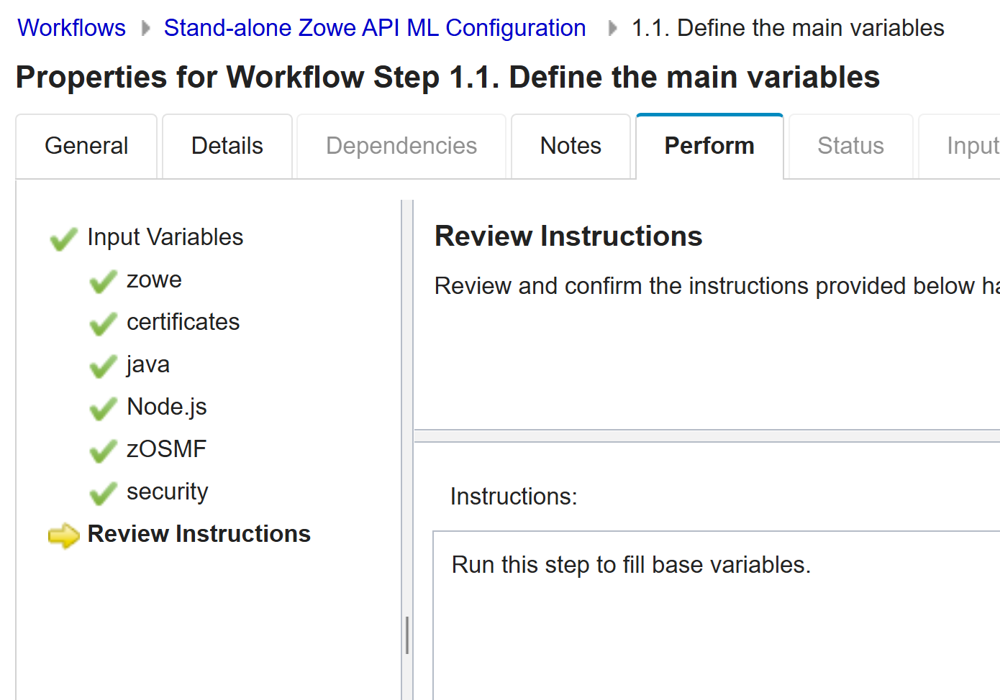
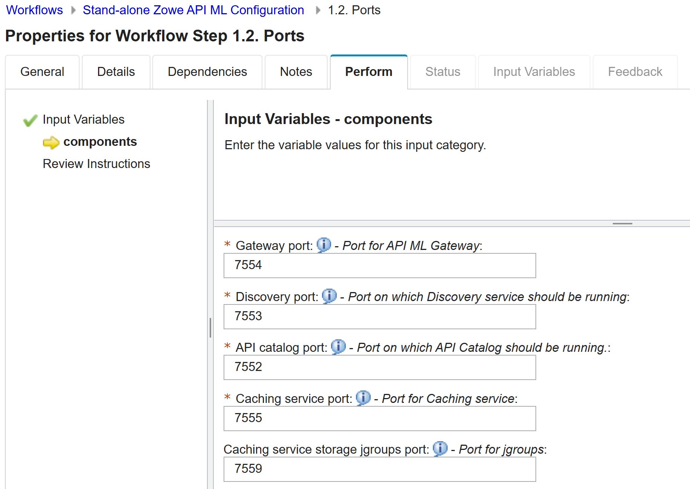

# Configuring API ML with z/OSMF Workflows

After you install Zowe, you can register and execute the z/OSMF workflows in the web interface to perform a range of
API Mediation Layer (API ML) and other Zowe configuration tasks. The **Stand-alone Zowe API ML Configuration** workflow simplifies configuration of Zowe API Mediation Layer and does not require the level of
expertise that is needed to perform manual API ML/Zowe configuration. The **Stand-alone Zowe API ML Configuration** workflow also runs the `zwe install` and `zwe init` command to initialize Zowe z/OS runtime.

:::info Required role: system programmer
:::

Ensure that you meet the following requirements before you start your Zowe configuration:

- Install and configure z/OSMF
- Install Zowe with an SMP/E build, PSWI, or a convenience build

The following components are automatically enabled after performing the **Stand-alone Zowe API ML Configuration** workflow:

- Zowe configuration manager
- Gateway
- Gateway internal mapper
- API Gateway
- API Catalog
- Discovery service
- Caching service

The following components are automatically disabled:

- Metrics service
- Cloud gateway
- Application server
- Jobs API
- Files API
- ZSS component
- JES Explorer
- MVS Explorer
- USS Explorer
  
:::note
These disabled components can be enabled by performing manual changes in the yaml file, but making such changes to the yaml file is not recommended for simplified and optimized configuration of API ML.
:::

You can execute the API ML/Zowe configuration workflow either from a PSWI during deployment or later from a created software
instance in z/OSMF. Alternatively, you can execute the configuration workflow z/OSMF during the workflow registration process.

The configuration workflow described in this article is executed directly from a deployment of the Zowe PSWI.

## Execute Stand-alone Zowe API ML Configuration workflow from PSWI

In the PSWI deployment phase, you are presented with a checklist that helps guide you through the deployment process.

The **Perform Workflows** step enables you to run either all attached workflows or just the
post-deployment workflow for mounting, which is required.

After you successfully performed the **Zowe Mount** workflow, you can start the **Stand-alone Zowe API ML Configuration** workflow.
When you select this workflow from the list of Workflow Definition Files, the following screen displays: 

You can see the workflow details by expanding the **Workflow Details** panel.
This workflow has three main steps:

[1. Define variables](#1-define-variables)  
[2. Create configuration](#2-create-configuration)  
[3. Perform Zowe installation](#3-perform-zowe-installation)

### 1. **Define variables**

This workflow step includes the list of Zowe variables.
When you expand **Define variables**, the following screen displays: 

First, define the main variables for your configuration.

After you complete defining the main variables for your configuration, define all ports for automatically enabled API ML services.  

Perform the following steps to execute each sub-step individually:

1. Click the title of the sub-step.
2. Select the **Perform** tab.
3. Review the step contents and update the variables that are marked by a red asterisk based on your mainframe environment.
4. Select **Next**. 
5. Repeat the previous two steps to complete all items until the **Finish** option is available.

:::note
Basic validation is supported in many fields. Validation includes proper path structure, dataset name conventions, or numeric size.
The workflow, however, does not check, for example, whether a target dataset exists, or a directory has sufficient space.
:::

After both sub-steps, **Define the main variables** and **Ports** are completed, the step **Define variables** is marked as Complete.

### 2. **Create configuration**

This step creates a configuration zowe.yaml file with the variable setup that was defined in the previous step. 
In this step you can review your configurations and, if necessary, make further changes directly in the JCL. 
When you are done, click **Finish**. The zowe.yaml file is ready, and the step is marked as Complete.

:::note
The **Create configuration** step is mandatory. A valid zowe.yaml is required to execute the **Zowe installation** step.
:::

### 3. **Perform Zowe Installation**

This step consumes the zowe.yaml configuration file you created in the previous step. It contains two sub-steps:

1. **Run the Zowe install** to run the `zwe install` command.
2. **Run the Zowe init** to run `zwe init mvs` and `zwe init stc` commands.

:::note
If you did not set up security prior this installation, you can alternatively submit the `ZWESECUR` JCL. For details, see [Configuring security](configuring-security.md).
:::

For more information about `zwe install` and `zwe init` commands, see the following articles:
* [zwe install command](../appendix/zwe_server_command_reference/zwe/zwe-install.md)
* [Configuring Zowe with zwe init](initialize-zos-system.md)

The **Stand-alone Zowe API ML Configuration** workflow strictly follows the Zowe v2 install and configuration schema. This workflow generates the zowe.yaml file and runs the Zowe `zwe` CLI tool.
After completing the workflow execution, you can return to the **Deployment Checklist** for the Zowe PSWI. 
After you complete the steps in the checklist you are ready to start your Zowe instance with optimized setup for Zowe API Mediation Layer.