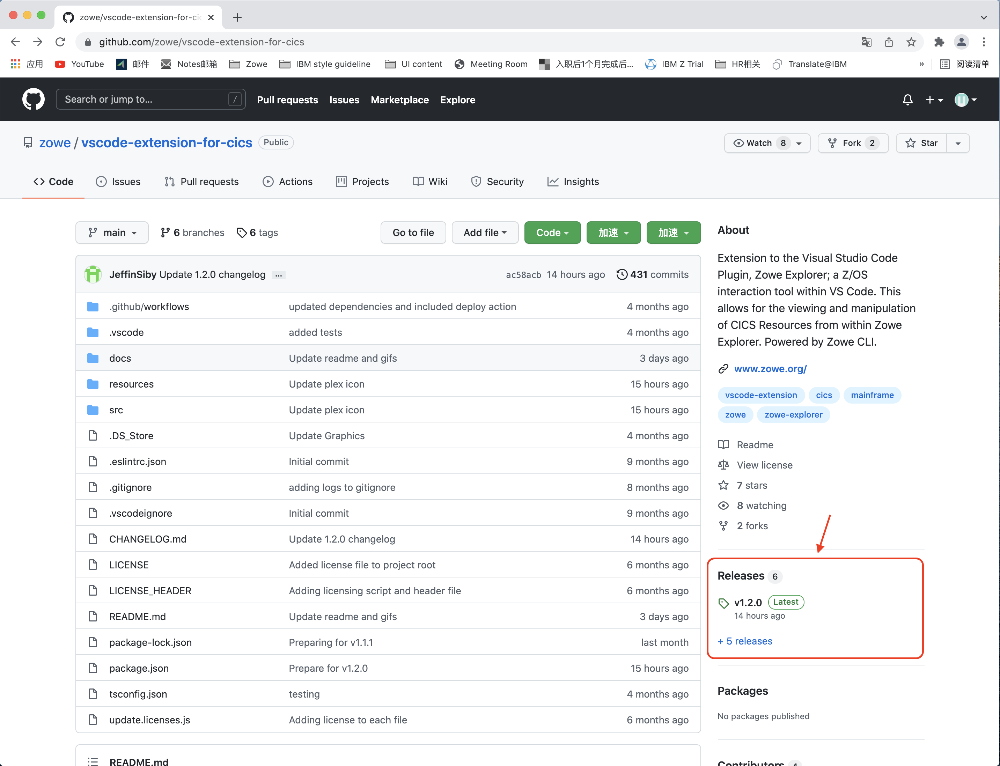
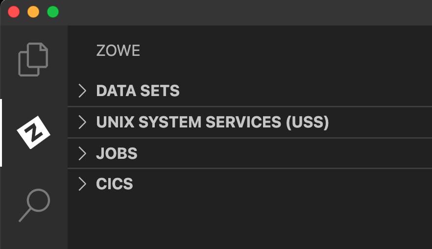
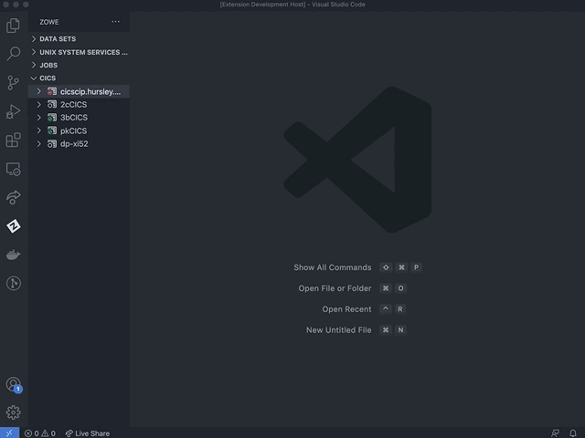
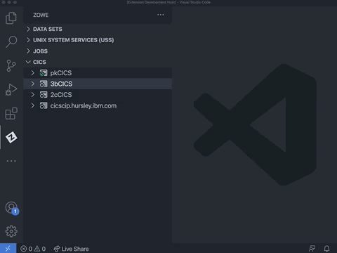
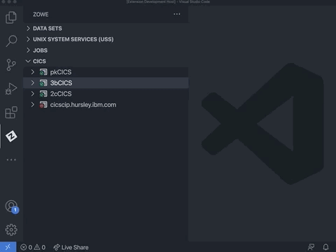
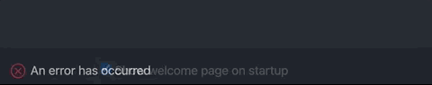

# Using Zowe Explorer CICS Extension

The CICS Extension for Zowe Explorer adds additional functionality to the popular Visual Studio Code extension, [Zowe Explorer](https://github.com/zowe/vscode-extension-for-zowe). This extension allows you to interact with CICS regions and programs, and run commands against them.

## Features

- **Load profiles** directly from a locally installed Zowe instance.
- Create new Zowe CICS profiles and connect to them.
- **Update** session details, and **delete** profiles by using the user-friendly interface.
- **Work with multiple regions** that contain programs, local transactions, and local files within a plex in a comprehensible tree-like format.
- Perform actions such as **Enable**, **Disable**, **New Copy**, and **Phase In** directly from the UI.
- Perform additional actions on local files including **Open** and **Close** directly from the UI.
- View and search attributes of resources and regions by right-clicking and using the dynamic filtering feature.
- **Apply multiple filters** to regions, programs, local transactions, and local files.
- View and interact with all resources under a plex.

## System requirements

Install [Visual Studio Code](https://code.visualstudio.com/download) on your PC.

Install Zowe Explorer V2.

## Installing

You can install or update the extension from Visual Studio Code Extensions or from a VSIX file.

- [Installing from Visual Studio Code Extensions](#installing-from-visual-studio-code-extensions)
- [Installing from a VSIX file](#installing-from-a-vsix-file)

### Installing from Visual Studio Code Extensions

1. Navigate to **Extensions** tab of your VS Code application.

2. Search for `Zowe Explorer for IBM CICS` and click it.

3. Click **Install** at the top of the page.

   If you do not have Zowe Explorer installed, it will automatically install it for you as part of the installation.

### Installing from a VSIX file

Before you perform the following steps, ensure that you have installed Zowe Explorer which is a required dependency. For more information, see [Installing Zowe Explorer](https://docs.zowe.org/stable/user-guide/ze-install#installing).

If your Zowe Explorer is installed, please follow the steps below to install Zowe Explorer CICS Extension from a VSIX file.

1. Visit the [download site](https://github.com/zowe/vscode-extension-for-cics). Select the **Latest** button which directs to a page that includes the latest version of `.vsix` file. Download it to your PC.

   

2. Open the Extensions icon in the side bar, navigate to the **...** menu, press **Install from VSIX ...** and select the downloaded `Zowe.cics-extension-for-zowe-2.x.x.vsix` file.

   

The following message indicates that the extension is installed successfully.

The Zowe Explorer pane will show tree views for **Data Sets**, **Unit System Services (USS)** and **Jobs**, and a new view for **CICS**.

## Getting started

### Creating profile

If you already have a Zowe CICS CLI profile, the CICS tree will load the default profile on startup.  

If you don't have an existing Zowe CICS CLI profile, follow these steps to create one:
#### Using Zowe Team Configuration

1. Select the **+** button in the CICS tree.

2. Select the **Create New CICS profile** option to open your config file.

3. Edit the config file to add a CICS profile.

4. Save the config file.

5. Click the **Refresh** button at the top level of the CICS tree or run the `Zowe Explorer for IBM CICS: Refresh` option in the command palette to refresh the Zowe Explorer for IBM CICS extension.

6. Select the **+** button in the CICS tree and click the newly created profile to load it into view.

#### Using Zowe V1 profiles

1. Select the **+** button in the CICS tree.

2. Select the **Create a CICS profile** option to open a panel that defines connection details.

**Note**: The connection must point to a CICS region's CICS Management Client Interface (CMCI) TCP/IP host name and port number. The region can be a WUI server in a CICSPlex, or else a stand-alone Single Management Application Programming (SMSS) region.  

Configuring a CICS region to have a connection is a system programmer task and more details can be found in [Setting up CMCI with CICSPlex SM](https://www.ibm.com/docs/en/cics-ts/5.3?topic=explorer-setting-up-cmci-cicsplex-sm) or [Setting up CMCI in a stand-alone CICS region](https://www.ibm.com/docs/en/cics-ts/5.3?topic=suace-setting-up-cmci-in-stand-alone-cics-region). If your CMCI connection is configured to use a self-signed certificate that your PC's trust store doesn't recognize, see [Untrusted TLS certificates](#untrusted-tls-certificates).

To show more than one CICS profiles in the tree, select the **+** button and choose from the list of profiles. Only profiles that not already included in the CICS tree will be shown.

### Updating profile

#### Updating profiles using Zowe team profiles

1. Right-click a profile to open up the profile menu actions.

2. Select the **Update Profile** button to open the config file.

3. Edit the config file to update the profile(s).

4. Save the config file.

5. Click the **Refresh** button at the top level of the CICS tree or run the `Zowe Explorer for IBM CICS: Refresh` option in the command palette to refresh the Zowe Explorer for IBM CICS extension.

#### Updating Zowe V1 profiles

1. Right-click a profile to open up the profile menu actions.

2. Select the **Update Profile** button to update the session details.

    This will open a panel with fields containing the details that are used to create the connection. You can modify all fields apart from the **Profile Name**.

3. Once the details are updated, click the **Update Profile** button to apply the changes to the profile.

   

### Hiding profiles

1. Right-click a chosen profile to open the menu actions.

2. Select **Hide Profile** to hide it from the CICS view.

3. To add the profile back, click the **+** button and select the profile from the quick pick list.

   

### Deleting profiles

#### Deleting Zowe team profiles

1. Right-click a chosen profile.

2. Select **Delete Profile** which opens the config file.

3. Edit the config file to remove the cics profile entry.

4. Save the config file.

5. Click the **Refresh** button at the top level of the CICS tree or run the `Zowe Explorer for IBM CICS: Refresh` option in the command palette to refresh the Zowe Explorer for IBM CICS extension.

#### Deleting Zowe V1 profiles

1. Right-click a chosen profile.

2. Select **Delete Profile** and click the **Yes** button when prompted to confirm the action of permanently deleting the profile. The functionality deletes the CICS profile from the persistent storage directory `~/.zowe/profiles/cics`.

## CICS resources

Expand a CICS profile to see the region name, and expand the region to view its resources.

- If the CICS profile is connected to a CMAS region that is part of a CICSPlex, the tree will show all of the regions managed by the CICSPlex.

- If the CICS profile is for an SMSS region, then just one region will be shown. Inactive regions in a plex are shown with an empty icon.

### Showing and filtering resources in a region

Expand a CICS region to show folders for the resource types **Programs**, **Transactions**, and **Local Files**. Expand each type to show the resources. The number of resources in a resource tree will appear in square brackets next to the tree name.

The list of resources is pre-filtered to exclude many of the IBM supplied ones to narrow the contents to just include user programs.

- Use the search icon against a resource type to apply a filter. You can enter an exact resource name or use wildcards. The search history is saved so you can recall previous searches.  

- To reset the filter to its initial criteria, use the clear filter icon against the resource type.  If you want to see all resources in a region (including IBM supplied ones), you can use __*__ as a filter.

**Tip:** To apply multiple filters, separate entries with a comma. You can append any filter with an __*__, which indicates wildcard searching.

### Showing and filtering resources in a plex

Similar to filtering resources in a region, you can apply a filter on a all region resources in a plex.

- Use the search icon inline with the **Regions** tree and then select either **Regions**, **Programs**, **Local Transactions** or **Local Files** from the drop-down menu to specify which resource type the filter should be applied to for all regions in the plex.

- To reset the filter to its initial criteria, use the clear filter icon against the **Regions** tree. This will open a drop-down menu which gives the option to clear the filter for all the **Regions**, **Programs**, **Local Transactions** or **Local Files** in the plex, and the option **All** to otherwise clear all filters within the plex.

   

**Tip:** To apply multiple filters, separate entries with a comma. You can append any filter with an __*__, which indicates wildcard searching.

### Showing and filtering resources in an 'All' resource tree

Plexes includes **All Programs**, **All Local Transactions** and **All Local Files** trees which contain all the corresponding resources from all regions in the plex.

- To view resources under these trees, use the search icon inline with the tree and apply a filter.
   
   

- If the applied filter results in over 500 records, you can change the filter to narrow down the search, or click the **view X more ...** item to retrieve 'X' more resources.

### Showing attributes

Right-click and use the pop-up menu against a program to list the available actions that can be performed.

For every resource, including a CICS region, the **Show Attributes** option opens a viewer listing all attributes and their values. The attributes page has a filter box at the top that lets you search for attributes matching the criteria.  

### Enabling and disabling

1. Right-click against a program, local transaction or local file to open up the pop-up menu.

2. Click **Disable [CICS resource]** to disable the resource. A disabled resource is identified by a `(Disabled)` text next to its name.

When a resource is already disabled, you can enable it again by clicking **Enable [CICS resource]** in the pop-up menu. 

### New copy and phase in

Use the new copy and the phase in actions against a CICS program to get the CICS region to load a fresh of the selected program into memory. This could be after you've edited a COBOL program source and successfully compiled it into a load library and now want to test your change.

The `New copy count` for a program which is greater than zero is shown next to the program item in the CICS resource tree.

### Opening and closing local files

**Open a local file**

1. Right-click against a closed local file. 
2. Select **Open Local File** to toggle the `openstatus` attribute to `OPEN`.

**Close a local file**

1. Right-click against an open local file and select **Close Local File**. 
2. When prompted, choose one option: **Wait**, **No Wait**, or **Force**. 

   After you select an option, the local file name will be appended with a `(Closed)` label upon success.

   

## Untrusted TLS certificates

If the CMCI connection uses a TLS certificate that does not exist in your PC's trust store, then by default the connection will be rejected because potentially this could be from an unsafe site.

To override this behavior, you can set the `Only accept trusted TLS certificates` field to `False` on the form when creating or updating the profile. This is the same as setting `rejectUnauthorized=false` on the Zowe CICS CLI profile.

If you define a profile as only accepting trusted TLS certificates when the Zowe Explorer first connects, it will detect the mismatch and pop up a message. You can select **Yes** to override the profile's setting to accept the untrusted certificate authority.  

## Usage tips

- All menu action commands available via right-clicking a profile or resource (excluding **Show Attributes**) can be applied to multiple items. To do this, you can multi-select the nodes of the same type before right-clicking and selecting the command.

- To multi-select, you can hold Ctrl/Cmd key while clicking resources. Or you can select the first item in a list of nodes then hold Shift and click both the last item to select a consecutive list of nodes.

- Click the refresh icon at the top of the CICS view to reload the resources in every region.

## Providing feedback or contributing

You are welcome to contribute to the Zowe Explorer CICS Extension in many forms and help make it better! 

- [Checking the source of an error](#checking-the-source-of-an-error)
- [Filing an issue](#filing-an-issue)

### Checking the source of an error

Before filing an issue, check if an error is arising from the Zowe Explorer for IBM CICS extension instead of the Zowe Explorer extension. To check the error source, expand the error message and review the `Source` description.

- Errors arising from the Zowe Explorer CICS extension will have the `Source` as `Zowe Explorer for IBM CICS (Extension)`,
- Errors arising from the Zowe Explorer extension will have the `Source` as `Zowe Explorer (Extension)`.

### Filing an issue

To file issues, use the [Zowe Explorer for IBM CICS issue list](https://github.com/zowe/vscode-extension-for-cics/issues), or chat with the community on [Slack](https://openmainframeproject.slack.com/archives/CUVE37Z5F) by indicating the message is for the Zowe Explorer for IBM CICS extension.

## Uninstalling

You can uninstall the Zowe Explorer CICS extension from the VS Code Extensions tab.

1. Navigate to **Extensions** tab of the VS Code application.

2. Find `Zowe Explorer for IBM CICS` and click it.

3. A panel will open. Click **Uninstall** at the top of the page.

4. A reload may be required. If a button appears for reload, click it and the extension will no longer be installed.
