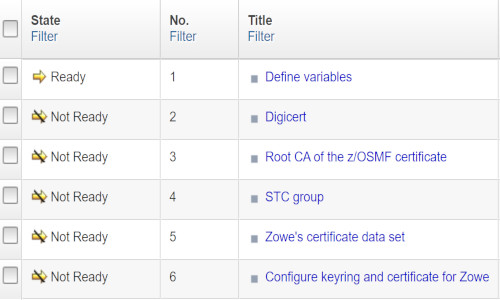
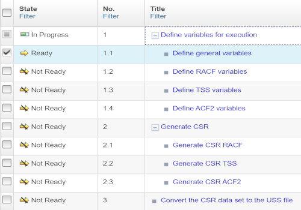
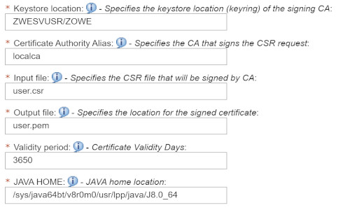
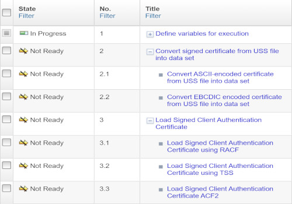

# Set up Zowe certificates using workflows

Zowe uses certificates that are held in z/OS Keyring.

You can use four z/OSMF workflows that enable you to manage keyring setup, certificates, certificate sign requests and signatures, and load certificates to a keyring. Use the following workflows to set up certificates for Zowe in your environment:

1. Set up a Zowe certificate and keyring using ZWEKRING.xml

    The `ZWEKRING.xml` workflow sets up a Zowe certificate and keyring. The workflow helps you set up the certificate and keyring and has the following features:

    - Generates a Zowe certificate that is signed by the Zowe local CA
    - Imports an existing certificate that is held in z/OS to the keyring for Zowe
    - Imports an external Zowe certificate from a data set in PKCS12 format
    - Connects a z/OSMF certificate authority to the Zowe keyring

    The workflow includes the steps that you can see on the following image:

    

     Based on the variable setup from the first step, the workflow can perform various certificate configurations and connect certificates to a keyring in RACF, TSS, and ACF2 security systems.

2. Create a certificate sign request (CSR) using ZWECRECR.xml

    The `ZWECRECR.xml` workflow creates a CSR request and has the following features:

    - Based on a variable setup, generates a certificate sign request.  

      You must define variables.

    - A CSR request is stored into a data set. Then the data set is automatically converted into a USS file.

      You must specify the USS file path.

    The workflow includes the steps that you can see on the following image:

    

   **Note:** You can find links to the specific security systems (BCM, IBM) official documentation in the instructions section of the workflow in related steps.

3. Sign a CSR request using ZWESIGNC.xml

   The `ZWESIGNC.xml` workflow signs a CSR request.

   After the successful workflow execution, the certificate is signed by the specified certificate authority and is stored in USS.

    The workflow includes the steps that you can see on the following image:

    

    Fill in the fields, that you can see on the following image, to sign a CSR request. Ensure that the workflow includes the following information:

    - A USS location path of the CSR file
    - A USS location path where a signed certificate is stored in pem format

    

4. Load the Signed Client Authentication Certificate into ESM using ZWELOADC.xml

   The `ZWELOADC.xml` workflow loads a signed client authentication certificate into a specific ESM under your ACID.

   The workflow can load ASCII- or EBCDIC-encoded certificate into a data set. Then, based on the variable setup, the workflow loads the certificate into a specific ESM.

   The workflow includes the steps that you can see on the following image:

   
