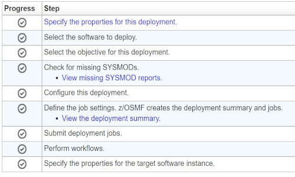

# Configure Zowe with z/OSMF Workflows

As a system programmer, after you install Zowe, you can register and execute the z/OSMF workflows in the web interface to complete the Zowe configuration. z/OSMF helps to simplify the Zowe configuration tasks and reduce the level of expertise that is needed for Zowe configuration.

Ensure that you meet the following requirements before you start the Zowe configuration:

- Install and configure z/OSMF
- Install Zowe with an SMP/E build, PSWI, or a convenience build

You can complete the following tasks with the z/OSMF workflow:

- Configure the Zowe instance directory
- Enable the API ML gateway
- Enable the metrics service
- Enable the API catalog
- Enable automatic discovery
- Enable a caching service
- Enable an application server
- Enable the ZSS component
- Enable the jobs API
- Enable the files API
- Enable JES Explorer
- Enable MVS Explorer
- Enable USS Explorer

You can execute the Zowe configuration workflow either from a PSWI during deployment or later from a created software instance in z/OSMF. Alternatively, you can execute the configuration workflow z/OSMF during the workflow registration process.

## Configure the Zowe instance directory

The Zowe instance directory contains configuration data that is required to launch a Zowe runtime. This includes port numbers, location of dependent runtime such as Java, Node, z/OSMF, as well as log files. When Zowe is started, configuration data is read from files in the instance directory and logs will be written to files in the instance directory. Zowe has three runtime systems: the z/OS Service microservice server, the Zowe Application Server, and the Zowe API Mediation Layer microservices.

Register the **ZWECONF.xml** workflow definition file in the z/OSMF web interface to create a Zowe instance directory and start the Zowe started task. The path to the workflow definition file is `<pathPrefix>/workflows/`

After you register the workflow definition file, perform the following steps to complete the process:

1. **Define variables**

  The workflow includes the list of instance configuration and the Zowe variables. Enter the values for variables based on your mainframe environment, Zowe instance configuration, and wanted components.

2. **Create configuration**

   Execute the step to create a configuration zowe.yaml file with the variable setup that was defined in step 1.

3. **Run Zowe install**

   Execute the `zwe install` command with the previously stored zowe.yaml file as a parameter.

   If you receive an error message (such as RC higher than 0), ensure that you edit incorrect input values or system setup before you re-run the `zwe install` command. To overwrite changed output, edit the step by adding the `--allow-overwritten` tag to the install command.

   **Example: Command that re-runs the installation**

   ```
   zwe install -c '/path/zowe.yaml' --allow-overwritten
   ```

4. **Run Zowe init**

    Execute the `zwe init` command with the previously stored zowe.yaml file as a parameter.

    **Note**: Messages and error codes from the subsequent JOBS command are not forwarded back to z/OSMF.

    The `zwe init` command is a combination of the following sub-commands that define configuration:

    - **mvs**: Copies the data sets that are provided with Zowe to custom data sets.
    - **security**: Creates user IDs and security manager settings.
    - **apfauth**: APF authorizes the LOADLIB that contains the modules that perform priviledged security calls on z/OS.
    - **certificate**: Configures Zowe to use TLS certificates.
    - **vsam**: Configures the VSAM files that help run the Zowe caching service for high availability (HA)
    - **stc**: Configures the system to launch the Zowe started task.

    If you execute the init step again, either manually delete failed artifacts that are created from previous init steps or edit the step by adding the `--allow-overwritten` tag to the init command.

    **Example: Command that re-runs init**

    ```
    zwe init -c '/path/zowe.yaml' --allow-overwritten
    ```

After you execute each step, the step is marked as complete. After completing the workflow execution, you can view the Zowe started task.

## Execute the configuration workflow

You can use the following methods to execute the configuration workflow:

- Directly from a PSWI during deployment
- From a deployed software instance (SI)
- From the Workflows tab in the z/OSMF web UI

### Execute workflow from PSWI

In the PSWI deployment phase, you are presented with the checklist that helps guide you during the deployment process.



The **perform workflows** step enables you to run either all attached workflows or just the mandatory one — the post-deployment workflow for mounting.

### Execute workflow from software instance

Software instance is created after PSWI deployment is complete. Execute a workflow from an SI.

**Follow these steps**:

1. Log in to z/OSMF.
2. Select the **Software Management** panel.
3. In the displayed table, select **Software Instances**.
4. Select the checkbox next to the **Software Instance Name** column for the instance you want to execute the workflow against.
5. Select the **Perform Workflows** option from the **Actions** menu.

   The **Software Management Software Instances Perform Workflows** dialog opens.

6. Select the **Create Workflow** option from the **Actions** menu.
7. In the displayed table, click on the name of the workflow you want to execute.
8. Click **OK**.

    The **Workflows** tab with the previously selected workflow opens.

9. Execute the workflow steps.

You have successfully executed a workflow from a software instance.

## Register and execute workflow in the z/OSMF web interface

z/OSMF workflow simplifies the procedure to configure and start Zowe. Execute the following steps to register and execute the workflow in the z/OSMF web interface:

1. Log in to the z/OSMF web interface and select **Use Desktop Interface**.

2. Select the Workflows File.

3. Select **Create Workflow** from the **Actions** menu.

   The **Create Workflow** panel appears.

4. Enter the complete USS path to the workflow you want to register in the **Workflow Definition File** field.

   - If you installed Zowe with the SMP/E build, the workflow is located in the SMP/E target zFS file system that was mounted during the installation.

   - (Optional) Enter the complete USS path to the edited workflow properties file in the Workflow Variable Input File field. Use this file to customize product instances and automate workflow execution, saving time and effort when deploying multiple standardized Zowe instances. The values from this file override the default values for the workflow variables.

        The sample properties file is located in the same directory with the workflow definition file. Create a copy of this file, and then modify as described in the file. Set the field to the path where the new file is located.

        **Note:** If you use the convenience build, the workflows and variable input files are located in the USS runtime folder in files/workflows.

5. Select the System where the workflow runs.

6. Select **Next**.

7. Specify a unique Workflow name.

8. Select or enter an Owner user ID, and select **Assign all steps to owner user ID**.

9. Select **Finish**.

    The **workflow** is registered in z/OSMF. The workflow is available for execution to deploy and configure the Zowe instance.

10. Perform the following steps to execute each step individually:

    a. Double-click the title of the step.

    b. Select the **Perform** tab.

    c. Review the step contents and update the input values.

    d. Select **Next**.

    Repeat the previous two steps to complete all items until the **Finish** option is available.

11. Select **Finish**.

After you execute each step, the step is marked as Complete. The workflow is executed.
