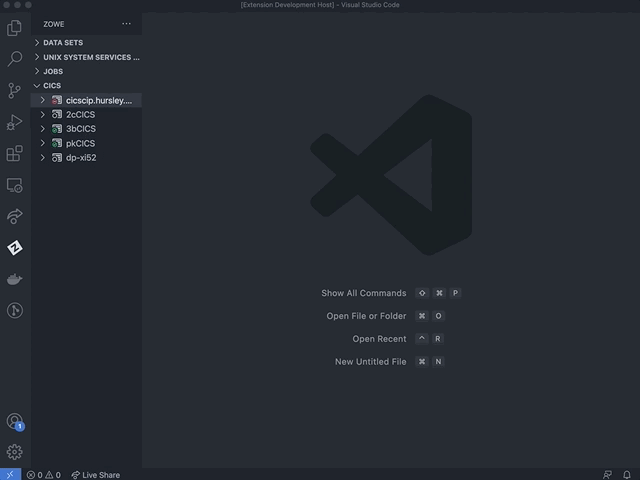

# Creating Zowe Explorer CICS Extension profiles

You need to have a Zowe Explorer profile to use all functions of the extension.

If you already have a Zowe CICS CLI profile, the CICS tree loads the default profile on startup.  

If you do not have an existing Zowe CICS CLI profile, follow these steps to create one:

## Using Zowe team configuration

1. Select the **+** button in the CICS tree.

2. Select the **Create New CICS profile** option to open the config file.

3. Edit the config file to add a CICS profile.

4. Save the config file.

5. Click the **Refresh** button at the top level of the CICS tree or run the `Zowe Explorer for IBM CICS: Refresh` option in the command palette to refresh the Zowe Explorer for IBM CICS extension.

6. Select the **+** button in the CICS tree and click the newly created profile to load it into view.

### Using Zowe V1 profiles

1. Select the **+** button in the CICS tree.

2. Select the **Create a CICS profile** option to open a panel that defines connection details.

**Note**: The connection must point to a CICS region's CICS Management Client Interface (CMCI) TCP/IP host name and port number. The region can be a WUI server in a CICSPlex, or else a stand-alone Single Management Application Programming (SMSS) region.  

Configuring a CICS region to have a connection is a system programmer task and more details can be found in [Setting up CMCI with CICSPlex SM](https://www.ibm.com/docs/en/cics-ts/5.3?topic=explorer-setting-up-cmci-cicsplex-sm) or [Setting up CMCI in a stand-alone CICS region](https://www.ibm.com/docs/en/cics-ts/5.3?topic=suace-setting-up-cmci-in-stand-alone-cics-region). If your CMCI connection is configured to use a self-signed certificate that your PC's trust store does not recognize, see [Overriding untrusted TLS certificates](ze-override-tls-certs.md).

To show more than one CICS profiles in the tree, select the **+** button and choose from the list of profiles. Only profiles that are not already included in the CICS tree are shown.

## Updating profiles

### Updating profiles using Zowe team profiles

1. Right-click a profile to open up the profile menu actions.

2. Select the **Update Profile** button to open the config file.

3. Edit the config file to update the profile(s).

4. Save the config file.

5. Click the **Refresh** button at the top level of the CICS tree or run the `Zowe Explorer for IBM CICS: Refresh` option in the command palette to refresh the Zowe Explorer for IBM CICS extension.

### Updating Zowe V1 profiles

1. Right-click a profile to open up the profile menu actions.

2. Select the **Update Profile** button to update the session details.

    This opens a panel with fields containing the details that are used to create the connection. You can modify all fields apart from the **Profile Name**.

3. Once the details are updated, click the **Update Profile** button to apply the changes to the profile.

   

## Hiding profiles

1. Right-click the profile you want to hide to open the menu actions.

2. Select **Hide Profile** to hide it from the CICS view.

3. To unhide the profile, click the **+** button and select the profile from the quick pick list.

   

## Deleting profiles

### Deleting Zowe team profiles

1. Right-click the team profile you want to delete to open the menu actions.

2. Select **Delete Profile**, which opens the config file.

3. Edit the config file to remove the cics profile entry.

4. Save the config file.

5. Click the **Refresh** button at the top level of the CICS tree or run the `Zowe Explorer for IBM CICS: Refresh` option in the command palette to refresh the Zowe Explorer for IBM CICS extension.

### Deleting Zowe V1 profiles

1. Right-click the Zowe V1 profile you want to delete to open the menu actions.

2. Select **Delete Profile** and click the **Yes** button when prompted to confirm the action of permanently deleting the profile. The functionality deletes the CICS profile from the persistent storage directory `~/.zowe/profiles/cics`.

