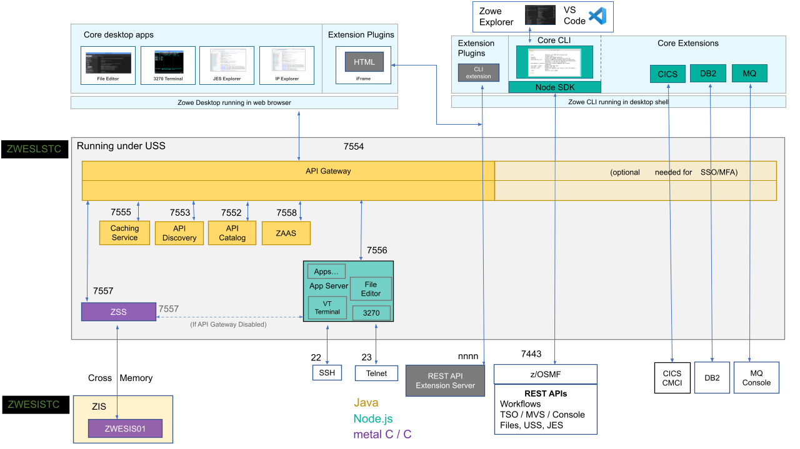
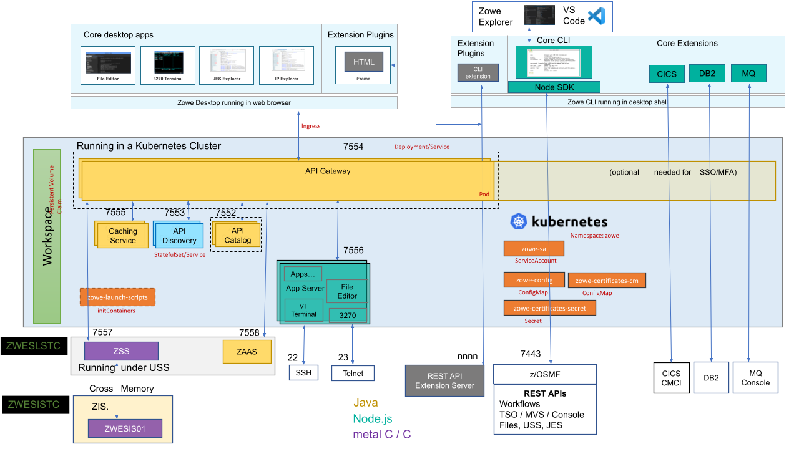
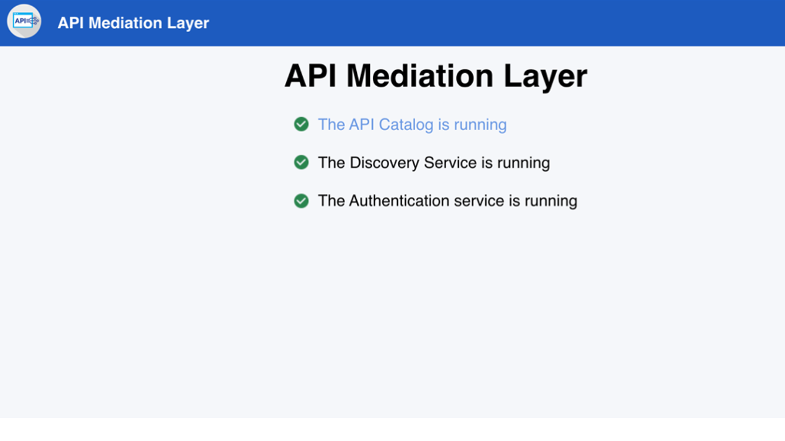
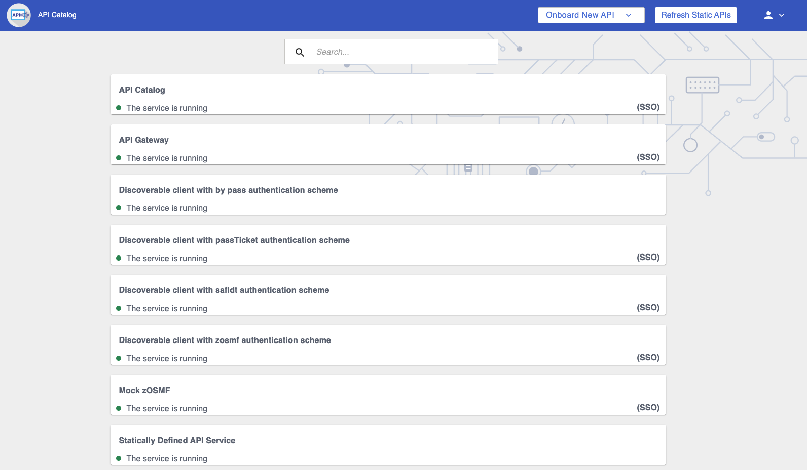

# Zowe architecture

Zowe&trade; is a collection of components that together form a framework that makes Z-based functionality accessible across an organization. Zowe functionality includes exposing Z-based components, such as z/OSMF, as REST APIs. The Zowe framework provides an environment where other components can be included and exposed to a broader non-Z based audience.

The following diagram illustrates the high-level Zowe architecture.

The diagram shows the default port numbers that are used by Zowe. These are dependent on each instance of Zowe and are held in the Zowe YAML configuration file.

Zowe components can be categorized by location: server or client. While the client is always an end-user tool such as a PC, browser, or mobile device, the server components can be further categorized by what machine they run on.

Zowe server components can be installed and run entirely on z/OS, but a subset of the components can alternatively run on Linux or z/Linux via Docker. While on z/OS, many of these components run under UNIX System Services (USS). The components that do not run under USS must remain on z/OS when using Docker in order to provide connectivity to the mainframe.

## Zowe architecture with high availability enablement on Sysplex

The following diagram illustrates the difference in locations of Zowe components when deploying Zowe into a Sysplex with high availability enabled as opposed to running all components on a single z/OS system.  

Zowe has a high availability feature built in. To enable this feature, you can define the `haInstances` section in your YAML configuration file.

The preceding diagram shows that `ZWESLSTC` has started two Zowe instances running on two separate LPARs that can be on the same or different sysplexes.  

- Sysplex distributor port sharing enables the API Gateway 7554 ports to be shared so that incoming requests can be routed to either the Gateway on LPAR A or LPAR B.
- The discovery servers on each LPAR communicate with each other and share their registered instances, which allows the API Gateway on LPAR A to dispatch APIs to components either on its own LPAR, or alternatively to components on LPAR B. As indicated in the diagram, each component has two input lines: one from the API Gateway on its own LPAR and one from the Gateway on the other LPAR.  When one of the LPARs goes down, the other LPAR remains operating within the Sysplex, thereby  providing high availability to clients that connect through the shared port irrespective of which Zowe instance is serving the API requests.

The `zowe.yaml` file can be configured to start Zowe instances on more than two LPARS, and also to start more than one Zowe instance on a single LPAR, thereby providing a grid cluster of Zowe components that can meet availability and scalability requirements.  

The configuration entries of each LPAR in the `zowe.yaml` file control which components are started. This configuration mechanism makes it possible to start just the desktop and API Mediation Layer on the first LPAR, and start all of the Zowe components on the second LPAR. Because the desktop on the first LPAR is available to the Gateway of the second LPAR, all desktop traffic is routed there.  

The caching services for each Zowe instance, whether on the same LPAR, or distributed across the sysplex, are connected to each other by the same shared VSAM data set. This arrangement allows state sharing so that each instance behaves similarly to the user irrespective of where their request is routed.  

## Zowe architecture when running in Kubernetes cluster

The following diagram illustrates the difference in locations of Zowe components when deploying Zowe into a Kubernetes cluster as opposed to running all components on a single z/OS system.

When deploying other server components into container orchestration software like Kubernetes, Zowe follows standard Kubernetes practices. The cluster can be monitored and managed with common Kubernetes administration methods.

- All Zowe workloads run on a dedicated namespace (`zowe` by default) to distinguish from other workloads in same Kubernetes cluster.
- Zowe has its own `ServiceAccount` to help with managing permissions.
- Server components use similar `zowe.yaml` on z/OS, which are stored in `ConfigMap` and `Secret`, to configure and start.
- Server components can be configured by using the same certificates used on z/OS components.
- Zowe claims its own `Persistent Volume` to share files across components.
- Each server component runs in separated containers.
- Components may register themselves to Discovery with their own `Pod` name within the cluster.
- Zowe workloads use the `zowe-launch-scripts` `initContainers` step to prepare required runtime directories.
- Only necessary components ports are exposed outside of Kubernetes with `Service`.

## App Server

The App Server is a portable, extensible HTTPS server written in node.js. It can be extended with expressjs routers to add REST or Websocket APIs. This server is responsible for the Zowe Application Framework, including the Desktop which is described later in this page.

When the API Gateway is running, this server and the Desktop are accessible at `https://<ZOWE_HOST_IP>:7554/zlux/ui/v1/`.
When the API Catalog is running, this server's API documentation is accessible at the API Catalog tile `Zowe Application Server`, which can be viewed at `https://<ZOWE_HOST_IP>:7554/apicatalog/ui/v1/#/tile/zlux/zlux`.
When running on z/OS, this server uses the jobname suffix of DS1. 

## ZSS

Zowe System Services (ZSS) is a z/OS native, extensible HTTPS server which allows you to empower web programs with z/OS functionality due to ZSS' conveniences for writing REST and Websocket APIs around z/OS system calls. The Zowe desktop delegates a number of its services to the ZSS server.

When the API Gateway is running, this server is accessible at `https://<ZOWE_HOST_IP>:7554/zss/api/v1`.
When the API Catalog is running, this server's API documentation is accessible at the API Catalog tile `Zowe System Services (ZSS)` which can be viewed at `https://<ZOWE_HOST_IP>:7554/apicatalog/ui/v1/#/tile/zss/zss`
When running on z/OS, the server uses the jobname suffix of SZ.

## ZIS

ZIS is a z/OS native, authorized cross-memory server that allows a secure and convenient way for Zowe programs, primarily ZSS, to build powerful APIs to handle z/OS data that would otherwise be unavailable or insecure to access from higher-level languages and software. As part of Zowe's security model, this server is not accessible over a network but rather empowers the less privileged servers. It runs as a separate STC, `ZWESISTC` to run the program `ZWESIS01` under its own user ID `ZWESIUSR`.

Unlike all of the servers described above which run under the `ZWESLSTC` started task as address spaces for USS processes, the Cross Memory server has its own separate started task `ZWESISTC` and its own user ID `ZWESIUSR` that runs the program `ZWESIS01`.

## API Mediation Layer

The API Mediation Layer is a collection of services for management and administration of APIs, and is comprised of the following components that are described in detail below:

* API Gateway
* API Catalog
* API Discovery
* Caching service
* ZAAS

### API Gateway

The API Gateway is a proxy server that routes requests from clients on its northbound or upstream edge, such as web browsers or the Zowe command line interface, to servers on its southbound (downstream) edge that are able to provide data to serve the request. The API Gateway is also responsible for generating the authentication token used to provide single sign-on (SSO) functionality. The API Gateway homepage is `https://<ZOWE_HOST_IP>:7554`. Following authentication, this URL enables users to navigate to the API Catalog.

When the API Gateway is running, this server is accessible at `https://<ZOWE_HOST_IP>:7554/`.
When running on z/OS, the server uses the jobname suffix of AG.

### API Catalog

The API Catalog provides a list of the API services that have registered themselves as catalog tiles. These tiles make it possible to view the available APIs from Zowe's southbound (downstream) servers, as well as test REST API calls.  

When the API Gateway is running, this server is accessible at `https://<ZOWE_HOST_IP>:7554/apicatalog/ui/v1`.
When the API Catalog is running, the API documentation of this server is accessible at the API Catalog tile `Zowe Applications` which can be viewed at `https://<ZOWE_HOST_IP>:7554/apicatalog/ui/v1/#/tile/apimediationlayer/apicatalog`
When running on z/OS, the server uses the jobname suffix of AC.

### API Discovery

The API Discovery server acts as the registration service broker between the API Gateway and its southbound (downstream) servers. This server can be accessed through the URL `https://<ZOWE_HOST_IP>:7552` making it possible to view a list of registered API services on the API discovery homepage.

When running on z/OS, the server uses the jobname suffix of AD.

### Caching service

The Caching service aims to provide an API which offers the possibility to store, retrieve, and delete data associated with keys. The service is used only by internal Zowe applications and is not exposed to the internet. The Caching service URL is `https://<ZOWE_HOST_IP>:7555`.
For more information about the Caching service, see [Using the Caching Service](../user-guide/api-mediation/api-mediation-caching-service).

When the API Gateway is running, this server is accessible at `https://<ZOWE_HOST_IP>:7554/cachingservice/api/v1`.
When the API Catalog is running, the API documentation of this server is accessible at the API Catalog tile `Zowe Applications` which can be viewed at `https://<ZOWE_HOST_IP>:7554/apicatalog/ui/v1/#/tile/zowe/cachingservice`.
When running on z/OS, the server uses the jobname suffix of CS.

## Desktop Apps

Zowe provides a number of rich GUI web applications for working with z/OS. Such applications include the Editor for files and datasets, the JES Explorer for jobs, and the IP Explorer for the TCPIP stack. You can access them through the Zowe desktop.

