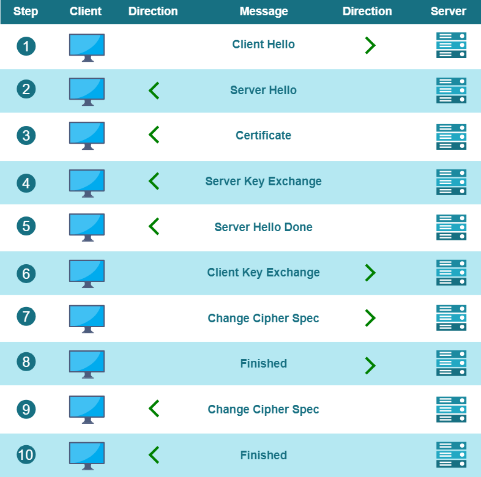

# Zowe Certificates overview

In order to leverage certificates in Zowe, it is useful to review the key concepts of digital certificates-based security and how Zowe implements this technology.

- [Zowe Certificates overview](#zowe-certificates-overview)
  - [Digital certificates definition](#digital-certificates-definition)
  - [Digital certificates usage](#digital-certificates-usage)
  - [Public key infrastructure](#public-key-infrastructure)
  - [Transport Layer Security](#transport-layer-security)
  - [Digital certificates types](#digital-certificates-types)
  - [Certificates storage](#certificates-storage)
    - [Keystore and Truststore](#keystore-and-truststore)
      - [Keystores](#keystores)
      - [Truststores](#truststores)
    - [SAF Keyring](#saf-keyring)

## Digital certificates definition
A Digital Certificate is an electronic file that is tied to a cryptographic (public and private) key pair and authenticates the identity of a website, individual, organization, user, device or server.
The de facto standard is the x.509 family type of certificates, which are the foundation behind [Public Key Infrastructure (PKI)](#public-key-infrastructure) security.

An X.509 certificate binds an identity to a public key using a digital signature.
A certificate contains an identity (a hostname, or an organization, or an individual) and a public key (RSA, DSA, ECDSA, ed25519, etc.).

Certificates can be self-signed or issued by a Certificate Authority (CA). A CA is an organization which provides infrastructure for the creation, validation, and revocation of certificates according to  contemporary security standards.

:::note
For testing purposes of Zowe, it is acceptable to use certificates issued and signed either by a company local CA, or certificates that are signed by a CA created by Zowe security tools specific for the target technology platform. Use of self-signed certificates is **not recommended** for production environments.
::: 

## Digital certificates usage

Digital certificates according to x.509 standard specification are the cornerstone for securing communication channels between clients and servers.

X.509 Digital certificates are primarly used to implement the following functions:
- Verification of the identity of a sender/receiver of an electronic message during TLS handshake.
- Encryption/Decryption of the messages between the sender and the receiver.
- Identification of client-service users.

Zowe uses digital certificates as a foundational element for both communication and for identity security.
Additionally, Zowe provides a client identity validation functionality based on the ownership of the provided x.509 client certificate and the mainframe security authentication mechanism.

For more information about how Zowe leverages certificates, see [Zowe certificate usage](../user-guide/use-certificates.md).

To review the various Zowe certificate configuration options, see the [Zowe certificate configuration overview](../user-guide/configure-certificates.md).

## Public key infrastructure
[Public Key Infrastructure (PKI)](https://en.wikipedia.org/wiki/Public_key_infrastructure) is a key element of internet security. PKI is both the technology and processes that make up the framework for encryption to protect and authenticate digital communications.
PKI includes software, hardware, policies, and procedures that are used to create, distribute, manage, store, and revoke digital certificates and manage public-key encryption.

For detailed information about Public Key Infrastructure (PKI), see [How Does PKI Work?](https://www.keyfactor.com/education-center/what-is-pki/#section2) in the _Keyfactor_ documentation.

Visit the following link to learn more about PKI in the context of the [z/OS Cryptographic Services](https://www.ibm.com/docs/en/zos/2.3.0?topic=planning-introducing-pki-services).

## Transport Layer Security
[Transport Layer Security (TLS)](https://en.wikipedia.org/wiki/Transport_Layer_Security) is a networking cryptography protocol that provides authentication, privacy, and data integrity between two communicating computer applications.
TLS is a successor to Secure Socket Layer (SSL), which was deprecated in 2015.

:::note 
While the transition from SSL 3.0 to TLS 1.0 occurred in 1999, the term SSL continues to be in common usage. At the time of this publication, this technology is still oftentimes referred to as SSL/TLS. 
:::

TLS defines a client-server handshake mechanism to establish an encrypted and secure connection, to ensure the authenticity of the communication between parties.
During the handshake, the parties negotiate an exchange algorithm, cipher suites, and exchange key material to establish a stateful encrypted connection.
The exact steps of the TLS handshake depend on the protocol version/s supported by the client and the server.
The current version at the time of this publication is 1.3, while version 1.2 is widely supported.

Being familiar with the key concepts and terms describing TLS security helps to properly set up the Zowe servers network security and to troubleshoot configuration issues. The following list presents some of the key concepts and terms:
- Cipher Suite
- Key Exchange
- Symmetric Encryption
- Asymmetric Encryption
- Authentication
- Basic vs mutually-authenticated handshake

The following diagram illustrates the TLS handshake steps:

The architecture of Zowe strictly relies on Transport Layer Security (TLS) to secure communication channels between Zowe components,
as well as between client applications and Zowe server components.

For more information, see the [TLS requirements in Zowe API ML requirements](../extend/extend-apiml/zowe-api-mediation-layer-security-overview#zowe-api-ml-tls-requirements).

:::note
When installed on a mainframe system, Zowe is able to utilize AT-TLS implementation if supported by the corresponding z/OS version/installation. For more information, see [Configuring AT-TLS for Zowe server](../user-guide/configuring-at-tls-for-zowe-server.md).
:::

## Digital certificates types
Zowe's architecture also distinguishes several aspects of PKI artifacts and their usage. Based on these artifacts and use-cases, users can determine which certificate type to use.
Some certificate types are specific for a given technology, while others are generic and applicable across a wider spectrum of platforms.

Certificates come in various file formats and can be stored in different [certificates storage](#certificates-storage) types.

Digital X.509 certificates can be issued in various file formats such as PEM, DER, PKCS#7 and PKCS#12.
PEM and PKCS#7 formats use Base64 ASCII encoding, while DER and PKCS#12 use binary encoding.

The choice of certificate format depends on the technologies used in the implementation of the server components and on the certificate storage type.
For example, Java servers can use JKS and JCEKS keystores, which are specific for the platform.

Zowe supports:
* **file-based PKCS12**  
  PKCS12 certificates are the most general and widely deployed certificate format.
* **z/OS keyring-based keystore (JKS/JCEKS)**  
  JKS/JCEKS certificates are specific types of certificates that depend on the Java environment.

:::note
Java 9 and higher can also work with PKCS12 certificates.
:::

## Certificates storage

There are two options for the storage of certificates:

* Keystore and Truststore combination
* SAF Keyrings

### Keystore and Truststore

Two key concepts to understand storage and verification of certificates are keystores and truststores.

* **Keystores** are used to store certificates and the verification of these certificates.
* **Truststores** are used to store the verification.

Zowe supports keystores and truststores that are either z/OS keyrings (when on z/OS) or PKCS12 files. By default, Zowe reads a PKCS12 keystore from `keystore` directory in zowe.yaml. This directory contains a server certificate, the Zowe generated certificate authority, and a `truststore` which holds intermediate certificates of servers that Zowe communicates with (for example z/OSMF).

#### Keystores  
Zowe can use PKCS12 certificates stored in USS to encrypt TLS communication between Zowe clients and Zowe z/OS servers, as well as intra z/OS Zowe server to Zowe server communication. Zowe uses a `keystore` directory to contain its external certificate, and a `truststore` directory to hold the public keys of servers which Zowe communicates with (for example z/OSMF).

#### Truststores  
Truststores are essential to provide secure communication with external services. The truststore serves as a secure repository for storing certificates and trust anchors. In the context of Zowe, the truststore establishes the trust relationships with external services as well as manages the relationship between Zowe's components and the certificates presented by the external services.

In addition to utilizing the intra-address space of certificates, Zowe incorporates external services on z/OS to enhance the encryption of messages transmitted between its servers. These external services, such as z/OSMF or Zowe conformant extensions, have registered themselves with the API Mediation Layer.

The API Mediation Layer, acting as an intermediary, validates these certificates. When the API ML receives a certificate from an external service, it examines each certificate in the certificate chain and compares it to the certificates in the truststore.

By leveraging the truststore, Zowe ensures that only trusted and authorized external services can establish communication with its servers.

### SAF Keyring

An alternative to certificate storage with keystores and trustores is to use a SAF Keyring. Use of a SAF Keyring is more secure than PKCS12 files. This SAF keyring method also makes it possible to import an existing certificate or generate new certificates with Top Secret, ACF2, and RACF.

For details about SAF Keyring, see the documentation [API ML SAF Keyring](../extend/extend-apiml/certificate-management-in-zowe-apiml.md#api-ml-saf-keyring) in the article **Certificate management in Zowe API Mediation Layer**.
