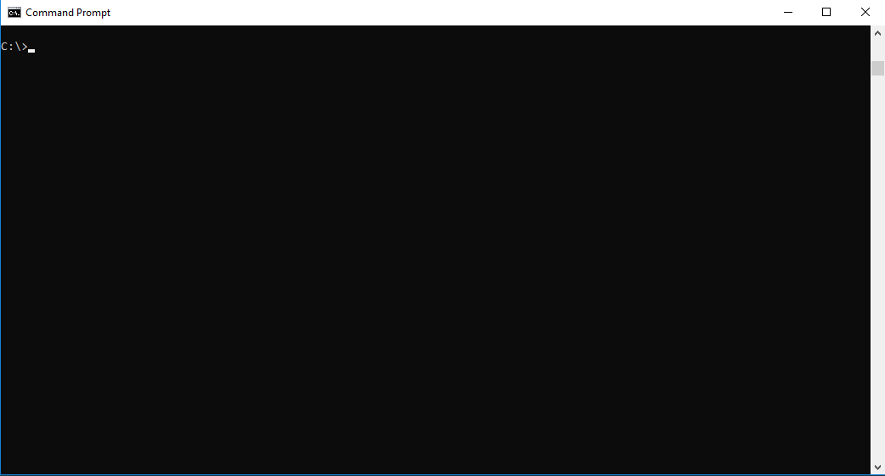

# Displaying help

Zowe CLI has a command-line help system that details the commands, actions, and options available in the product.

## Top-level help

To view top-level help, open a command-line and issue the following command:

```
zowe --help
```

    - An example of the Zowe CLI response:

        

Alternatively, to display a full list of all available commands:

```
zowe --ac
```

:::tip

All Zowe CLI commands begin with `zowe`.

:::

## Group, action, and object help

Append the global `--help` option to learn about a specific command group, action, or object.

For example, issue the following command to learn about the `create` action in the `zos-files` group:

```
zowe zos-files create --help
```

## Launching local web help

Launch an interactive form of help content in a web browser. When you issue the following command, web help is custom-generated to include commands for all of your currently installed plug-ins:

```
zowe --help-web

PS C:\Users\myName> zowe --help-web
Generating web help...............done!
Launching web help in browser...
PS C:\Users\myName>
```

:::tip

Append `--help-web` to a specific command or action to launch directly into the appropriate web help page.

:::
## Viewing web help in other ways

There are several methods to view Zowe CLI web help:

- <a href="/v3.0.x/web_help/index.html" target="_blank">Use a web browser</a>
- <a href="/v3.0.x/zowe_web_help.zip" target="_blank">Extract from a ZIP file</a>
- <a href="/v3.0.x/CLIReference_Zowe.pdf" target="_blank">Download a PDF file</a>

