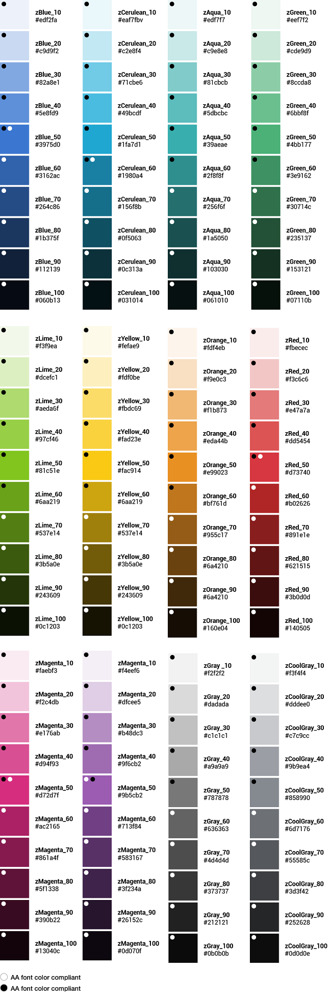
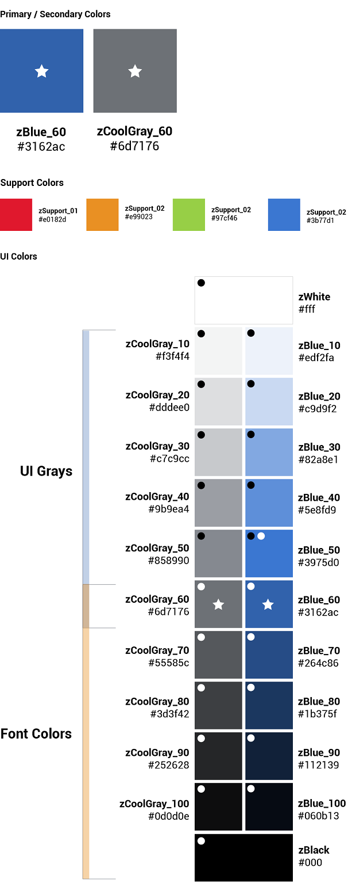
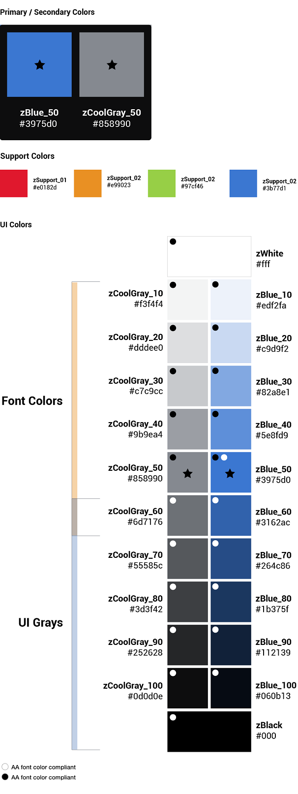

# Colors

Color brings a design to life. Color is versatile; it's used to express emotion and tone, as well as place emphasis and create associations. Color should always be used in meaningful and intentional ways to create patterns and visual cues.

## Color palette

The Zowe&trade; color palette is designed and implemented in a theme-able manner. The universal color variables are determined by common roles and usage; it is not based singularly on a color value (i.e. unique hex code). The same color value might be assigned to multiple variables in a theme's palette when the values have distinctly different roles.

A universal variable can also have multiple associated roles when the color is consistently used across those roles. This allows for uniform color application across themes, while giving each theme the freedom to express its own individuality at a more detailed level.

 

### Light theme

### Dark theme

## Color contrast | WCAG AA standards

- Type colors

  All type color combinations on Zowe must pass WCAG AA standards of 4.5:1 for normal text and 3:1 for large text. For larger text, if the font weight is light (300) or normal (400) the text should be no smaller than 24px. If the font weight is Semi-Bold (600) then the large text should be no smaller than 19px.

- Body Text (4.5:1)

- Large Text (3:1): at least 24px / 19px semi-bold

WCAG guidelines: [https://www.w3.org/WAI/standards-guidelines/wcag/](https://www.w3.org/WAI/standards-guidelines/wcag/)

Contrast Checker Tool: [https://webaim.org/resources/contrastchecker/](https://webaim.org/resources/contrastchecker/)
