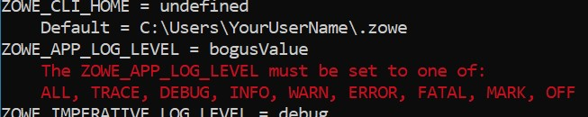

# Gathering information to troubleshoot Zowe CLI

An important step in troubleshooting is confirming that your local environment is set up correctly. There are several Zowe CLI commands you can use to view the conditions for the following system settings:

- Configurations
- Supported components 
- Command property values

These commands offer differing levels of information for analysis. Review this list to understand the outputs they provide and how to apply them for troubleshooting.

## Generating a working environment report

Issue the following command:

```
zowe config report-env
```

The output provides a granular view of key areas in the working environment on your terminal, including the following settings:

- Node.js version, operating system path, environment variables

- NPM information
- Zowe CLI version, profile names
- Installed plug-ins and their versions

This detailed report helps provide insights as you troubleshoot. If it finds a problem with a setting, the report displays a warning message.



Alternatively, the output can be saved as a text file that can be attached to an issue submitted to the [Zowe CLI issues list](https://github.com/zowe/zowe-cli/issues). Before filing an issue, confirm that it has not already been submitted.

## Finding configuration file properties and locations

Issue the following command:

```
zowe config list --locations
```
The output provides a brief overview with the following information:

- Configuration file locations
- Profile names and types
- Profile type defaults
- All property values (host, port, etc.)

This overview outlines configuration property values and where they are specified.

## Finding configuration file locations

Issue the following command:

```
zowe config list --locations --root
```

The output provides a list of configuration files that affect your Zowe commands in the directory from which this command is issued.

## Finding property values used by a Zowe command

Add the `--show-inputs-only` option to any Zowe command.

For example, if you want to check the command to list a data set, add the option to the following command:

```
zowe zos-files list data-set "SYS1.PARMLIB*" --show-inputs-only
```

The output provides the property values that are used by the specified command, which can help the user identify properties that might be incorrect.
