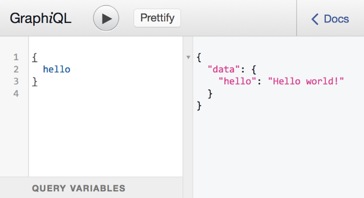

# Using GraphQL APIs

GraphQL is a query language for APIs that provides descriptions of the data in your APIs, and allows for specific queries to facilitate API development. Routing for such APIs is possible within the Zowe ecosystem, however at the present time, Zowe itself does not provide any GraphQL APIs.

For more information about configuring routing to API ML, see the following articles:

* [Implementing routing to the Gateway](../../extend/extend-apiml/implementing-routing-to-the-api-gateway.md)
* [Routing Requests to REST API](./routing-requests-to-rest-apis.md)

:::tip

* For information about how to use GraphQL, see [GraphQL Best Practices](https://graphql.org/learn/best-practices/) in the GraphQL product documentation. 

* For information about how to use HTTP to deliver the GraphQL interface, see [Serving over HTTP](https://graphql.org/learn/serving-over-http/) in the GraphQL product documentation.

:::

## Difference between GraphQL APIs and traditional REST APIs

REST APIs operate on the principle of resource-based endpoints. Each endpoint in a REST API corresponds to a specific resource (like a user or product), and the type of request (`GET`, `POST`, `PUT`, `DELETE`) dictates the operation performed on that resource. This approach leads to a straightforward and uniform interface but often results in the over-fetching or under-fetching of data. Over-fetching occurs when the fixed data structure of an endpoint returns more information than the client needs, while under-fetching happens when the client must make additional requests to gather all the necessary data. Additionally, REST APIs rely heavily on HTTP status codes for error handling and utilize standard HTTP methods for caching and statelessness.

By contrast, GraphQL offers a more flexible and efficient way of working with data. Unlike REST, which uses multiple endpoints, GraphQL uses a single endpoint through which clients can make versatile queries. These queries are tailored to retrieve exactly the data required, eliminating over-fetching and under-fetching issues inherent in REST. GraphQL's strongly typed system, defined by a schema, ensures that the data conforms to a specific structure, providing a contract between the server and client. This approach simplifies data retrieval for complex, nested data and allows for more precise error handling within the responses. However, GraphQL's flexibility can lead to more complex queries and demands careful consideration regarding performance, especially in designing how queries are resolved on the server side.

## Routing to GraphQL example

The following routing example applies only to services extending API ML that provide GraphQL APIs.

Use the following format to map to a GraphQL API:

**Example:**

    routes:
        - gatewayUrl: "api/v1/graphql"
          serviceUrl: "/graphql"

In this example, the service has a service ID of `helloworldservice` that exposes the following endpoints:

* **GraphQL**  `https://gateway/helloworldservice/api/v1/graphql` routed to `https://hwServiceHost:port/graphql/`

where:

* The gatewayUrl is matched against the prefix of the URL path used at the Gateway `https://gateway/urlPath`
  * `urlPath` is `serviceId/prefix/resourcePath`.
* The service ID is used to find the service host and port.
* The `serviceUrl` is used to prefix the `resourcePath` at the service host.

:::note
The service ID is not included in the routing metadata. Instead, the service ID is in the basic Eureka metadata.
:::

## How GraphQL Works

GraphQL operates through the type system you define for your data and uses the following structure:

- **Schema Definition**  
Define a 'schema' or a model of the data that can be queried through the API. This schema acts as a contract between the client and the server.
- **Query**  
Clients send queries to your GraphQL server. These queries specify what data the client needs.
- **Resolving Queries**  
The server processes these queries according to the schema and returns the appropriate results.

## Key Concepts of GraphQL

- **Queries and Mutations**  
In GraphQL, queries are used for reading data, while mutations are used for writing data. This clear separation makes understanding and maintaining the API simpler.
- **Real-time Data with Subscriptions**  
GraphQL supports subscriptions, which allow clients to subscribe to real-time updates, essential for dynamic content applications.
- **Strongly Typed**  
GraphQL APIs are strongly typed so that every operation is checked and validated against the schema, leading to more reliable and predictable APIs.

## Displaying GraphQL in API Catalog

Since Zowe v3, it is possible to configure the service to display an interactive documentation UI inside the API Catalog services' detail page.

This capability is enabled in the API Catalog by default.
It requires the service to onboard to the Discovery Service with `apiml.apiInfo.api-<version>.graphqlUrl` set to the endpoint where the service exposes the GraphQL API.
