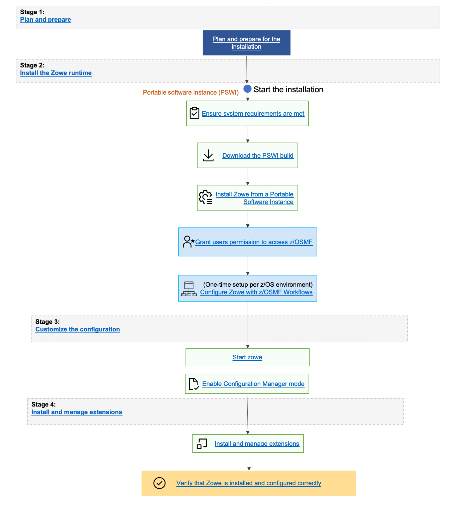

# Installing Zowe from a Portable Software Instance

As a systems programmer, your responsibilities include acquiring, installing, maintaining, and configuring mainframe products on your systems. z/OSMF lets you perform these tasks. z/OSMF lets you manage software on your z/OS systems through a browser at any time, from any location. By streamlining some traditional tasks and automating others, z/OSMF can simplify some areas of system management and also reduce the level of expertise that is required for managing system activities. Experienced users can view, define, and update policies that affect system behavior, monitor system performance, and manage their z/OS software.
As products and vendors adopt z/OSMF services, you can install and maintain all your mainframe products in a common way according to industry best practices. After configuration is complete, you can execute the product and easily provision new software instances for use on other systems throughout your environment.

## End-to-end installation diagram

## Prerequisites

To install Zowe using z/OSMF, ensure that you meet the following requirements:

- z/OSMF 2.5 or higher
- 1.2GB of free space
- READ access to data set names with the HLQ **ZWE** on the user ID you use to deploy the portable package

## Procedure

Refer to the following subpages to guide you through the installation procedure using z/OSMF.

- [Address z/OSMF Requirements](./install-zowe-pswi-address-requirements.md)  
Provides information about z/OSMF general configuration and security requirements.

- [Acquire a z/OSMF Portable Software Instance](./install-zowe-pswi-acquire.md)  
Provides the steps to acquire the product software by downloading the z/OSMF portable software instance to the z/OSMF host. You must then register the portable software instance in z/OSMF.

- [Install Product Software Using z/OSMF Deployments](./install-zowe-pswi-deployment.md)  
Provides the steps to install (deploy) the portable software instance to an LPAR using z/OSMF Deployments. This step creates the SMP/E environment and runs the RECEIVE, APPLY, and ACCEPT steps to prepare the software instance for SMP/E operations. This step also:

    - Customizes the data set names that are defined to SMP/E.
    - Mounts required USS files if necessary.
    - Performs workflow execution to customize the deployed runtime environment for use on a specific z/OS system.

When these tasks are completed, you are ready to install preventive maintenance.
